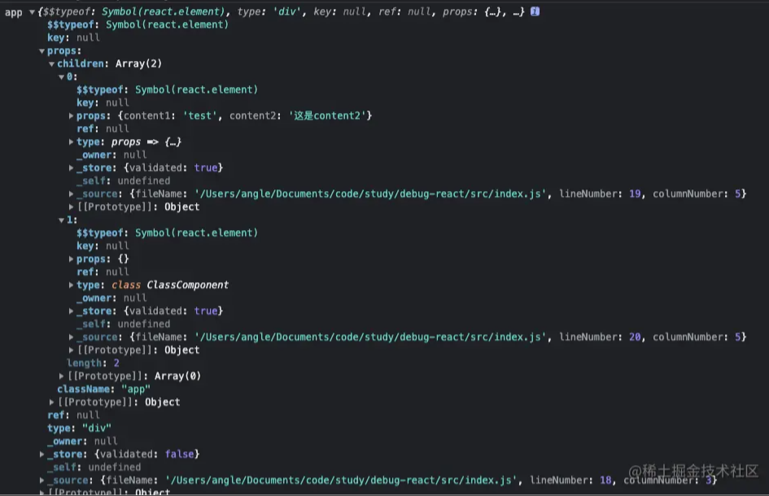
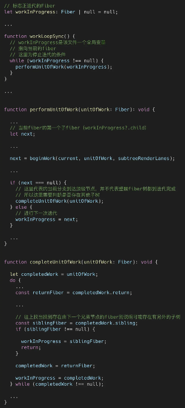

#### 前言
```
其中，最主流的做法是通过构建虚拟DOM树，虚拟DOM记录了真实DOM的相关数据，在复杂的更新过程中，利用系统调度将复杂的更新按帧率分割成多个小更新，
通过计算出每个时间片虚拟DOM的数据和该时间片前虚拟DOM的数据进行比对，便可得出最小的更新位置和更新内容，最后再按时间片映射进真实的DOM中，
这样就能平衡DOM频繁渲染带来的性能损耗和复杂计算带来的渲染阻塞。而在React中便是使用Fiber对标虚拟DOM。

基于react是17.0.2版本
```

#### 实例代码
```javascript
// FunctionComponent.ts
import { FC } from 'react';

interface FunctionComponentProps {
  content1: string;
  content2?: string;
}

export const FunctionComponent: FC<FunctionComponentProps> = (props) => {
  const { content1, content2 } = props;
  return (
    <div className="function-component">
      <span>{content1}</span>
      <span>{content2}</span>
    </div>
  );
}

FunctionComponent.defaultProps = {
  content2: '这是content2',
}

// ClassComponent.ts
import { Component } from 'react';

export class ClassComponent extends Component {
  render() {
    return (
      <>
        <span>a</span>
        <span>b</span>
      </>
    );
  }
}

// index.ts
import * as ReactDOM from 'react-dom';
import { FunctionComponent } from './FunctionComponent';
import { ClassComponent } from './ClassComponent';

const app = (
  <div className="app">
    <FunctionComponent content1="test" />
    <ClassComponent />
  </div>
);

ReactDOM.render(
  app,
  document.getElementById('root')
);
```

在React开发中，官方推荐使用JSX创建ReactElement，简单来说JSX就是用类似与Html的语法格式通过babel转化成构建节点的一种语法糖。
通过转化后，我们发现JSX调用的是React.createElement函数构建ReactElementObj，相关结构如下：
```javascript
// 注意这里不用ReactElement命名是，因为在源码中ReactElement是一个创建ReactElementObj的函数，这里为了避免歧义所以用ReactElementObj
interface ReactElementObj {
  // 标识ReactElementObj的类型
  // 一般由createElement创建$$typeof为 REACT_ELEMENT_TYPE
  $$typeof: number ｜ Symbol;
  // createElemennt传入的type
  type: FunctionComponent | ClassComponent | string | number ｜ Symbol | any;
  // createElement处理的props
  props: Record<string, any>;
  ...
}
function createElement(type: FunctionComponent | ClassComponent | string | number ｜ Symbol | any, config: Record<string, any> | null, ...children: ReactElementObj[]): ReactElementObj;
```

其中createElement接收的参数：
```
type： JSX的标签，普通的html标签t为string类型（小写）， 自定义标签为FunctionComponent或ClassComponent，React内置标签（Fragment、StrictMode、Suspense...）为特定number或Symbol(如果浏览器支持)。
config： JSX标签的属性，没有则传null。
children: 从第3个参数起表示该标签的孩子节点。
```
在createElement中主要处理（相关源码----> 点击这里）：
https://github.com/angleshe/react/blob/main/packages/react/src/ReactElement.js
```
从config分离出config中的key,ref,__self,__source（特殊属性），和props（常规属性）。
向props中添加children（单项/数组）。
对props中的属性为undefined且组件存在defaultProps的属性赋默认值。
返回ReactElement字面量。
```
index.ts中的app是就是一个ReactElementObj的字面量，把它打印出来如下图:

```
其中我们关注的是type和props，由于app的外层是div html普通的标签所以type值为‘div’，props则取得div 中的属性className和下级节点的ReactElementObj，
我们再观察子项ReactElementObj的type都为componet导入的部分。

经过这一步的分析我们得出在ReactDOM.render 中第一入参其实是一个ReactElementObj字面量，而ReactDOM.render 中首要任务便是通过传入的ReactElementObj构建出整个虚拟Dom树---FiberTree
```

#### 2.Fiber基本结构
做为基本虚拟DOM，至少包含：真实DOM的数据、渲染方式和与其他DOM的关系。
而Fiber的基本结构如下：
https://github.com/angleshe/react/blob/main/packages/react-reconciler/src/ReactFiber.old.js
```javascript
interface FiberNode {
  // 标识Fiber的类型
  tag: WorkTag;

  // dom相关数据
  // 本次渲染的Props；对标ReactElementObj中的props
  pendingProps: Record<string, any>;
  // 本次渲染前的Props
  memoizedProps: Record<string, any>;
  // 渲染前的State
  memoizedState: Record<string, any>;

  // 渲染方方式，（生成子Fiber相关）
  // 对标ReactElementObj的type
  type: FunctionComponent | ClassComponent | string | number | Symbol | any;
  // 当type为ClassComponent时，stateNode指向实例化后的对象。
  // 当为react内部类型时，stateNode则指向对应系统相关类型渲染需要的工具类对象
  stateNode: any;
 
  // 与其他fiber的关系
  // 指向父本Fiber
  return: FiberNode | null;
  // 指向第一个孩子节点
  child: FiberNode | null;
  // 指向下一个兄弟节点
  sibling: FiberNode | null;
  // 记录在兄弟节点（父本所有子节点）中的位置
  index: number;
  ...
}
```

#### 3.构建Fiber树
react的整颗fiber树是由rootFiber为根引出来的。根据ReactElementObj类型我们大概可以把Fiber分为3种类型：
```
1.普通html标签：下一级的节点记录在该fiber的pendingProps.children中，通过ReactElementObj转化为Fiber节点，当该节点的
pendingProps.children为空或为string（文本节点）时证明该节点为顶级节点（没有子节点）。

2.react内部提供标签：下一级的节点由react内部自己维护的逻辑生成子节点

3.自定义组件： 下一级的节点存在于当前fiber的type中（FunctionComponent：直接调用可以生成ReactElementObj， ClassComponent：
实例化type后调用render()方法）生成ReactElementObj，在通过ReactElementObj转化为下级节点。
```
react把每个fiber当成生成fiber最小单元只要迭代所有fiber则到顶级Fiber时整颗FiberTree便生成了。
源码中主要通过调用workLoopSync实现fiber迭代：


