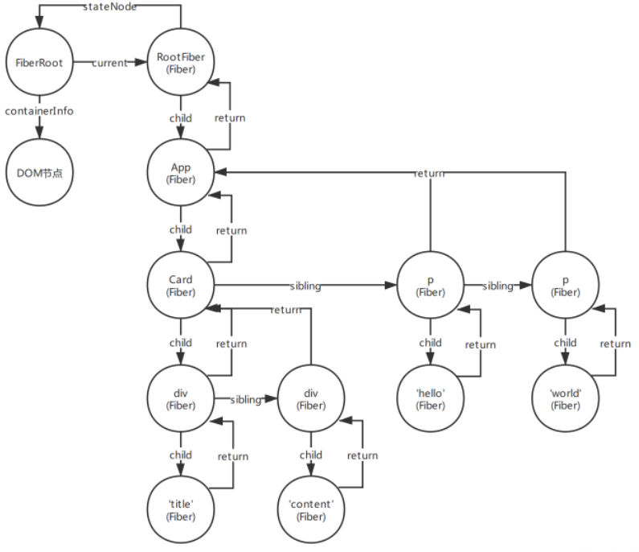

#### fiber树
```
<App>
  <Card>
	<div>title</div>
	<div>content</div>
  </Card>
  <p>hello</p>
  <p>world</p>
</App>
```

ReactDOM一次渲染后，会构建出如下的一棵Fiber树:
这颗Fiber树的每个节点通过child、sibling、return来相互连接，最后构成一个虚拟DOM树


#### FiberRoot
```
type BaseFiberRootProperties = {|
  // Any additional information from the host associated with this root.
  // 指向真实DOM节点，
  // 如ReactDOM.render(<App />, document.getElementById('app'))中的第二个参数
  containerInfo: any,
  // Used only by persistent updates.
  // 这个在react-dom中不会用到
  pendingChildren: any,
  // The currently active root fiber. This is the mutable root of the tree.
  // 指向FiberRoot
  current: Fiber,
 
  /* 下面是更新相关的时间优先级 */
  // The following priority levels are used to distinguish between 1)
  // uncommitted work, 2) uncommitted work that is suspended, and 3) uncommitted
  // work that may be unsuspended. We choose not to track each individual
  // pending level, trading granularity for performance.
  //
  // The earliest and latest priority levels that are suspended from committing.
  // 最老和最新的在提交时被挂起任务的优先级
  earliestSuspendedTime: ExpirationTime,
  latestSuspendedTime: ExpirationTime,
  // The earliest and latest priority levels that are not known to be suspended.
  // 最老和最新的不确定是否会挂起的优先级，这是所有任务一开始进来的状态
  earliestPendingTime: ExpirationTime,
  latestPendingTime: ExpirationTime,
  // The latest priority level that was pinged by a resolved promise and can
  // be retried.
  // 这个是异步的Suspense组件更新时，它的children的promise被reslove时，重新尝试更新时的任务优先级
  latestPingedTime: ExpirationTime,
 
 
  // If an error is thrown, and there are no more updates in the queue, we try
  // rendering from the root one more time, synchronously, before handling
  // the error.
  // 在渲染阶段出现无法处理的错误时会被设置为true
  didError: boolean,
 
  // 正在等待提交任务的优先级(expirationTime过期时间)
  pendingCommitExpirationTime: ExpirationTime,
  // A finished work-in-progress HostRoot that's ready to be committed.
  // 本次更新完成后，最终需要被提交的RootFiber
  finishedWork: Fiber | null,
  // Timeout handle returned by setTimeout. Used to cancel a pending timeout, if
  // it's superseded by a new one.
  // 在任务被挂起的时候通过setTimeout设置后返回的id，用来下一次如果有新的任务挂起时清理还没触发的timeout
  timeoutHandle: TimeoutHandle | NoTimeout,
  // Top context object, used by renderSubtreeIntoContainer
  // 顶层context对象，只有主动调用renderSubtreeIntoContainer时才会有用
  context: Object | null,
  pendingContext: Object | null,
  // Determines if we should attempt to hydrate on the initial mount
  // 用来确定第一次渲染是否是服务端渲染(ssr)
  +hydrate: boolean,
  // Remaining expiration time on this root.
  // TODO: Lift this into the renderer
  // 下一个需要被处理的任务对应的优先级(expirationTime过期时间)
  nextExpirationTimeToWorkOn: ExpirationTime,
  // 本次更新对应的优先级
  expirationTime: ExpirationTime,
  // List of top-level batches. This list indicates whether a commit should be
  // deferred. Also contains completion callbacks.
  // TODO: Lift this into the renderer
  // 批处理相关的
  firstBatch: Batch | null,
  // Linked-list of roots
  // 连接多个FiberRoot
  // react支持多次调用ReactDOM.render，每次都会生成对应的FiberRoot
  nextScheduledRoot: FiberRoot | null,
|};
 ```
#### fiber
```
export type Fiber = {|
  // These first fields are conceptually members of an Instance. This used to
  // be split into a separate type and intersected with the other Fiber fields,
  // but until Flow fixes its intersection bugs, we've merged them into a
  // single type.
 
  // An Instance is shared between all versions of a component. We can easily
  // break this out into a separate object to avoid copying so much to the
  // alternate versions of the tree. We put this on a single object for now to
  // minimize the number of objects created during the initial render.
 
  // Tag identifying the type of fiber.
  // 用来表示当前Fiber对应的是那种类型的组件，如ClassComponent、FunctionComponent等
  tag: WorkTag,
 
  // Unique identifier of this child.
  // 组件的key
  key: null | string,
 
  // The value of element.type which is used to preserve the identity during
  // reconciliation of this child.
  // 组件对应的ReactElemnt里的type，比如class组件对应那个class
  elementType: any,
 
  // The resolved function/class/ associated with this fiber.
  // 一般都等于elementType，但是通过lazy加载的组件，一开始会为null，直到加载完成才会设置为正确的type
  type: any,
 
  // The local state associated with this fiber.
  // 对应的实例，比如class组件对应class实例，原生的组件对应dom
  stateNode: any,
 
  // Conceptual aliases
  // parent : Instance -> return The parent happens to be the same as the
  // return fiber since we've merged the fiber and instance.
 
  // Remaining fields belong to Fiber
 
  // The Fiber to return to after finishing processing this one.
  // This is effectively the parent, but there can be multiple parents (two)
  // so this is only the parent of the thing we're currently processing.
  // It is conceptually the same as the return address of a stack frame.
  // 指向父节点
  return: Fiber | null,
 
  // Singly Linked List Tree Structure.
  // 指向子节点
  child: Fiber | null,
  // 指向兄弟节点
  sibling: Fiber | null,
  // 当前fiber在父节点对应子节点中的位置
  index: number,
 
  // The ref last used to attach this node.
  // I'll avoid adding an owner field for prod and model that as functions.
  // 组件的ref
  ref: null | (((handle: mixed) => void) & {_stringRef: ?string}) | RefObject,
 
  // Input is the data coming into process this fiber. Arguments. Props.
  // 等待被更新的属性
  pendingProps: any, // This type will be more specific once we overload the tag.
  // 上一次渲染完成后的属性
  memoizedProps: any, // The props used to create the output.
 
  // A queue of state updates and callbacks.
  // 等待更新的任务队列
  updateQueue: UpdateQueue<any> | null,
 
  // The state used to create the output
  // 上一次渲染完成的state
  memoizedState: any,
 
  // A linked-list of contexts that this fiber depends on
  // 当前组件的第一个context，可以有多个连成链表
  firstContextDependency: ContextDependency<mixed> | null,
 
  // Bitfield that describes properties about the fiber and its subtree. E.g.
  // the ConcurrentMode flag indicates whether the subtree should be async-by-
  // default. When a fiber is created, it inherits the mode of its
  // parent. Additional flags can be set at creation time, but after that the
  // value should remain unchanged throughout the fiber's lifetime, particularly
  // before its child fibers are created.
  // 当前组件的mode，默认继承夫节点。比如是否处于异步渲染等
  mode: TypeOfMode,
 
  // Effect
  // 用来记录本次更新在当前组件产生的副作用，比如新增、修改、删除等
  effectTag: SideEffectTag,
 
  // Singly linked list fast path to the next fiber with side-effects.
  // 用链表记录产生的副作用
  nextEffect: Fiber | null,
 
  // The first and last fiber with side-effect within this subtree. This allows
  // us to reuse a slice of the linked list when we reuse the work done within
  // this fiber.
  // 副作用链表中的第一个和最后一个
  firstEffect: Fiber | null,
  lastEffect: Fiber | null,
 
  // Represents a time in the future by which this work should be completed.
  // Does not include work found in its subtree.
  // 本次更新任务的fiber对应的优先级
  expirationTime: ExpirationTime,
 
  // This is used to quickly determine if a subtree has no pending changes.
  // 它的子组件对应的更新优先级
  childExpirationTime: ExpirationTime,
 
  // This is a pooled version of a Fiber. Every fiber that gets updated will
  // eventually have a pair. There are cases when we can clean up pairs to save
  // memory if we need to.
  // 指向当前fiber对应的一个拷贝
  alternate: Fiber | null,
 
  /* 下面是调试相关的，收集每个Fiber和子树的渲染时间 */
  // Time spent rendering this Fiber and its descendants for the current update.
  // This tells us how well the tree makes use of sCU for memoization.
  // It is reset to 0 each time we render and only updated when we don't bailout.
  // This field is only set when the enableProfilerTimer flag is enabled.
  actualDuration?: number,
 
  // If the Fiber is currently active in the "render" phase,
  // This marks the time at which the work began.
  // This field is only set when the enableProfilerTimer flag is enabled.
  actualStartTime?: number,
 
  // Duration of the most recent render time for this Fiber.
  // This value is not updated when we bailout for memoization purposes.
  // This field is only set when the enableProfilerTimer flag is enabled.
  selfBaseDuration?: number,
 
  // Sum of base times for all descedents of this Fiber.
  // This value bubbles up during the "complete" phase.
  // This field is only set when the enableProfilerTimer flag is enabled.
  treeBaseDuration?: number,
 
  // Conceptual aliases
  // workInProgress : Fiber ->  alternate The alternate used for reuse happens
  // to be the same as work in progress.
  // __DEV__ only
  _debugID?: number,
  _debugSource?: Source | null,
  _debugOwner?: Fiber | null,
  _debugIsCurrentlyTiming?: boolean,
|};
```
#### Update
```javascript
export type Update<State> = {
  // 本次更新任务的优先级(过期时间)
  expirationTime: ExpirationTime,
 
  // 这次更新的类型，比如this.setState()对应0，this.enqueueForceUpdate()对应2
  // export const UpdateState = 0;
  // export const ReplaceState = 1;
  // export const ForceUpdate = 2;
  // export const CaptureUpdate = 3;
  tag: 0 | 1 | 2 | 3,
  // 本次更新的内容，比如this.setState({ title: 'hello' })，这时payload为{ title: 'hello' }
  payload: any,
  // 这次更新的回调函数，比如this.setState({}, callback)
  callback: (() => mixed) | null,
  // 因为可以在一个组件上多次调用this.setState，这时会产生多个更新update，通过next连接
  next: Update<State> | null,
  // 用于记录更新完成后需要执行的副作用，比如上面的callback，这个也是一个链表的形式
  nextEffect: Update<State> | null,
};
```

当用户调用一些会产生更新的方法时，会创建一个update:
```javascript
this.setState({ title: 'hello' }, () => console.log('hello'));
this.setState(() => ({ title: 'world' }), () => console.log('world'));
 
const update1 = {
  expirationTime: 动态计算的一个时间值,
  tag: 0,
  payload: { title: 'hello' },
  callback: () => console.log('hello'),
  next: update2,
  nextEffect: update2
};
 
const update2 = {
  expirationTime: 动态计算的一个时间值,
  tag: 0,
  payload: () => ({ title: 'world' }),
  callback: () => console.log('world'),
  next: update1,
  nextEffect: update1
}
```
update形成的链表是一个循环链表，也就是最后一个的next会指向第一个
UpdateQueue
```javascript
export type UpdateQueue<State> = {
  // 上次更新完成后的state，用于本次更新使用
  baseState: State,
 
  // 记录update链表中的第一个update，也就是上面提到的update.next维护的链表
  firstUpdate: Update<State> | null,
  // 记录update链表中的最后一个update
  lastUpdate: Update<State> | null,
 
  // 更新过程中可能会出现异常，这时候react会尝试去更新，这时会创建一个用于更新异常的update
  // 这里就是维护异常更新的链表中的第一个和最后一个，每个update通过update.next连接
  firstCapturedUpdate: Update<State> | null,
  lastCapturedUpdate: Update<State> | null,
 
  // 记录update产生副作用的链表中的第一个和最后一个，通过update.nextEffect连接
  firstEffect: Update<State> | null,
  lastEffect: Update<State> | null,
 
  // 记录异常处理产生的update的副作用链表，通过update.nextEffect连接
  firstCapturedEffect: Update<State> | null,
  lastCapturedEffect: Update<State> | null,
};
```
这个updateQueue对应fiber里的updateQueue，每当组件调用会产生更新的函数时，比如setState，就是产生一个update，加入到组件对应的fiber中的
updateQueue中，在后续更新流程中就会遍历组件的updateQueue来计算出本次更新最终的state。
