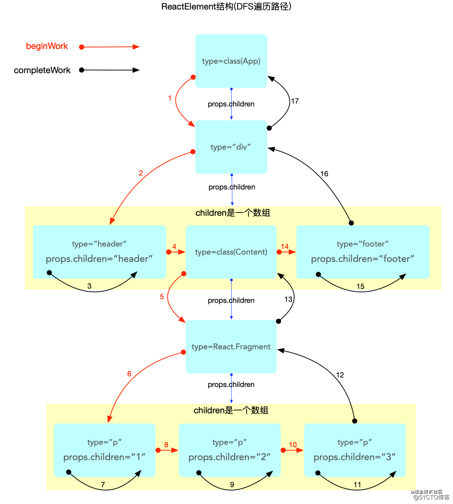
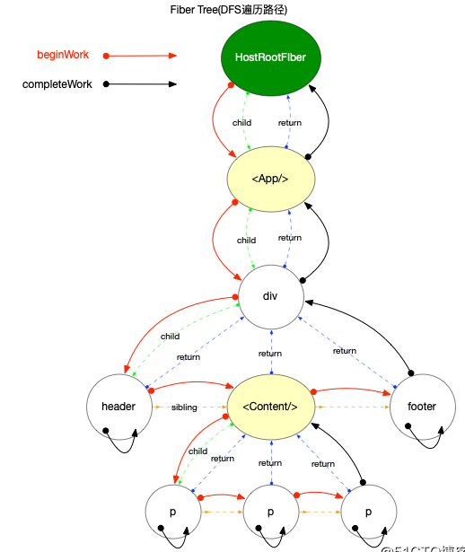

#### 参考
```
https://blog.51cto.com/u_15098004/2611341
```

#### 基于React 17
```
React源码中使用到了很多算法技巧, 主要包含位运算, 深度优先遍历, 链表操作, 栈操作, 堆排序等
```

#### 基础
```
对于树或图结构的搜索(或遍历)来讲, 分为深度优先(DFS)和广度优先(BFS).
深度优先遍历: DFS(英语:Depth-First-Search,DFS)是一种用于遍历或搜索树或图的算法.

当节点v的所在边都己被探寻过, 搜索将回溯到发现节点v的那条边的起始节点. 这一过程一直进行到已发现从源节点可达的所有节点为止.
如果还存在未被发现的节点, 则选择其中一个作为源节点并重复以上过程, 整个进程反复进行直到所有节点都被访问为止.


```

#### DFS 的主流实现方式有 2 种
```
1.递归(简单粗暴)
2.利用栈存储遍历路径
```

#### 4.在React中使用场景
```
深度优先遍历在react当中的使用非常典型, 最主要的使用时在ReactElement和fiber树的构造过程. 其次是在使用context时, 
需要深度优先地查找消费context的节点.
```

#### 4-1.ReactElement "树"的构造
```
ReactElement不能算是严格的树结构, 为了方便表述, 后文都称之为树.

在react-reconciler包中, ReactElement的构造过程实际上也是reconciler调和过程. 与fiber树的构造是相互交替, 
逐级进行的(在fiber 树构建章节中详细解读, 本节只介绍深度优先遍历的使用场景).

ReactElement树的构造, 实际上就是各级组件render之后的总和. 整个过程体现在reconciler工作循环之中.
```

源码位于ReactFiberWorkLoop.js中, 此处为了简明, 已经将源码中与 dfs 无关的旁支逻辑去掉.
```javascript
// https://github.com/facebook/react/blob/v17.0.1/packages/react-reconciler/src/ReactFiberWorkLoop.old.js#L1558

// The work loop is an extremely hot path. Tell Closure not to inline it.
/** @noinline */
function workLoopSync() {
    // 1. 最外层循环, 保证每一个节点都能遍历, 不会遗漏
    // Already timed out, so perform work without checking if we need to yield.
    while (workInProgress !== null) {
        performUnitOfWork(workInProgress);
    }
}

function performUnitOfWork(unitOfWork: Fiber): void {
    // The current, flushed, state of this fiber is the alternate. Ideally
    // nothing should rely on this, but relying on it here means that we don't
    // need an additional field on the work in progress.
    const current = unitOfWork.alternate;
    setCurrentDebugFiberInDEV(unitOfWork);

    let next;   // 2. beginWork是向下探寻阶段
    if (enableProfilerTimer && (unitOfWork.mode & ProfileMode) !== NoMode) {
        startProfilerTimer(unitOfWork);
        next = beginWork(current, unitOfWork, subtreeRenderLanes);
        stopProfilerTimerIfRunningAndRecordDelta(unitOfWork, true);
    } else {
        next = beginWork(current, unitOfWork, subtreeRenderLanes);
    }

    resetCurrentDebugFiberInDEV();
    unitOfWork.memoizedProps = unitOfWork.pendingProps;
    if (next === null) { // 3. completeUnitOfWork 是回溯阶段completeUnitOfWork(unitOfWork);
        // If this doesn't spawn new work, complete the current work.
        completeUnitOfWork(unitOfWork);
    } else {
        workInProgress = next;
    }

    ReactCurrentOwner.current = null;
}

function completeUnitOfWork(unitOfWork: Fiber): void {
    // Attempt to complete the current unit of work, then move to the next
    // sibling. If there are no more siblings, return to the parent fiber.
    let completedWork = unitOfWork;
    do {
        // The current, flushed, state of this fiber is the alternate. Ideally
        // nothing should rely on this, but relying on it here means that we don't
        // need an additional field on the work in progress.
        const current = completedWork.alternate;
        const returnFiber = completedWork.return;

        // Check if the work completed or if something threw.
        if ((completedWork.flags & Incomplete) === NoFlags) {
            setCurrentDebugFiberInDEV(completedWork);
            let next;   // 3.1 回溯并处理节点
            if (
                !enableProfilerTimer ||
                (completedWork.mode & ProfileMode) === NoMode
            ) {
                next = completeWork(current, completedWork, subtreeRenderLanes);
            } else {
                startProfilerTimer(completedWork);
                next = completeWork(current, completedWork, subtreeRenderLanes);
                // Update render duration assuming we didn't error.
                stopProfilerTimerIfRunningAndRecordDelta(completedWork, false);
            }
            resetCurrentDebugFiberInDEV();

            if (next !== null) {       // 判断在处理节点的过程中, 是否派生出新的节点
                // Completing this fiber spawned new work. Work on that next.
                workInProgress = next;
                return;
            }

            resetChildLanes(completedWork);

            if (
                returnFiber !== null &&
                // Do not append effects to parents if a sibling failed to complete
                (returnFiber.flags & Incomplete) === NoFlags
            ) {
                // Append all the effects of the subtree and this fiber onto the effect
                // list of the parent. The completion order of the children affects the
                // side-effect order.
                if (returnFiber.firstEffect === null) {
                    returnFiber.firstEffect = completedWork.firstEffect;
                }
                if (completedWork.lastEffect !== null) {
                    if (returnFiber.lastEffect !== null) {
                        returnFiber.lastEffect.nextEffect = completedWork.firstEffect;
                    }
                    returnFiber.lastEffect = completedWork.lastEffect;
                }

                // If this fiber had side-effects, we append it AFTER the children's
                // side-effects. We can perform certain side-effects earlier if needed,
                // by doing multiple passes over the effect list. We don't want to
                // schedule our own side-effect on our own list because if end up
                // reusing children we'll schedule this effect onto itself since we're
                // at the end.
                const flags = completedWork.flags;

                // Skip both NoWork and PerformedWork tags when creating the effect
                // list. PerformedWork effect is read by React DevTools but shouldn't be
                // committed.
                if (flags > PerformedWork) {
                    if (returnFiber.lastEffect !== null) {
                        returnFiber.lastEffect.nextEffect = completedWork;
                    } else {
                        returnFiber.firstEffect = completedWork;
                    }
                    returnFiber.lastEffect = completedWork;
                }
            }
        } else {
            // This fiber did not complete because something threw. Pop values off
            // the stack without entering the complete phase. If this is a boundary,
            // capture values if possible.
            const next = unwindWork(completedWork, subtreeRenderLanes);

            // Because this fiber did not complete, don't reset its expiration time.

            if (next !== null) {
                // If completing this work spawned new work, do that next. We'll come
                // back here again.
                // Since we're restarting, remove anything that is not a host effect
                // from the effect tag.
                next.flags &= HostEffectMask;
                workInProgress = next;
                return;
            }

            if (
                enableProfilerTimer &&
                (completedWork.mode & ProfileMode) !== NoMode
            ) {
                // Record the render duration for the fiber that errored.
                stopProfilerTimerIfRunningAndRecordDelta(completedWork, false);

                // Include the time spent working on failed children before continuing.
                let actualDuration = completedWork.actualDuration;
                let child = completedWork.child;
                while (child !== null) {
                    actualDuration += child.actualDuration;
                    child = child.sibling;
                }
                completedWork.actualDuration = actualDuration;
            }

            if (returnFiber !== null) {
                // Mark the parent fiber as incomplete and clear its effect list.
                returnFiber.firstEffect = returnFiber.lastEffect = null;
                returnFiber.flags |= Incomplete;
            }
        }

        const siblingFiber = completedWork.sibling;
        // 3.2 判断是否有旁支
        if (siblingFiber !== null) {
            // If there is more work to do in this returnFiber, do that next.
            workInProgress = siblingFiber;
            return;
        }
        
        // 3.3 没有旁支 继续回溯
        // Otherwise, return to the parent
        completedWork = returnFiber;
        // Update the next thing we're working on in case something throws.
        workInProgress = completedWork;
    } while (completedWork !== null);

    // We've reached the root.
    if (workInProgressRootExitStatus === RootIncomplete) {
        workInProgressRootExitStatus = RootCompleted;
    }
}
```
以上源码本质上是采用递归的方式进行 dfs, 假设有以下组件结构:
```javascript
class App extends React.Component {  
    render() {
        return (      
            <div className="app"><header>header</header><Content /><footer>footer</footer>  </div>
        );
  }
}

class Content extends React.Component {  
    render() {
        return (      
            <React.Fragment><p>1</p><p>2</p><p>3</p>  </React.Fragment>
        );
  }
}
export default App;
```

注意:
* ReactElement树是在大循环中的beginWork阶段"逐级"生成的.
* "逐级"中的每一级是值一个class或function类型的组件, 每调用一次render或执行一次function调用, 就会生成一批ReactElement节点.
* ReactElement树的构造, 实际上就是各级组件render之后的总和.

#### 4-2.fiber 树的构造
```
在ReactElement的构造过程中, 同时伴随着fiber树的构造, fiber树同样也是在beginWork阶段生成的.

绘制出遍历路径如下:
```


#### 4-3.查找 context 的消费节点
当context改变之后, 需要找出依赖该context的所有子节点(详细分析会在context原理章节深入解读), 这里同样也是一个DFS, 具体源码在 ReactFiberNewContext.js.
将其主杆逻辑剥离出来, 可以清晰的看出采用循环递归的方式进行遍历:
```javascript
// https://github.com/facebook/react/blob/v17.0.1/packages/react-reconciler/src/ReactFiberNewContext.old.js#L182-L295

export function propagateContextChange(
    workInProgress: Fiber,
    context: ReactContext<mixed>,
    changedBits: number,
    renderLanes: Lanes,
): void {
    let fiber = workInProgress.child;
    if (fiber !== null) {
        // Set the return pointer of the child to the work-in-progress fiber.
        fiber.return = workInProgress;
    }
    while (fiber !== null) {
        let nextFiber;

        // Visit this fiber.
        const list = fiber.dependencies;
        
        // 匹配context等逻辑, 和dfs无关, 此处可以暂时忽略  // ...
        if (list !== null) {
            nextFiber = fiber.child;

            let dependency = list.firstContext;
            while (dependency !== null) {
                // Check if the context matches.
                if (
                    dependency.context === context &&
                    (dependency.observedBits & changedBits) !== 0
                ) {
                    // Match! Schedule an update on this fiber.

                    if (fiber.tag === ClassComponent) {
                        // Schedule a force update on the work-in-progress.
                        const update = createUpdate(
                            NoTimestamp,
                            pickArbitraryLane(renderLanes),
                        );
                        update.tag = ForceUpdate;
                        // TODO: Because we don't have a work-in-progress, this will add the
                        // update to the current fiber, too, which means it will persist even if
                        // this render is thrown away. Since it's a race condition, not sure it's
                        // worth fixing.
                        enqueueUpdate(fiber, update);
                    }
                    fiber.lanes = mergeLanes(fiber.lanes, renderLanes);
                    const alternate = fiber.alternate;
                    if (alternate !== null) {
                        alternate.lanes = mergeLanes(alternate.lanes, renderLanes);
                    }
                    scheduleWorkOnParentPath(fiber.return, renderLanes);

                    // Mark the updated lanes on the list, too.
                    list.lanes = mergeLanes(list.lanes, renderLanes);

                    // Since we already found a match, we can stop traversing the
                    // dependency list.
                    break;
                }
                dependency = dependency.next;
            }
        } else if (fiber.tag === ContextProvider) {
            // Don't scan deeper if this is a matching provider
            nextFiber = fiber.type === workInProgress.type ? null : fiber.child;
        } else if (
            enableSuspenseServerRenderer &&
            fiber.tag === DehydratedFragment
        ) {
            // If a dehydrated suspense boundary is in this subtree, we don't know
            // if it will have any context consumers in it. The best we can do is
            // mark it as having updates.
            const parentSuspense = fiber.return;
            invariant(
                parentSuspense !== null,
                'We just came from a parent so we must have had a parent. This is a bug in React.',
            );
            parentSuspense.lanes = mergeLanes(parentSuspense.lanes, renderLanes);
            const alternate = parentSuspense.alternate;
            if (alternate !== null) {
                alternate.lanes = mergeLanes(alternate.lanes, renderLanes);
            }
            // This is intentionally passing this fiber as the parent
            // because we want to schedule this fiber as having work
            // on its children. We'll use the childLanes on
            // this fiber to indicate that a context has changed.
            scheduleWorkOnParentPath(parentSuspense, renderLanes);
            nextFiber = fiber.sibling;
        } else {
            // // 向下探寻 
            // Traverse down.
            nextFiber = fiber.child;
        }

        if (nextFiber !== null) {
            // Set the return pointer of the child to the work-in-progress fiber.
            nextFiber.return = fiber;
        } else {
            // No child. Traverse to next sibling.
            nextFiber = fiber;
            while (nextFiber !== null) {
                if (nextFiber === workInProgress) {
                    // We're back to the root of this subtree. Exit.
                    nextFiber = null;
                    break;
                }
                const sibling = nextFiber.sibling;
                if (sibling !== null) {
                    // Set the return pointer of the sibling to the work-in-progress fiber.
                    sibling.return = nextFiber.return;
                    nextFiber = sibling;
                    break;
                }
                // No more siblings. Traverse up.
                nextFiber = nextFiber.return;
            }
        }
        fiber = nextFiber;
    }
}
```

#### 总结
由于react内部使用了ReactElement和fiber两大树形结构, 所以有不少关于节点访问的逻辑.

本节主要介绍了DFS的概念和它在react源码中的使用情况. 其中fiber树的DFS遍历, 涉及到的代码多, 分布广, 涵盖了reconciler阶段的大部分工作, 是reconciler阶段工作循环的核心流程.

除了DFS之外, 源码中还有很多逻辑都是查找树中的节点(如: 向上查找父节点等). 对树形结构的遍历在源码中的比例很高, 了解这些算法技巧能够更好的理解react源码.
