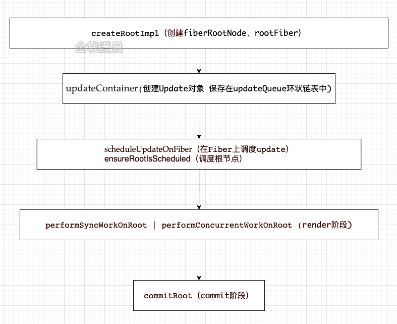
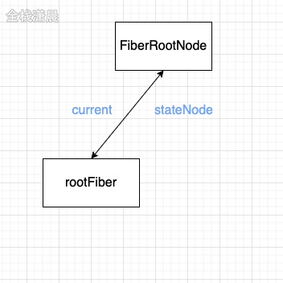

```

```

react有3种模式进入主体函数的入口，我们可以从 react官方文档 使用 Concurrent 模式（实验性）中对比三种模式：
```
legacy 模式： ReactDOM.render(<App />, rootNode)。这是当前 React app 使用的方式。当前没有计划删除本模式，但是这个模式可能不支持这些新功能。

blocking 模式： ReactDOM.createBlockingRoot(rootNode).render(<App />)。目前正在实验中。作为迁移到 concurrent 模式的第一个步骤。

concurrent 模式： ReactDOM.createRoot(rootNode).render(<App />)。目前在实验中，未来稳定之后，打算作为 React 的默认开发模式。这个模式开启了所有的新功能。
```

### legacy 模式
legacy 模式在合成事件中有自动批处理的功能，但仅限于一个浏览器任务。
```
legacy模式是我们常用的，它构建dom的过程是同步的，所以在render的reconciler中，如果diff的过程特别耗时，那么导致的结果就是js一直阻塞高优先级的任务(例如用户的点击事件)，表现为页面的卡顿，无法响应。
```

concurrent Mode是react未来的模式
```
concurrent Mode是react未来的模式，它用时间片调度实现了异步可中断的任务，根据设备性能的不同，时间片的长度也不一样，在每个时间片中，如果任务到了过期时间，就会主动让出线程给高优先级的任务。这部分将在第15节 scheduler&lane模型 。
```
###### 两种模式函数主要执行过程
1.主要执行流程：


2.详细函数调用过程：
用demo_0跟着视频调试更加清晰，黄色部分是主要任务是创建fiberRootNode和rootFiber，红色部分是创建Update，蓝色部分是调度render阶段的入口函数


###### legacy模式：
render调用legacyRenderSubtreeIntoContainer，最后createRootImpl会调用到createFiberRoot创建fiberRootNode,然后调用createHostRootFiber创建rootFiber，其中fiberRootNode是整个项目的的根节点，rootFiber是当前应用挂在的节点，也就是ReactDOM.render调用后的根节点
```js
//最上层的节点是整个项目的根节点fiberRootNode
ReactDOM.render(<App />, document.getElementById("root"));//rootFiber
```



创建完Fiber节点后，legacyRenderSubtreeIntoContainer调用updateContainer创建创建Update对象挂载到updateQueue的环形链表上，然后执行scheduleUpdateOnFiber调用performSyncWorkOnRoot进入render阶段和commit阶段
```js
function legacyRenderSubtreeIntoContainer(parentComponent, children, container, forceHydrate, callback) {
  //...
  var root = container._reactRootContainer;
  var fiberRoot;

  if (!root) {
    // mount时,legacyCreateRootFromDOMContainer 创建根节点
    root = container._reactRootContainer = legacyCreateRootFromDOMContainer(container, forceHydrate);//创建root节点
    fiberRoot = root._internalRoot;

    if (typeof callback === 'function') {//处理回调
      var originalCallback = callback;

      callback = function () {
        var instance = getPublicRootInstance(fiberRoot);
        originalCallback.call(instance);
      };
    } 


    unbatchedUpdates(function () {
      updateContainer(children, fiberRoot, parentComponent, callback);//创建update入口
    });
  } else {
    // update时
    fiberRoot = root._internalRoot;

    if (typeof callback === 'function') {//处理回调
      var _originalCallback = callback;

      callback = function () {
        var instance = getPublicRootInstance(fiberRoot);

        _originalCallback.call(instance);
      };
    } 
    
    updateContainer(children, fiberRoot, parentComponent, callback);
  }
}

function updateContainer(element, container, parentComponent, callback) {
  var lane = requestUpdateLane(current$1);//获取当前可用lane 在12章讲解
  var update = createUpdate(eventTime, lane); //创建update

  update.payload = {
    element: element//jsx
  };

  enqueueUpdate(current$1, update);//update入队
  scheduleUpdateOnFiber(current$1, lane, eventTime);//调度update
  return lane;
}

function scheduleUpdateOnFiber(fiber, lane, eventTime) {
  if (lane === SyncLane) {//同步lane 对应legacy模式
    //...
    performSyncWorkOnRoot(root);//render阶段的起点 render在第6章讲解
  } else {//concurrent模式
    //...
    ensureRootIsScheduled(root, eventTime);//确保root被调度
  } 
}

```

legacyCreateRootFromDOMContainer 作用创建根节点，调用
createLegacyRoot() 创建根节点
```js
function legacyCreateRootFromDOMContainer(container, forceHydrate) {
  var shouldHydrate = forceHydrate || shouldHydrateDueToLegacyHeuristic(container); // First clear any existing content.

  if (!shouldHydrate) {
    var warned = false;
    var rootSibling;

    while (rootSibling = container.lastChild) {
      {
        if (!warned && rootSibling.nodeType === ELEMENT_NODE && rootSibling.hasAttribute(ROOT_ATTRIBUTE_NAME)) {
          warned = true;

          error('render(): Target node has markup rendered by React, but there ' + 'are unrelated nodes as well. This is most commonly caused by ' + 'white-space inserted around server-rendered markup.');
        }
      }

      container.removeChild(rootSibling);
    }
  }

  {
    if (shouldHydrate && !forceHydrate && !warnedAboutHydrateAPI) {
      warnedAboutHydrateAPI = true;

      warn('render(): Calling ReactDOM.render() to hydrate server-rendered markup ' + 'will stop working in React v18. Replace the ReactDOM.render() call ' + 'with ReactDOM.hydrate() if you want React to attach to the server HTML.');
    }
  }

  return createLegacyRoot(container, shouldHydrate ? {
    hydrate: true
  } : undefined);
}
```

### 线路1.createLegacyRoot() 创建根节点createFiberRoot和createHostRootFiber,调用构造函数ReactDOMBlockingRoot(),最终调用createRootImpl()

重点函数： createFiberRoot
```
//最后调用 FiberRootNode 创建项目的根节点rootFiber,此时所有的属性都挂载好了
// 同时调用 createHostRootFiber 创建 rootFiber
// 同时调用 initializeUpdateQueue 初始化 queue
/*
注意createFiberRoot 这里建立指向：
  // 把fiberRoot 的current指向 uninitializedFiber
  root.current = uninitializedFiber;
  // rootFiber 的stateNode 指向 fiberRoot
  uninitializedFiber.stateNode = root;
*/
function createFiberRoot(containerInfo, tag, hydrate, hydrationCallbacks) {
```
```js
function createLegacyRoot(container, options) {
  return new ReactDOMBlockingRoot(container, LegacyRoot, options);
}
function ReactDOMBlockingRoot(container, tag, options) {
  this._internalRoot = createRootImpl(container, tag, options);
}
// 主要调用 createContainer
function createRootImpl(container, tag, options) {
  // Tag is either LegacyRoot or Concurrent Root
  var hydrate = options != null && options.hydrate === true;
  var hydrationCallbacks = options != null && options.hydrationOptions || null;
  var mutableSources = options != null && options.hydrationOptions != null && options.hydrationOptions.mutableSources || null;
  var root = createContainer(container, tag, hydrate);
  markContainerAsRoot(root.current, container);
  var containerNodeType = container.nodeType;

  {
    var rootContainerElement = container.nodeType === COMMENT_NODE ? container.parentNode : container;
    listenToAllSupportedEvents(rootContainerElement);
  }

  if (mutableSources) {
    for (var i = 0; i < mutableSources.length; i++) {
      var mutableSource = mutableSources[i];
      registerMutableSourceForHydration(root, mutableSource);
    }
  }

  return root;
}
// createContainer() 调用 createFiberRoot 创建 fiberRoot
function createContainer(containerInfo, tag, hydrate, hydrationCallbacks) {
  return createFiberRoot(containerInfo, tag, hydrate);
}
//最后调用 FiberRootNode 创建项目的根节点rootFiber,此时所有的属性都挂载好了
// 同时调用 createHostRootFiber 创建 rootFiber
// 同时调用 initializeUpdateQueue 初始化 queue
/*
注意createFiberRoot 这里建立指向：
  // 把fiberRoot 的current指向 uninitializedFiber
  root.current = uninitializedFiber;
  // rootFiber 的stateNode 指向 fiberRoot
  uninitializedFiber.stateNode = root;
*/
function createFiberRoot(containerInfo, tag, hydrate, hydrationCallbacks) {
  var root = new FiberRootNode(containerInfo, tag, hydrate);//创建fiberRootNode
  const uninitializedFiber = createHostRootFiber(tag);//创建rootFiber
  //rootFiber和fiberRootNode连接
  root.current = uninitializedFiber;
  uninitializedFiber.stateNode = root;
  //创建updateQueue
  initializeUpdateQueue(uninitializedFiber);
  return root;
}

// createHostRootFiber 创建 rootFiber
function createHostRootFiber(tag) {
  var mode;

  if (tag === ConcurrentRoot) {
    mode = ConcurrentMode | BlockingMode | StrictMode;
  } else if (tag === BlockingRoot) {
    mode = BlockingMode | StrictMode;
  } else {
    mode = NoMode;
  }

  if ( isDevToolsPresent) {
    // Always collect profile timings when DevTools are present.
    // This enables DevTools to start capturing timing at any point–
    // Without some nodes in the tree having empty base times.
    mode |= ProfileMode;
  }

  return createFiber(HostRoot, null, null, mode);
}
// new FiberNode 创建rootFiber
var createFiber = function (tag, pendingProps, key, mode) {
  // $FlowFixMe: the shapes are exact here but Flow doesn't like constructors
  return new FiberNode(tag, pendingProps, key, mode);
};

//这里就是fiber 那一章讲的属性
function FiberNode(tag, pendingProps, key, mode) {
  // Instance
  this.tag = tag;
  this.key = key;
  this.elementType = null;
  this.type = null;
  this.stateNode = null; // Fiber

  this.return = null;
  this.child = null;
  this.sibling = null;
  this.index = 0;
  this.ref = null;
  this.pendingProps = pendingProps;
  this.memoizedProps = null;
  this.updateQueue = null;
  this.memoizedState = null;
  this.dependencies = null;
  this.mode = mode; // Effects

  this.flags = NoFlags;
  this.nextEffect = null;
  this.firstEffect = null;
  this.lastEffect = null;
  this.lanes = NoLanes;
  this.childLanes = NoLanes;
  this.alternate = null;

  {
    // Note: The following is done to avoid a v8 performance cliff.
    //
    // Initializing the fields below to smis and later updating them with
    // double values will cause Fibers to end up having separate shapes.
    // This behavior/bug has something to do with Object.preventExtension().
    // Fortunately this only impacts DEV builds.
    // Unfortunately it makes React unusably slow for some applications.
    // To work around this, initialize the fields below with doubles.
    //
    // Learn more about this here:
    // https://github.com/facebook/react/issues/14365
    // https://bugs.chromium.org/p/v8/issues/detail?id=8538
    this.actualDuration = Number.NaN;
    this.actualStartTime = Number.NaN;
    this.selfBaseDuration = Number.NaN;
    this.treeBaseDuration = Number.NaN; // It's okay to replace the initial doubles with smis after initialization.
    // This won't trigger the performance cliff mentioned above,
    // and it simplifies other profiler code (including DevTools).

    this.actualDuration = 0;
    this.actualStartTime = -1;
    this.selfBaseDuration = 0;
    this.treeBaseDuration = 0;
  }

  {
    // This isn't directly used but is handy for debugging internals:
    this._debugID = debugCounter++;
    this._debugSource = null;
    this._debugOwner = null;
    this._debugNeedsRemount = false;
    this._debugHookTypes = null;

    if (!hasBadMapPolyfill && typeof Object.preventExtensions === 'function') {
      Object.preventExtensions(this);
    }
  }
} // This is a constructor function, rather than a POJO constructor, still
```

createFiberRoot 同时调用 initializeUpdateQueue 初始化 queue
传入 rootFiber
initializeUpdateQueue(uninitializedFiber)
```js
function createFiberRoot(containerInfo, tag, hydrate, hydrationCallbacks) {
  var root = new FiberRootNode(containerInfo, tag, hydrate);//创建fiberRootNode
  const uninitializedFiber = createHostRootFiber(tag);//创建rootFiber
  //rootFiber和fiberRootNode连接
  root.current = uninitializedFiber;
  uninitializedFiber.stateNode = root;
  //创建updateQueue
  initializeUpdateQueue(uninitializedFiber);
  return root;
}

//对于HostRoot或者ClassComponent会使用initializeUpdateQueue创建updateQueue，然后将updateQueue挂载到fiber节点上
export function initializeUpdateQueue<State>(fiber: Fiber): void {
  const queue: UpdateQueue<State> = {
    baseState: fiber.memoizedState,//初始state，后面会基于这个state，根据Update计算新的state
    firstBaseUpdate: null,//Update形成的链表的头
    lastBaseUpdate: null,//Update形成的链表的尾
		//新产生的update会以单向环状链表保存在shared.pending上，计算state的时候会剪开这个环状链表，并且连接在			  //lastBaseUpdate后
    shared: {
      pending: null,
    },
    effects: null,
  };
  fiber.updateQueue = queue;
}
```

### 线路2,legacyRenderSubtreeIntoContainer() 调用 updateContainer()
```js
function legacyRenderSubtreeIntoContainer(parentComponent, children, container, forceHydrate, callback) {
  //...
  var root = container._reactRootContainer;
  var fiberRoot;

  if (!root) {
    // mount时,legacyCreateRootFromDOMContainer 创建根节点
    root = container._reactRootContainer = legacyCreateRootFromDOMContainer(container, forceHydrate);//创建root节点
    fiberRoot = root._internalRoot;

    if (typeof callback === 'function') {//处理回调
      var originalCallback = callback;

      callback = function () {
        var instance = getPublicRootInstance(fiberRoot);
        originalCallback.call(instance);
      };
    } 
    unbatchedUpdates(function () {
      updateContainer(children, fiberRoot, parentComponent, callback);//创建update入口
    });
    ...
```
updateContainer()
1.updateContainer中会获取 update的优先级 后面会讲到
```js
  var lane = requestUpdateLane(current$1);
```
2.同时创建update: var update = createUpdate(eventTime, lane)
```js
//创建过程中初始化update 对象
function createUpdate(eventTime, lane) {
  var update = {
    eventTime: eventTime,
    lane: lane,
    tag: UpdateState,
    payload: null,
    callback: null,
    next: null
  };
  return update;
}
```
3.挂在jsx 对象
```js
  ...
  update.payload = {
    element: element
  };
  callback = callback === undefined ? null : callback;
  ...
```
```js
function updateContainer(element, container, parentComponent, callback) {
  {
    onScheduleRoot(container, element);
  }

  var current$1 = container.current;
  var eventTime = requestEventTime();

  {
    // $FlowExpectedError - jest isn't a global, and isn't recognized outside of tests
    if ('undefined' !== typeof jest) {
      warnIfUnmockedScheduler(current$1);
      warnIfNotScopedWithMatchingAct(current$1);
    }
  }

  var lane = requestUpdateLane(current$1);

  var context = getContextForSubtree(parentComponent);

  if (container.context === null) {
    container.context = context;
  } else {
    container.pendingContext = context;
  }

  {
    if (isRendering && current !== null && !didWarnAboutNestedUpdates) {
      didWarnAboutNestedUpdates = true;

      error('Render methods should be a pure function of props and state; ' + 'triggering nested component updates from render is not allowed. ' + 'If necessary, trigger nested updates in componentDidUpdate.\n\n' + 'Check the render method of %s.', getComponentName(current.type) || 'Unknown');
    }
  }

  var update = createUpdate(eventTime, lane); // Caution: React DevTools currently depends on this property
  // being called "element".

  update.payload = {
    element: element
  };
  callback = callback === undefined ? null : callback;

  if (callback !== null) {
    {
      if (typeof callback !== 'function') {
        error('render(...): Expected the last optional `callback` argument to be a ' + 'function. Instead received: %s.', callback);
      }
    }

    update.callback = callback;
  }

  enqueueUpdate(current$1, update);
  scheduleUpdateOnFiber(current$1, lane, eventTime);
  return lane;
}
```

4.enqueueUpdate(current$1, update); 将update对象挂在updateQueue
```js
function updateContainer(element, container, parentComponent, callback) {
  ...
  enqueueUpdate(current$1, update);
  ...
}
function enqueueUpdate(fiber, update) {
  var updateQueue = fiber.updateQueue;

  if (updateQueue === null) {
    // Only occurs if the fiber has been unmounted.
    return;
  }

  var sharedQueue = updateQueue.shared;
  var pending = sharedQueue.pending;

  if (pending === null) {
    // This is the first update. Create a circular list.
    update.next = update;
  } else {
    update.next = pending.next;
    pending.next = update;
  }

  sharedQueue.pending = update;

  {
    if (currentlyProcessingQueue === sharedQueue && !didWarnUpdateInsideUpdate) {
      error('An update (setState, replaceState, or forceUpdate) was scheduled ' + 'from inside an update function. Update functions should be pure, ' + 'with zero side-effects. Consider using componentDidUpdate or a ' + 'callback.');

      didWarnUpdateInsideUpdate = true;
    }
  }
}
```
5.updateContainer 中调用 scheduleUpdateOnFiber
performSyncWorkOnRoot 也就对应 legacy模式
```js
//判断lane 优先级
  if (lane === SyncLane) {
//如果是同步的 lane 会执行 performSyncWorkOnRoot()
      schedulePendingInteractions(root, lane); // This is a legacy edge case. The initial mount of a ReactDOM.render-ed
      // root inside of batchedUpdates should be synchronous, but layout updates
      // should be deferred until the end of the batch.

      performSyncWorkOnRoot(root);
```

```js
function updateContainer(element, container, parentComponent, callback) {
  ...
  scheduleUpdateOnFiber(current$1, lane, eventTime);
  ...
}

function scheduleUpdateOnFiber(fiber, lane, eventTime) {
  checkForNestedUpdates();
  warnAboutRenderPhaseUpdatesInDEV(fiber);
  var root = markUpdateLaneFromFiberToRoot(fiber, lane);

  if (root === null) {
    warnAboutUpdateOnUnmountedFiberInDEV(fiber);
    return null;
  } // Mark that the root has a pending update.


  markRootUpdated(root, lane, eventTime);

  if (root === workInProgressRoot) {
    // Received an update to a tree that's in the middle of rendering. Mark
    // that there was an interleaved update work on this root. Unless the
    // `deferRenderPhaseUpdateToNextBatch` flag is off and this is a render
    // phase update. In that case, we don't treat render phase updates as if
    // they were interleaved, for backwards compat reasons.
    {
      workInProgressRootUpdatedLanes = mergeLanes(workInProgressRootUpdatedLanes, lane);
    }

    if (workInProgressRootExitStatus === RootSuspendedWithDelay) {
      // The root already suspended with a delay, which means this render
      // definitely won't finish. Since we have a new update, let's mark it as
      // suspended now, right before marking the incoming update. This has the
      // effect of interrupting the current render and switching to the update.
      // TODO: Make sure this doesn't override pings that happen while we've
      // already started rendering.
      markRootSuspended$1(root, workInProgressRootRenderLanes);
    }
  } // TODO: requestUpdateLanePriority also reads the priority. Pass the
  // priority as an argument to that function and this one.


  var priorityLevel = getCurrentPriorityLevel();

  if (lane === SyncLane) {
    if ( // Check if we're inside unbatchedUpdates
    (executionContext & LegacyUnbatchedContext) !== NoContext && // Check if we're not already rendering
    (executionContext & (RenderContext | CommitContext)) === NoContext) {
      // Register pending interactions on the root to avoid losing traced interaction data.
      schedulePendingInteractions(root, lane); // This is a legacy edge case. The initial mount of a ReactDOM.render-ed
      // root inside of batchedUpdates should be synchronous, but layout updates
      // should be deferred until the end of the batch.

      performSyncWorkOnRoot(root);
    } else {
      ensureRootIsScheduled(root, eventTime);
      schedulePendingInteractions(root, lane);

      if (executionContext === NoContext) {
        // Flush the synchronous work now, unless we're already working or inside
        // a batch. This is intentionally inside scheduleUpdateOnFiber instead of
        // scheduleCallbackForFiber to preserve the ability to schedule a callback
        // without immediately flushing it. We only do this for user-initiated
        // updates, to preserve historical behavior of legacy mode.
        resetRenderTimer();
        flushSyncCallbackQueue();
      }
    }
  } else {
    // Schedule a discrete update but only if it's not Sync.
    if ((executionContext & DiscreteEventContext) !== NoContext && ( // Only updates at user-blocking priority or greater are considered
    // discrete, even inside a discrete event.
    priorityLevel === UserBlockingPriority$2 || priorityLevel === ImmediatePriority$1)) {
      // This is the result of a discrete event. Track the lowest priority
      // discrete update per root so we can flush them early, if needed.
      if (rootsWithPendingDiscreteUpdates === null) {
        rootsWithPendingDiscreteUpdates = new Set([root]);
      } else {
        rootsWithPendingDiscreteUpdates.add(root);
      }
    } // Schedule other updates after in case the callback is sync.


    ensureRootIsScheduled(root, eventTime);
    schedulePendingInteractions(root, lane);
  } // We use this when assigning a lane for a transition inside
  // `requestUpdateLane`. We assume it's the same as the root being updated,
  // since in the common case of a single root app it probably is. If it's not
  // the same root, then it's not a huge deal, we just might batch more stuff
  // together more than necessary.


  mostRecentlyUpdatedRoot = root;
} // This is split into a separate function so we can mark a fiber with pending
```

+ concurrent模式
```
+ createRoot调用createRootImpl创建fiberRootNode和rootNode

+ 创建完Fiber节点后，调用ReactDOMRoot.prototype.render执行updateContainer，然后scheduleUpdateOnFiber异步调度performConcurrentWorkOnRoot进入render阶段和commit阶段
```
```js
function ensureRootIsScheduled(root, currentTime) {
  //...
  var nextLanes = getNextLanes(root, root === workInProgressRoot ? workInProgressRootRenderLanes : NoLanes); //计算nextLanes

  //...

 //将lane的优先级转换成schduler的优先级
  var schedulerPriorityLevel = lanePriorityToSchedulerPriority(newCallbackPriority);
  //以schedulerPriorityLevel的优先级执行performConcurrentWorkOnRoot 也就是concurrent模式的起点
  newCallbackNode = 	  scheduleCallback(schedulerPriorityLevel,performConcurrentWorkOnRoot.bind(null, root));
}
```

###### 两种模式的不同点：
```
1.createRootImpl中传入的第二个参数不一样 一个是LegacyRoot一个是ConcurrentRoot
2.requestUpdateLane中获取的lane的优先级不同
3.在函数scheduleUpdateOnFiber中根据不同优先级进入不同分支，legacy模式进入performSyncWorkOnRoot，concurrent模式会异步调度performConcurrentWorkOnRoot
```