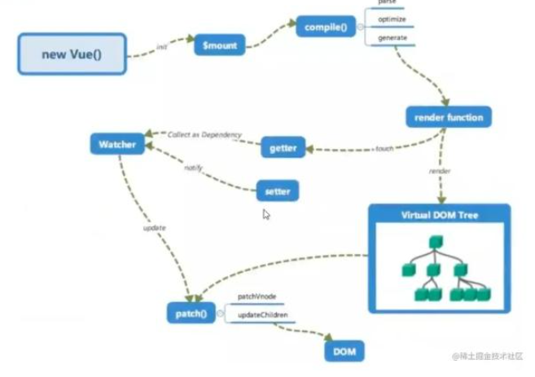
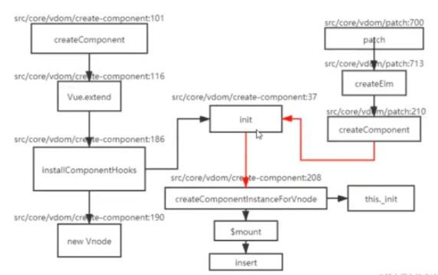

### vue中使用了哪些设计模式?
单例模式：new多次，只有一个实例

工场模式：传入参数就可以创建实例(虚拟节点的创建)

发布订阅模式：eventBus

观察者模式：watch和dep

代理模式：_data属性、proxy、防抖、节流

中介者模式：vuex

策略模式

外观模式

### Vue为什么要用虚拟Dom
虚拟dom就是用js对象来描述真实Dom，是对真实Dom的抽象

由于直接操作Dom性能低，但是js层的操作效率高，可以将Dom操作转化成对象操作。最终通过diff算法比对差异进行更新Dom

虚拟Dom不依赖真实平台环境，可以实现跨平台

### Vue的diff算法原理是什么?
Vue的diff算法是平级比较，不考虑跨级比较的情况。内部采用深度递归的方式+双指针方式比较

先比较两个节点是不是相同节点

相同节点比较属性，复用老节点

先比较儿子节点，考虑老节点和新节点儿子的情况

优化比较：头头、尾尾、头尾、尾头

比对查找，进行复用

### 既然vue通过数据劫持可以精准的探测数据变化，为什么还要进行diff检测差异?
响应式数据变化，Vue确实可以在数据变化的时候，响应式系统可以立刻得知。但是如何每个属性都添加watcher的话，性能会非常的差。

粒度过细，会导致更新不精准

所以采用watcher + Diff算法来检测差异。

### 请说明key的作用和原理
Vue在patch过程中，通过key可以判断两个虚拟节点是否是相同节点。

没有key会导致更新的时候出问题

尽量不要采用索引作为key

### Vue中如何进行依赖收集的?
数组和对象类型的值变化的时候，通过defineReactive方法，借助了defineProperty，将所有的属性添加了getter和setter。用户在取值和设置的时候，可以进行一些操作。

缺陷：只能监控最外层的属性，如果是多层的，就要进行全量递归。

get里面会做依赖搜集(dep[watcher, watcher]) set里面会做数据更新(notify，通知watcher更新)

Vue初始化的时候，挂载之后会进行编译。生成renderFunction。

当取值的时候，就会搜集watcher，放到dep里面。

当用户更改值的时候，就会通知watcher，去更新视图。

### 请描述组件的渲染流程
产生组件虚拟节点 -> 创建组件的真实节点 -> 插入到页面

### 请描述组件的更新流程
属性更新会触发patchVnode方法，组件的虚拟节点会调用prepatch钩子，然后更新属性，更新组件。

