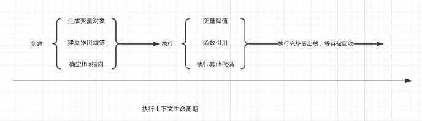

### JavaScript 的执行过程
理解 ESM 的模块导入，这里需要补充一个知识点 —— JavaScript 的执行过程。
#### JavaScript 执行过程分为两个阶段:
1. 编译阶段
2. 执行阶段

#### 编译阶段
在编译阶段 JS 引擎主要做了三件事：
- 词法分析
- 语法分析
- 字节码生成

#### 执行阶段
在执行阶段，会分情况创建各种类型的执行上下文<br>
例如：全局执行上下文 (只有一个)、函数执行上下文。而执行上下文的创建分为两个阶段：
- 创建阶段
- 执行阶段

在创建阶段会做如下事情：
- 绑定 this
- 为函数和变量分配内存空间
- 初始化相关变量为 undefined

我们日常提到的 变量提升 和 函数提升 就是在 创建阶段 做的，所以下面的写法并不会报错：
因为在执行之前的创建阶段，已经分配好了 msg 和 add 的内存空间。
```javaScript
console.log(msg);
add(1,2)

var msg = 'hello'
function add(a,b){
  return a + b;
}
```

### JavaScript 的常见报错类型
SyntaxError 最为特殊，因为它是 编译阶段 抛出来的错误，如果发生语法错误，JS 代码一行都不会执行。而其他类型的异常都是 执行阶段 的错误，就算报错，也会执行异常之前的脚本。
1. RangeError
```javaScript
// 这类错误很常见，例如栈溢出就是 RangeError；
function a () {
  b()
}
function b () {
  a()
}
a()

// out: 
// RangeError: Maximum call stack size exceeded
```

2. ReferenceError 也很常见，打印一个不存在的值就是 ReferenceError：
3. SyntaxError很常见，当语法不符合 JS 规范时，就会报这种错误：
4. TypeError 当一个基础类型当作函数来用时，就会报这个错误：


### JS解析器是如何找到变量的呢？
得对执行上下文有一个进一步的了解。

当调用一个函数时（激活），一个新的执行上下文就会被创建。而一个执行上下文的生命周期可以分为两个阶段。

1. 创建阶段
在这个阶段中，执行上下文会分别创建变量对象，建立作用域链，以及确定this的指向。

2. 代码执行阶段
创建完成之后，就会开始执行代码，这个时候，会完成变量赋值，函数引用，以及执行其他代码。

可以看出详细了解执行上下文极为重要，因为其中涉及到了变量对象，作用域链，this等很多人没有怎么弄明白，但是却极为重要的概念，它关系到我们能不能真正理解JavaScript。




### 先重点了解变量对象
变量对象的创建，依次经历了以下几个过程。
1. 建立arguments对象。检查当前上下文中的参数，建立该对象下的属性与属性值。

2. 检查当前上下文的函数声明，也就是使用function关键字声明的函数。在变量对象中以函数名建立一个属性，属性值为指向该函数所在内存地址的引用。如果函数名的属性已经存在，那么该属性将会被新的引用所覆盖。

3. 检查当前上下文中的变量声明，每找到一个变量声明，就在变量对象中以变量名建立一个属性，属性值为undefined。如果该变量名的属性已经存在，为了防止同名的函数被修改为undefined，则会直接跳过，原属性值不会被修改。
```javaScript
// var foo = 30;
function foo() { console.log('function foo') }
var foo = 20;

console.log(foo); // 20
// console.log(foo()); // 执行错误
/*
既然变量声明的foo遇到函数声明的foo会跳过，可是为什么最后foo的输出结果仍然是被覆盖了？
因为上面的三条规则仅仅适用于变量对象的创建过程。也就是执行上下文的创建过程。foo = 20是在执行上下文的执行过程中运行的，输出结果自然会是20。
*/
```

对比下
```javaScript
console.log(foo); // function foo
function foo() { console.log('function foo') }
var foo = 20;


// 执行顺序为
// 首先将所有函数声明放入变量对象中
function foo() { console.log('function foo') }

// 其次将所有变量声明放入变量对象中，但是因为foo已经存在同名函数，因此此时会跳过undefined的赋值
// var foo = undefined;

// 然后开始执行阶段代码的执行
console.log(foo); // function foo
foo = 20;
```

扩展
```javaScript
foo = 10
console.log(foo); // 10
function foo() { console.log('function foo') }
console.log(foo); // 10
var foo = 20;
console.log(foo); // 20
```


### 在上面的规则中我们看出，function声明会比var声明优先级更高一点。

为了帮助大家更好的理解变量对象，我们结合一些简单的例子来进行探讨。
```javaScript
function test() {
    console.log('test1:',a);
    console.log('test2:',foo());

    var a = 1;
    function foo() {
        return 2;
    }
}

test();
/*
test1: undefined
test2: 2
*/
```

全局作用域中运行test()时，test()的执行上下文开始创建。为了便于理解，我们用如下的形式来表示:
```javaScript
// 创建过程
testEC = {
    // 变量对象
    VO: {},
    scopeChain: {}
}

// 因为本文暂时不详细解释作用域链，所以把变量对象专门提出来说明

// VO 为 Variable Object的缩写，即变量对象
VO = {
    arguments: {...},  //注：在浏览器的展示中，函数的参数可能并不是放在arguments对象中，这里为了方便理解，我做了这样的处理
    foo: <foo reference>  // 表示foo的地址引用
    a: undefined
}

/*
未进入执行阶段之前，变量对象中的属性都不能访问！但是进入执行阶段之后，变量对象转变为了活动对象，里面的属性都能被访问了，然后开始进行执行阶段的操作。

如果再面试的时候被问到变量对象和活动对象有什么区别，他们其实都是同一个对象，只是处于执行上下文的不同生命周期。不过只有处于函数调用栈栈顶的执行上下文中的变量对象，才会变成活动对象。
*/
```

```javaScript
// 执行阶段
VO ->  AO   // Active Object
AO = {
    arguments: {...},
    foo: <foo reference>,
    a: 1,
    this: Window
}
```
所以上面例子执行顺序:
```javaScript
function test() {
    function foo() {
        return 2;
    }
    var a;
    console.log(a);
    console.log(foo());
    a = 1;
}

test();
```

### 加多一个例子
仔细对比这个例子中变量对象从创建阶段到执行阶段的变化，如果你已经理解了，说明变量对象相关的东西都已经难不倒你了。
```javaScript
function test() {
    console.log('test1:',foo);
    console.log('test2:',bar);

    var foo = 'world';
    console.log('test3:',foo);
    var bar = function () {
        return 'say';
    }

    function foo() {
        return 'hello';
    }
}

test();
/*
test1: ƒ foo() {
        return 'hello';
}
test2: undefined
test3: world
*/

// 创建阶段
VO = {
    arguments: {...},
    foo: <foo reference>,
    bar: undefined
}
// 这里有一个需要注意的地方，因为var声明的变量当遇到同名的属性时，会跳过而不会覆盖

// 执行阶段
VO -> AO
VO = {
    arguments: {...},
    foo: 'Hello',
    bar: <bar reference>,
    this: Window
}
```