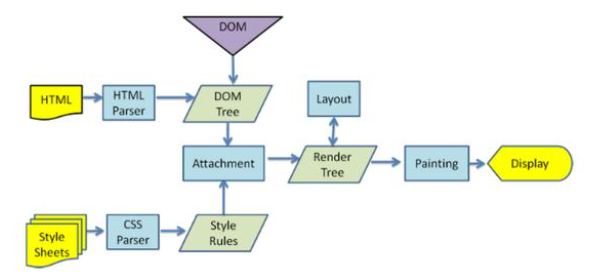
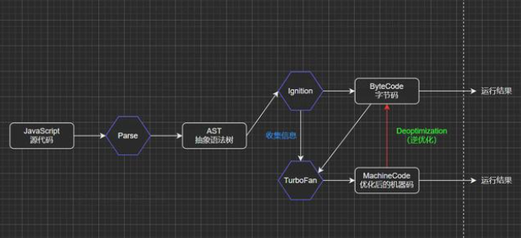
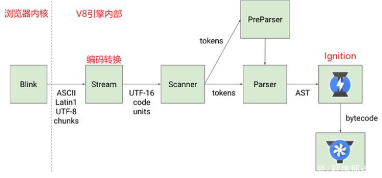

### 概叙
浏览器每新建一个标签页，相当于开启了一个新的进程（进程可以看作是一间工厂），这个进程会实例化js引擎等
（js引擎就是工厂里的一个工具人）


#### 浏览器内核
浏览器内核指的是浏览器的排版引擎（layout engine），也称为浏览器引擎、页面渲染引擎或样版引擎。
浏览器从服务器下载的文件最终要进行解析，这里就涉及到浏览器内核。不同的浏览器由不同的内核构成，以下是几个常见的浏览器内核：
```
Gecko：早期被Netscape和Mozilla Firefox浏览器使用过；

Trident：由微软开发的，IE浏览器一直在使用，但Edge浏览器内核已经转向了Blink；

Webkit：苹果基于KHTML开发，并且是开源的，用于Safari，Google Chrome浏览器早期也在使用；

Blink：Google基于Webkit开发的，是Webkit的一个分支，目前应用于Google Chrome、Edge、Opera等等；
```

#### 浏览器的渲染过程
浏览器从服务器下载完文件后，就需要对其进行解析和渲染，流程如下：
1. HTML Parser将HTML解析转换成DOM树；

2. CSS Parser将样式表解析转换成CSS规则树；

3. 转换完成的DOM树和CSS规则树Attachment（附加）在一起，并生成一个Render Tree（渲染树）；

4. 需要注意的是，在生成Render Tree并不会立即进行绘制，中间还会有一个Layout（布局）操作，也就是布局引擎；
```
为什么需要布局引擎再对Render Tree进行操作？因为不同时候浏览器所处的状态是不一样的（比如浏览器宽度），Layout的作用就是确定元素具体的展示位置和展示效果；

有了最终的Render Tree，浏览器就进行Painting（绘制），最后进行Display展示；

可以发现图中还有一个紫色的DOM三角，实际上这里是js对DOM的相关操作；
在HTML解析时，如果遇到JavaScript标签，就会停止解析HTML，而去加载和执行JavaScript代码；
```


### JavaScript代码由谁来执行呢？下面该JavaScript引擎出场了

#### 为什么需要JavaScript引擎？
JavaScript是一门高级编程语言，所有的高级编程语言都是需要转换成最终的机器指令来执行的；
而我们知道编写的JS代码可以由浏览器或者Node执行，其底层最终都是交给CPU执行；
但是CPU只认识自己的指令集，也就是机器语言，而JavaScript引擎主要功能就是帮助我们将JavaScript代码翻译CPU所能认识指令，最终被CPU执行；

#### JavaScript引擎有哪些？
SpiderMonkey：第一款JavaScript引擎，由Brendan Eich开发（JavaScript作者）；

Chakra：用于IE浏览器，由微软开发；

JavaScriptCore：Webkit中内置的JavaScript引擎，由苹果公司开发；

V8：目前最为强大和流行的JavaScript引擎，由Google开发；
#### 浏览器内核和JS引擎的关系
这里以Webkit内核为例。

实际上，Webkit由两部分组成：
- WebCore：负责HTML解析、布局、渲染等相关的操作；
- JavaScriptCore（JSCore）：解析和执行JavaScript代码；

小程序中编写的JavaScript代码就是由JSCore执行的，也就是小程序使用的引擎就是JavaScriptCore：
渲染层：由Webview来解析和渲染wxml、wxss等；
逻辑层：由JSCore来解析和执行JS代码；


#### V8引擎的原理
先了解一下官方对V8引擎的定义：
V8引擎使用C++编写的Google开源高性能JavaScript和WebAssembly引擎，它用于Chrome和Node.js等，可以独立运行，也可以嵌入到任何C++的应用程序中。。

所以说V8并不单单只是服务于JavaScript的，还可以用于WebAssembly（一种用于基于堆栈的虚拟机的二进制指令格式），并且可以运行在多个平台。

下图简单的展示了V8的底层架构：


### V8引擎的架构
V8的底层架构主要有三个核心模块（Parse、Ignition和TurboFan），接下来对上面架构图进行详细说明
#### Parse模块：将JavaScript代码转换成AST（抽象语法树）。

该过程主要对JavaScript源代码进行词法分析和语法分析；

词法分析：对代码中的每一个词或符号进行解析，最终会生成很多tokens（一个数组，里面包含很多对象）；

比如，对const name = 'curry'这一行代码进行词法分析：
```
// 首先对const进行解析，因为const为一个关键字，所以类型会被记为一个关键词，值为consttokens: [  { type: 'keyword', value: 'const' }]// 接着对name进行解析，因为name为一个标识符，所以类型会被记为一个标识符，值为nametokens: [  { type: 'keyword', value: 'const' },  { type: 'identifier', value: 'name' }]// 以此类推...
```

语法分析：在词法分析的基础上，拿到tokens中的一个个对象，根据它们不同的类型再进一步分析具体语法，最终生成AST；

以上即为简单的JS词法分析和语法分析过程介绍，如果想详细查看我们的JavaScript代码在通过Parse转换后的AST，可以使用AST Explorer工具
AST在前端应用场景特别多，比如将TypeScript代码转成JavaScript代码、ES6转ES5、还有像vue中的template等，都是先将其转换成对应的AST，然后再生成目标代码；

参考官方文档：https://v8.dev/blog/scanner

#### Ignition模块：一个解释器，可以将AST转换成ByteCode（字节码）。
字节码（Byte-code）：是一种包含执行程序，由一序列 op 代码/数据对组成的二进制文件，是一种中间码。

将JS代码转成AST是便于引擎对其进行操作，前面说到JS代码最终是转成机器码给CPU执行的，为什么还要先转换成字节码呢？

因为JS运行所处的环境是不一定的，可能是windows或Linux或iOS，不同的操作系统其CPU所能识别的机器指令也是不一样的。字节码是一种中间码，本身就有跨平台的特性，然后V8引擎再根据当前所处的环境将字节码编译成对应的机器指令给当前环境的CPU执行。

参考官方文档：https://v8.dev/blog/ignition-interpreter

#### TurboFan模块：一个编译器，可以将字节码编译为CPU认识的机器码。
在了解TurboFan模块之前可以先考虑一个问题，如果每执行一次代码，就要先将AST转成字节码然后再解析成机器指令，是不是有点损耗性能呢？强大的V8早就考虑到了，所以出现了TurboFan这么一个库；

TurboFan可以获取到Ignition收集的一些信息，如果一个函数在代码中被多次调用，那么就会被标记为热点函数，然后经过TurboFan转换成优化的机器码，再次执行该函数的时候就直接执行该机器码，提高代码的执行性能；

图中还存在一个Deoptimization过程，其实就是机器码被还原成ByteCode，比如，在后续执行代码的过程中传入热点函数的参数类型发生了变化（如果给sum函数传入number类型的参数，那么就是做加法；如果给sum函数传入String类型的参数，那么就是做字符串拼接），可能之前优化的机器码就不能满足需求了，就会逆向转成字节码，字节码再编译成正确的机器码进行执行；

从这里就可以发现，如果在编写代码时给函数传递固定类型的参数，是可以从一定程度上优化我们代码执行效率的，所以TypeScript编译出来的JavaScript代码的性能是比较好的；

参考官方文档：https://v8.dev/blog/turbofan-jit

#### V8引擎执行过程
V8引擎的官方在Parse过程提供了以下这幅图，最后就来详细了解一下Parse具体的执行过程。

①Blink内核将JS源码交给V8引擎；

②Stream获取到JS源码进行编码转换；

③Scanner进行词法分析，将代码转换成tokens；

④经过语法分析后，tokens会被转换成AST，中间会经过Parser和PreParser过程：

因为并不是所有的JavaScript代码，在一开始时就会执行的，如果一股脑对所有JavaScript代码进行解析，必然会影响性能，所以V8就实现了Lazy Parsing（延迟解析）方案，对不必要的函数代码进行预解析，也就是先解析急需要执行的代码内容，对函数的全量解析会放到函数被调用时进行。

Parser：直接解析，将tokens转成AST树；

PreParser：预解析（为什么需要预解析？）

⑤生成AST后，会被Ignition转换成字节码，然后转成机器码，最后就是代码的执行过程了；