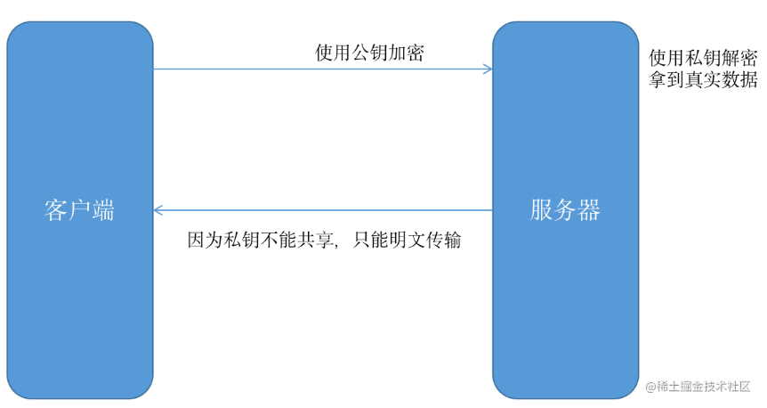
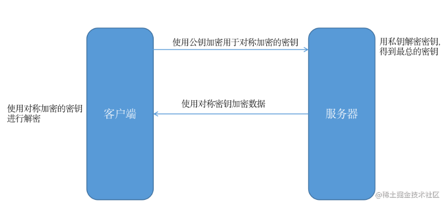

#### Http与Https的区别
- 在OSI 网络模型中，HTTP工作于应用层，而HTTPS 的安全传输机制工作在传输层

- HTTP 无法加密，而HTTPS 对传输的数据进行加密,HTTP 是不安全的，而 HTTPS 是安全的

- HTTP无需证书，而HTTPS 需要CA机构wosign的颁发的SSL证书

- HTTP 标准端口是80 ，而 HTTPS 的标准端口是443

#### 1.HTTPS 是身披 SSL 外壳的 HTTP
HTTPS 并非是应用层的一种新协议。只是 HTTP 通信接口部分用 SSL（Secure Socket Layer）和 TLS（Transport Layer Security）协议代替而已。 通常，HTTP 直接和 TCP 通信。当使用 SSL 时，则演变成先和 SSL 通信，再由 SSL 和 TCP 通信了。简言之，所谓 HTTPS，其实就是身披 SSL 协议这层外壳的 HTTP。

在采用 SSL 后，HTTP 就拥有了 HTTPS 的加密、证书和完整性保护这些功能。 SSL 是独立于 HTTP 的协议，所以不光是 HTTP 协议，其他运行在应用层的 SMTP 和 Telnet 等协议均可配合 SSL 协议使用。可以说 SSL 是当今世界上应用最为广泛的网络安全技术。

#### 2.HTTP+ 加密 + 认证 + 完整性保护 =HTTPS
```
如果在 HTTP 协议通信过程中使用未经加密的明文，比如在 Web 页面中输入信用卡号，如果这条通信线路遭到窃听，那么信用卡号就暴露了。 另外，对于 HTTP 来说，服务器也好，客户端也好，都是没有办法确认通信方的。因为很有可能并不是和原本预想的通信方在实际通信。并且还需要考虑到接收到的报文在通信途中已经遭到篡改这一可能性。 为了统一解决上述这些问题，需要在 HTTP 上再加入加密处理和认证等机制。我们把添加了加密及认证机制的 HTTP 称为 HTTPS（HTTP Secure）
```
```
经常会在 Web 的登录页面和购物结算界面等使用 HTTPS 通 信。使用 HTTPS 通信时，不再用 http://，而是改用 https://。另外，当浏览器访问 HTTPS 通信有效的 Web 网站时，浏览器的地址栏内会出现一个带锁的标记。对 HTTPS 的显示方式会因浏览器的不同而有所改变。
```

#### HTTPS 的加密方式是什么
先了解**对称加密**就是加密和解密使用的密钥是一样的，比如我也可以自己规定一种加密方式，如下所示：

具体实现
在每次发送真实数据之前，客户端先生成一把密钥，然后先把密钥传输给服务端。之后客户端给服务端发送真实数据的时候，会用这把密钥对数据进行加密，服务端收到加密数据之后，用刚才收到的密钥进行解密。


这种加密方式运用在客户端与服务器数据传输安全吗，显然是不安全的，因为密钥也需要被传输，而且是明文传输。
优点
- 加密算法与解密算法想同。
- 加密算法的优点：加密解密的效率很高；
- 加密算法的缺点：容易被劫持，使用时间稍长就会被中间劫持，根据数据规率找破解出加密算法。
- 解决方案：可以每次通信都动态协商一个加密算法，但还是有可能被劫持掉。
```javaScript
// 密钥
var secretKey = 666

// 加密方法
function encrypt(val){
    return val * 666
}
// 解密方法
function deciphering(val){
    return val/666
}
```
**非对称加密**
```
非对称加密算法需要两个密钥：公开密钥（publickey:简称公钥）和私有密钥（privatekey:简称私钥）。公钥与私钥是一对，如果用公钥对数据进行加密，只有用对应的私钥才能解密。因为加密和解密使用的是两个不同的密钥，所以这种算法叫作非对称加密算法。

密钥形式
公钥与私钥是一对。传输双方均有自己的一对密钥（也就是双方每方均有：公、私密钥一把，双方加起来共4把）

例子:传输双方比如是甲乙双方，甲方有配对的公、私密钥一对，且公钥负责加密，私钥负责解对应的公钥加的密。乙方同理。

优缺点
非对称密钥的算法强度复杂（是优点也是缺点），安全性依赖于算法与密钥。 优点：安全性较高，比对称密钥安全性高很多。 非对称加密算法的保密性比较好，它消除了最终用户交换密钥的需要。 缺点：由于其算法复杂，而使得加密解密速度没有对称加密解密的速度快。

具体实现
1.客户端要向服务器发送信息，客户端和服务器都要产生一对用于加密和解密的公钥和私钥。 
2.客户端的私钥保密，客户端的公钥告诉服务器；服务器的私钥保密，服务器的公钥告诉客户端。 
3.客户端要给服务器发送信息时，客户端用服务器的公钥加密信息，因为服务器的公钥是公开的，客户端可以得到。 
4.客户端将这个消息发给服务器（已经用服务器的公钥加密消息）。 
5.服务器收到这个消息后，服务器用自己的私钥解密客户端的消息。其他所有收到这个报文的人都无法解密，因为只有服务器才有服务器的私钥。
```
非对称加密就是使用公钥加密的数据只能用私钥解密，使用私钥加密的数据只能用公钥解密。

- 加密算法：加密和解密的算法不同。—服务器生成一对公钥和私钥；将公钥传给客户端，客户端用公钥进行加密，服务端使用私钥解密。
- 公钥和私钥：通过加密算法—RSA算法，得到一对密钥（就是两串字符），公钥用于对数据加密 ，私钥用于对数据解密。因为加密和解密的方式不同，因此很难被破解。就算公钥被劫持，但客户端使用公钥加密的数据只能用私钥解密。
- 优点：安全性高，不容易被破解。
- 缺点：解密效率比较低。
- 对称加密算法和非对称加密算法结合起来：①将客户端与服务端动态协商对称算法过程用非对称算法加密起来；②使用协商的对称加密算法对数据通信过程进行加密，这样既保证了安全，也提高了效率。
- 存在的问题：若中间黑客劫持了服务器发送给客户端的公钥，然后将自己的公钥发送给客户端，因为客户端不知道服务端的身份，所以就出现数据被劫持。若客户端能够知道服务无端身份，就不怕劫持了，所以又引进了：签名证书。

比如现在浏览器有公钥（可公开），服务器有私钥（不公开），数据传输如下：

客户端可以使用公钥进行加密服务端使用私钥解密，但是服务端给客户端发数据时就不能进行加密了，因为客户端只有公钥，服务端只有私钥，
如果要加密，服务端只能把私钥也传给客户端，客户端才能解密，这样显然没什么意义了。

#### HTTPS采用的加密方式
既然对称和非对称加密都不安全，那 HTTPS 是使用什么加密方式呢？答案是 在传输数据阶段依然使用对称加密，但是 对称加密的密钥  我们采用非对称加密来传输。

如下图所示：（实际流程复杂的多，这里为了便于理解只演示核心流程）


使用了对称和非对称加密相结合后数据可以被安全的传输了，现在数据是安全了，但是并不能保证我们访问的站点安全。也就是黑客可以通过 DNS 劫持，把用户要访问的站点直接换成其他站点。那这个问题如何解决呢？

答案是添加数字证书，就是让服务器像浏览器证明 “我就是我”。而且对称加密的密钥也被存放在数字证书里面。

这样以来，即使 DNS 被劫持了，但是假的服务器并不能提供对应的数据证书（不能伪造），自然就建立不了连接。

##### 签名证书（CA）
- 签名证书：进行身份验证；并且传送公钥信息，公司生成一对密钥之后，拿到权威机构处生成一个签名证书，证书包含：公钥信息，权威机构信息，公司机构信息，有效时间等。
- SSl加密过程：在通信的时候，连接建立之后，服务器先向客户端传送证书，客户端通过证书的信息进行验证：①若身份验证不通过，则可以直接断开连接，若身份验证通过，然后用证书中的公钥加密对称算法的协商过程，最终利用协商好的对称加密算法对数据通信进行加密。


#### https的加密方式
采用的是处理信息的方式是：结合对称加密+非对称加密这两种方式，我们可以用非对称加密的方式来传输对称加密过程中的密钥，之后我们就可以采取对称加密的方式来传输数据了。

```
服务器用明文的方式给客户端发送自己的公钥，客户端收到公钥之后，会生成一把密钥(对称加密用的)，然后用服务器的公钥对这把密钥进行加密，之后再把密钥传输给服务器，服务器收到之后进行解密，最后服务器就可以安全得到这把密钥了，而客户端也有同样一把密钥，他们就可以进行对称加密了。


但是，非对称加密的方式也并非万无一失，在此举个例子：

服务器以明文的方式给客户端传输公钥的时候，中间人截取了这把属于服务器的公钥，并且把中间人自己的公钥冒充服务器的公钥传输给了客户端。

之后客户端就会用中间人的公钥来加密自己生成的密钥。然后把被加密的密钥传输给服务器，这个时候中间人又把密钥给截取了，中间人用自己的私钥对这把被加密的密钥进行解密，解密后中间人就可以获得这把密钥了。

最后中间人再对这把密钥用刚才服务器的公钥进行加密，再发给服务器。

毫无疑问，在这个过程中，中间人获取了对称加密中的密钥，在之后服务器和客户端的对称加密传输中，这些加密的数据对中间人来说，和明文没啥区别。
```

#### 证书
```
非对称性加密之所以不安全，是应为客户端不知道，这把公钥是不是服务器的。

因此，我们需要找到一种策略来证明这把公钥就是服务器的，而不是别人冒充的,就像身份证一样，唯一标识我们服务器的公钥，解决这个问题的方式就是使用数字证书，具体是这样的.

互联网世界中充当公理的机构来签发这个证书，它就是CA机构，它是如今互联网世界正常运作的前提，而CA机构颁发的“身份证”就是数字证书：

网站在使用HTTPS前，需要向CA机构申领一份数字证书，数字证书里含有证书持有者信息、公钥信息等。服务器把证书传输给浏览器，浏览器从证书里获取公钥就行了，证书就如身份证，证明“该公钥对应该网站”。而这里又有一个显而易见的问题，“证书本身的传输过程中，如何防止被篡改”？即如何证明证书本身的真实性？身份证运用了一些防伪技术，而数字证书怎么防伪呢？

我们把证书原本的内容生成一份“签名”，比对证书内容和签名是否一致就能判别是否被篡改。这就是数字证书的“防伪技术”，这里的“签名”就叫数字签名：

数字签名的制作过程：
CA机构拥有非对称加密的私钥和公钥。

CA机构对证书明文数据T进行hash。

对hash后的值用私钥加密，得到数字签名S。

明文和数字签名共同组成了数字证书，这样一份数字证书就可以颁发给网站了。
```

浏览器验证过程：
```
拿到证书，得到明文T，签名S。

用CA机构的公钥对S解密（由于是浏览器信任的机构，所以浏览器保有它的公钥。详情见下文），得到S’。

用证书里指明的hash算法对明文T进行hash得到T’。

显然通过以上步骤，T’应当等于S‘，除非明文或签名被篡改。所以此时比较S’是否等于T’，等于则表明证书可信。

这样的加密和验证方式的双重保险之下，基本就能保证我们的连接以及数据交互的安全，拥有这样证书和签名的网站我们访问起来有一把小锁的标识，说明我们的访问是安全的。


```