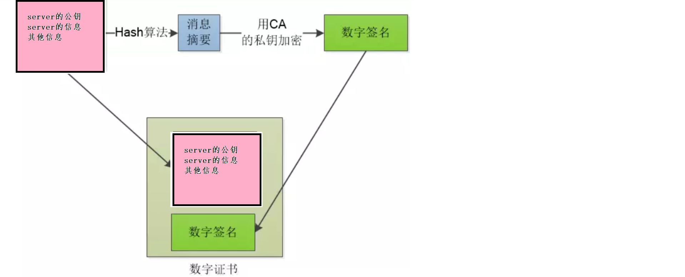

## 简要过程
浏览器缓存——>DNS域名解析——>TCP连接——>HTTP请求与响应——->DOM渲染——>TCP关闭
1. 使用DNS域名解析（域名和服务器IP对应关系保存在hosts文件中），找到对应服务器IP
2. 发起TCP（传输连接协议）三次握手建立连接（ 建立连接三次 ）
3. 建立tcp连接后发起请求(包括端口路径，请求参数和各种信息)
4. 服务器响应（response）http请求（浏览器获取HTML页面
5. 浏览器解析html代码，当解析时遇到css或js文件，就向服务器请求并下载对应的css文件和js文件
6. 浏览器对页面进行渲染，执行js代码；
7. 释放连接四次

## 为什么不是四次握手或者两次握手？
不是两次握手的原因?
```
为了防止失效的连接请求报文段突然又传送到主机B，因而产生错误。

失效的连接请求报文段是指：主机A发出的连接请求没有收到主机B的确认，于是经过一段时间后，主机A又重新向主机B发送连接请求，
且建立成功，顺序完成数据传输。

考虑这样一种特殊情况，主机A第一次发送的连接请求并没有丢失，而是因为网络节点导致延迟达到主机B，主机B以为是主机A又发起
的新连接，于是主机B同意连接，并向主机A发回确认，但是此时主机A根本不会理会，主机B就一直在等待主机A发送数据，导致主机B
的资源浪费。（这就是缺少第三次握手(A再给B确认））
```
## tcp四次挥手
A:我没有数据发给你了，你如果还有数据发给我，就继续发吧
B：我知道了，我发完了告诉你
B：我也发完了，你可以关了 
A：我知道了，我断开了，可以确认断开了

## TCP连接和HTTP请求之间的联系？
HTTP是比TCP更高层次的应用层协议，根据规则，只有低层协议建立之后才能，才能进行更高层协议的连接，因此，首先要建立TCP连接，
一般TCP连接的端口号是80

一个TCP连接可发送多个HTTP请求，可保持TCP连接，一个 TCP 连接中 HTTP 请求依次发送。

## http
http缺点：明文不加密（会被窃听）【加密算法】，不验证身份（可能被伪装）【数字证书】，不验证信息完整（可能被修改）【数字签名】

### 加密方式
1.单密钥加密：公用一个密钥来对消息进行加密解密，客户端和服务器约定好一个加密的密钥，然后通过密钥对信息进行加密，然后传输，然后解密
常见对称加密算法DES，AES

2.非对称加密
（加密解密使用的是不同的密钥，所以是非对称）：（一组密钥，一个公钥，一个私钥，并且只知道公钥无法推断出私钥，而且 通过公钥加密的内容，
只有私钥才可以解开，而通过私钥加密的内容，只有公钥才可以解开。 ）
```
小红生成一对密钥，一公一私。发过去公钥key1

然后现在小灰有了小红的公钥key1,小灰自己生成一个密钥key2（公钥），用key1对key2进行加密，发给小红

小红现在使用自己的密钥，解开了公钥key1,然后有了key2，然后，就可以使用key2进行加密通信了。

相同的，小灰要和小红通信也是一样的。

常见非对称加密算法RSA，DSA
```

## 数字证书和数字签名
如上所说，为了解决公钥来源的不安全性，引入第三方 数字证书认证中心（CA）

服务器可以向CA来申请数字证书

小红：拿着公钥key1和其他信息去CA申请数字证书
```
CA：

（CA公钥公开，私钥特别保护，CA拿到信息之后，使用单向hash算法，比如常见的MD5，对信息进行加密，加密后称为摘要，CA私钥对摘要进行加密变成数字签名，数字签名和各种信息合在一起成为数字证书）

小红：把证书发给小灰

小灰：验证证书真假（ 各大浏览器和操作系统已经维护了所有权威证书机构的名称和公钥 ），去看是哪个机构，然后从本地拿到机构的公钥解密数字签名，然后按照相同的规则小灰把其他的信息（不是摘要）也生成一信息摘要，摘要一致，证书有效，然后从解码的信息中得到小红的公钥key1

A1:公钥，123:其他信息(时间 host各种需要的信息) ，C2:CA私钥

A1（123）---> CA C2(MD5(A1+123))+A1+123+MD5 最后对比MD5(A1+123)是否一致

小灰：然后自己生成的公钥key2，使用小红的公钥加密key2，发给小红，小红用自己的私钥解开得到key2，然后进行通信

无法篡改的原因？

1.拿到证书，如果伪造证书，但是你没有CA的密钥C2

2.如果直接使用原数据，可以解密后看数据，证书里面是有host的，如果你的网站的host和证书不一致，也不行
```

1.HTTPS是什么？
HTTP+ 加密 + 认证 + 完整性保护 =HTTPS

## SSL的基本概念
SSL/TLS协议提供的服务主要有：

- 认证用户和服务器，确保数据发送到正确的客户机和服务器；
- 加密数据以防止数据中途被窃取；
- 维护数据的完整性，确保数据在传输过程中不被改变。

```
基本思路：公钥加密

客户端先向服务器端索要公钥，然后用公钥加密信息，服务器收到密文后，用自己的私钥解密

公钥放在数字证书中，证书可信，公钥即可信
```


SSL（Secure Socket Layer，安全套接字层）/TLS(Transport Layer Security，传输层安全协议)

TLS 是以SSL 为原型开发的协议，有时会统一称该协议为 SSL。*当前主流的版本是SSL3.0 和 TLS1.0

SSL位于应用层和传输层之间，所以可以为任何基于TCP等可靠连接的应用层协议提供安全性保证，用于Web浏览器和服务器之间的身份认证和加密数据传输.

SSL{SSL记录层：位于可靠的传输之上（比如TCP），提供压缩，认证，加密等功能

SSL握手层：位于ssl记录层之上，提供数据传输前的身份验证，协商算法，交换密钥等功能。}

（2）SSL/TLS握手阶段（建立通信连接）

（1）浏览器发出加密通信的请求（ClientHello）



参考：
https://zhuanlan.zhihu.com/p/418178630