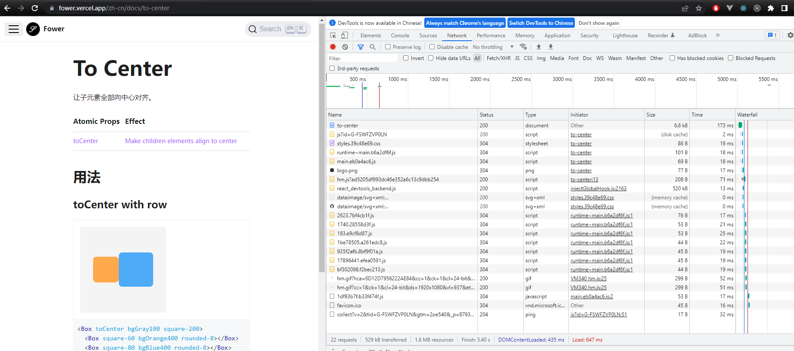
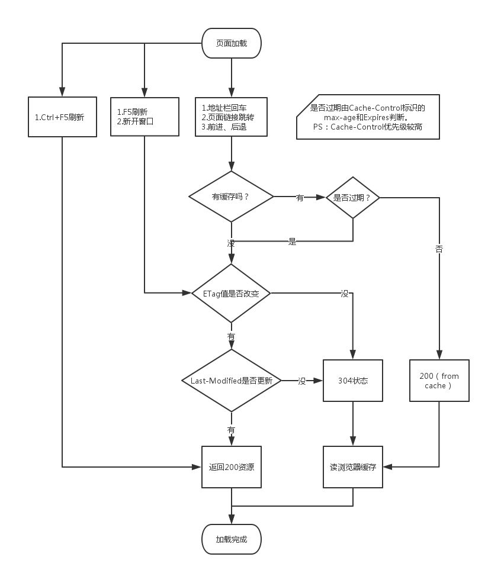

#### 首先： html是一种标记语言，用来描述和标记的，不能实现缓存。
html里面的JavaScript代码是当这个html页面加载时浏览器解释执行，也不可以实现数据缓存

参考：
如何避免js 被缓存
https://www.likecs.com/show-383960.html

#### webpack 如何解决js被缓存
1.文件名
我们可以通过修改 webpack 中 output.filename ，来定义输出文件的名称。
```
如果你有一个体积巨大的文件，并且只改了一行代码，用户仍然需要重新下载整个文件。
解决思路：

我们需要让内容发生变化的文件重新命名，没有发生变化的文件不需要重新命名，读取缓存。
文件拆分，把它分为了两个文件，那么用户只需要下载那个被修改的文件即可，浏览器可以从缓存中加载另一个文件。
将 output.filename 设置为 filename: '[name].[contenthash].js' 来定义输出文件的名称。
```

2.拆分第三方库
日常开发时，安装的第三方库（例如 lodash 或 react）很少像本地的源代码那样频繁修改，是不是可以将它们缓存起来。
我们可以将它们提取到单独的 vendor chunk 文件中。利用浏览器的长效缓存机制，命中缓存来消除请求，并减少向服务器获取资源，同时还能保证浏览器代码和服务器代码版本一致。

#### 强缓存
可见请求带有：
- disk cache  磁盘缓存
此时的数据时缓存到内存中的，当kill进程后，也就是浏览器关闭以后，数据将不存在。但是这种方式只能缓存派生资源

- memory cache 内存缓存
直接从磁盘中读取缓存，当kill进程时，数据还是存在。

强缓存作为性能优化中缓存方面最有效的手段，能够极大的提升性能。 由于强缓存不会向服务端发送请求，对服务端的压力也是大大减小。
对于不太经常变更的资源，可以设置一个超长时间的缓存时间，比如一年。 浏览器在首次加载后，都会从缓存中读取。但是由于不会向服
务端发送请求，那么如果资源有更改的时候，怎么让浏览器知道呢？

现在常用的解决方法是加一个?v=xxx的后缀，在更新静态资源版本的时候，更新这个v的值，这样相当于向服务端发起一个新的请求，从而达到更新静态资源的目的。

#### 浏览器对于缓存什么策略或者机制？
决定使用哪种缓存的应该是客户端
结论：所以实际应用中，遇到资源更新之后，还是有缓存的情况，除了刷新cdn，还要检查下是否有设置http响应头，做对应的缓存过期时间处里，如果没有做缓存
过期策略，如果客户端缓存的资源，并且走了 disk cache，可能怎么刷新都没办法获取最新的资源。

##### 1.三级缓存原理
```
1. 先去内存看，如果有，直接加载

2. 如果内存没有，择取硬盘获取，如果有直接加载

3. 如果硬盘也没有，那么就进行网络请求

4. 加载到的资源缓存到硬盘和内存

比如：访问图片-> 200 -> 退出浏览器

再进来-> 200(from disk cache) -> 刷新 -> 200(from memory cache)
```


##### 2.http header
- max-age

- Expires 指定的时间根据服务器配置可能有两种：
   1. 文件最后访问时间
   2. 文件绝对修改时间
如果max-age和Expires同时存在，则被Cache-Control的max-age覆盖

- last-modified
WEB 服务器认为对象的最后修改时间，比如文件的最后修改时间，动态页面的最后产生时间
- Cache-Control 强缓存
- ETag 对象（比如URL）的标志值，就一个对象而言，文件被修改，Etag也会修改


