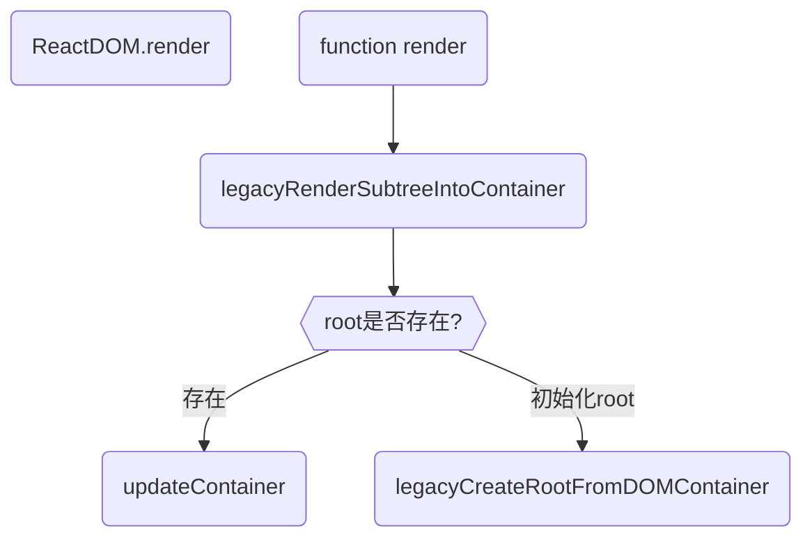

```mermaid
flowchart TB
A1(ReactDOM.render)
B2(function render)

B3(legacyRenderSubtreeIntoContainer)
B2-->B3

B3-->B3-1{{root是否存在?}}
B3-1--存在-->C2(updateContainer)
B3-1--初始化root-->C1(legacyCreateRootFromDOMContainer)
```