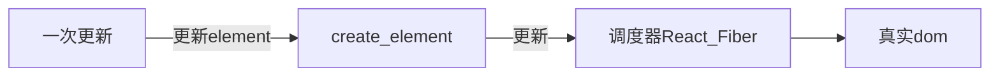
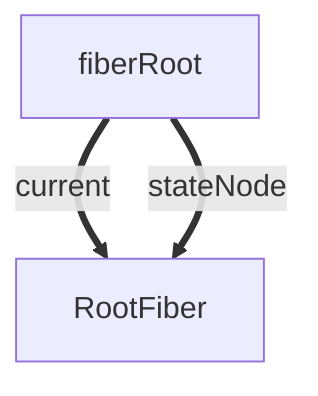

## 前言
### 大型应用为什么会慢?
在构建复杂的大型应用的时候，各种页面之前的相互操作和更新很有可能会引起页面的重绘或重排列，而频繁操作这些dom其实是非常消耗性能的
```javaScript
这是一个节点上的属性，可以看到一个节点上的属性是非常多的，在复杂应用中，操作这些属性的时候可能一不小心就会引起节点大量的更新，那如何提高应用的性能呢？

const div = document.createElement('div');
let str = ''
for(let k in div){
  str+=','+k
}
console.log(str)
```

### 为什么会出现Fiber
react在进行组件渲染时，从setState开始到渲染完成整个过程是同步的（“一气呵成”）。如果需要渲染的组件比较庞大，js执行会占据主线程时间较长，会导致页面响应度变差，使得动画、手势交互等事件产生卡顿。

React 提供pureComponent,shouldComponentUpdate，useMemo,useCallback让开发者来操心哪些subtree是需要重新渲染的，哪些是不需要重新渲染的。究其本质，是因为 React 采用 jsx 语法过于灵活，不理解开发者写出代码所代表的意义，没有办法做出优化。


为什么JS长时间执行会影响交互响应、动画？因为JavaScript在浏览器的主线程上运行，恰好与样式计算、布局以及许多情况下的绘制一起运行。如果JavaScript运行时间过长，就会阻塞这些其他工作，可能导致掉帧。

因此，为了解决以上的痛点问题，React希望能够彻底解决主线程长时间占用问题，于是引入了 Fiber 来改变这种不可控的现状，把渲染/更新过程拆分为一个个小块的任务，通过合理的调度机制来调控时间，指定任务执行的时机，从而降低页面卡顿的概率，提升页面交互体验。通过Fiber架构，让reconcilation过程变得可被中断。适时地让出CPU执行权，可以让浏览器及时地响应用户的交互。

### react fiber的任务
- 把渲染/更新过程拆分为更小的、可中断的工作单元
- 在浏览器空闲时执行工作循环
- 将所有执行结果汇总patch到真实DOM上

react 把渲染/更新过程分为2个阶段（diff + patch）：
1. diff ~ render/reconciliation
2. patch ~ commit

```
diff的实际工作是对比prevInstance和nextInstance的状态，找出差异及其对应的DOM change。
diff本质上是一些计算（遍历、比较），是可拆分的（算一半待会儿接着算） 
```

```
patch阶段把本次更新中的所有DOM change应用到DOM树，是一连串的DOM操作。
些DOM操作虽然看起来也可以拆分（按照change list一段一段做），但这样做一方面可能造成DOM实际状态与维护的内部状态不一致，另外还会影响体验。而且，一般场景下，DOM更新的耗时比起diff及生命周期函数耗时不算什么，拆分的意义不很大
```
所以，render/reconciliation阶段的工作（diff）可以拆分，commit阶段的工作（patch）不可拆分
### 怎么拆？
react的拆分单位是fiber（fiber tree上的一个节点）

在更新的时候可能会更新大量的dom，所以react在应用层和dom层之间增加了一层Fiber，而Fiber是在内存中工作的，所以在更新的时候只需要在内存中进行dom更新的比较，最后再应用到需要更新真实节点上

- 在react15之前，这个对比的过程被称之为stack reconcile，它的对比方式是‘一条路走到黑’，也就是说这个对比的过程是不能被中断的，这会出现什么情况呢，比如在页面渲染一个比较消耗性能操作，如果这个时候如果用户进行一些操作就会出现卡顿，应用就会显得不流畅。

- react16之后出现了scheduler，以及react17的Lane模型，它们可以配合着工作，将比较耗时的任务按照Fiber节点划分成工作单元，并且遍历Fiber树计算或者更新节点上的状态可以被中断、继续，以及可以被高优先级的任务打断，比如用户触发的更新就是一个高优先级的任务，高优先级的任务优先执行，应用就不会太卡顿。


### 为什么Fiber能提升效率?
1. Fiber双缓存可以在构建好wip Fiber树之后切换成current Fiber，内存中直接一次性切换，提高了性能

2. Fiber的存在使异步可中断的更新成为了可能，作为工作单元，可以在时间片内执行工作，没时间了交还执行权给浏览器，下次时间片继续执行之前暂停之后返回的Fiber

3. Fiber可以在reconcile的时候进行相应的diff更新，让最后的更新应用在真实节点上

## 1.fiber 概念和结构
Fiber 的英文含义是“纤维”，它是比线程（Thread）更细的线，比线程（Thread）控制得更精密的执行模型。在广义计算机科学概念中，Fiber 又是一种协作的（Cooperative）编程模型，帮助开发者用一种【既模块化又协作化】的方式来编排代码。

Fiber 就是 React 16 实现的一套新的更新机制，让 React 的更新过程变得可控，避免了之前一竿子递归到底影响性能的做法。

它是Fiber树结构的节点单位
Fiber是一个链表数据结构（环状链表）
```
Child 指向 当前Fiber的第一个子节点
Sibling 指向当前Fiber的的下一个兄弟节点
Return 指向当前 Fiber 节点的 父节点
```

fiber 是react中最小的执行单位，可以理解为fiber就是虚拟DOM。
是一个js对象，能承载节点信息、优先级、updateQueue，同时它还是一个工作单元。

fiber 根据优先级暂停、继续、排列优先级：Fiber节点上保存了优先级，能通过不同节点优先级的对比，达到任务的暂停、继续、排列优先级等能力，也为上层实现批量更新、Suspense提供了基础


更新 fiber 的过程叫做 Reconciler（调度器）

### 2.element,fiber, DOM 之间的关系？
- element 就是jsx语法，通过React.createElement创建成element对象.
- DOM 就是浏览器的DOM
- fiber：每一次的 element 变化都会通过 调和 fiber 来 触发真实 DOM 渲染。



### fiber结构
每一个 element 都会对应一个 fiber ，每一个 fiber 是通过 return ， child ，sibling 三个属性建立起联系的。

- return： 指向父级 Fiber 节点。
- child：指向子 Fiber 节点。
- sibling：指向兄弟 fiber 节点。

1.简略属性:
```javaScript
function FiberNode(){

    ....

  this.key = key;                  // key调和子节点时候用到。 
  
  this.return = null;              // 指向父级fiber
  this.child = null;               // 指向子级fiber
  this.sibling = null;             // 指向兄弟fiber 
  this.index = 0;                  // 索引

  this.expirationTime = NoWork;    // 通过不同过期时间，判断任务是否过期， 在v17版本用lane表示。

  this.alternate = null;           //双缓存树，指向缓存的fiber。更新阶段，两颗树互相交替。
  
  ....
}
```

2.详细属性：
```javaScript
function FiberNode(
  tag: WorkTag,
  pendingProps: mixed,
  key: null | string,
  mode: TypeOfMode,
) {
  //作为静态的数据结构 保存节点的信息 
  this.tag = tag;//对应组件的类型
  this.key = key;//key属性
  this.elementType = null;//元素类型
  this.type = null;//func或者class
  // 管理 instance 自身的特性
  this.stateNode = null;//真实dom节点

  //作为fiber数架构 连接成fiber树
  this.return = null;//指向父节点
  this.child = null;//指向child
  this.sibling = null;//指向兄弟节点
  this.index = 0;

  this.ref = null;

  //用作为工作单元 来计算state
  this.pendingProps = pendingProps;
  this.memoizedProps = null;
  this.updateQueue = null;
  this.memoizedState = null;
  this.dependencies = null;

  this.mode = mode;
    
	//effect相关
  this.effectTag = NoEffect;
  /*
 effectTag、nextEffect、firstEffect、lastEffect为effect相关信息，保存当前diff的成果。这些参数共同为后续的工作循环提供了可能，使react可以在执行完每个fiber时停下，根据浏览器的繁忙情况判断是否继续往下执行，因此我们也可以将fiber理解成一个工作单元。 
  */
  // 单链表结构，方便遍历 Fiber Tree 上有副作用的节点
  this.nextEffect = null;
  this.firstEffect = null;
  this.lastEffect = null;

  //优先级相关的属性
  this.lanes = NoLanes;
  this.childLanes = NoLanes;

  // 在fiber更新时克隆出的镜像fiber，对fiber的修改会标记在这个fiber上（实际上是两颗fiber数，用于更新缓存，提升运行效率）
  // current和workInProgress的指针
  this.alternate = null;
}
```

结构例子：
```javaScript
export default class Index extends React.Component{
   state={ number:666 } 
   handleClick=()=>{
     this.setState({
         number:this.state.number + 1
     })
   }
   render(){
     return <div>
       hello，world
       <p > 《React进阶实践指南》 { this.state.number }   </p>
       <button onClick={ this.handleClick } >点赞</button>
     </div>
   }
}
```

## fiber对应的关系如下 mermaid 流程见辅助文件
```
```

## fiber Fiber是怎样工作的?
真实dom对应在内存中的Fiber节点形成Fiber树，这颗Fiber树在react中叫current Fibe，

而正在构建Fiber树叫workInProgress Fiber，这两颗树的节点通过alternate相连.

构建workInProgress Fiber发生在createWorkInProgress中，它能创建或者复用Fiber
```javaScript
export function createWorkInProgress(current: Fiber, pendingProps: any): Fiber {
  let workInProgress = current.alternate;
  // 区分是在mount时还是在update时
  if (workInProgress === null) {
    workInProgress = createFiber(
      current.tag,
      pendingProps,
      current.key,
      current.mode,
    );
    workInProgress.elementType = current.elementType;
    workInProgress.type = current.type;
    workInProgress.stateNode = current.stateNode;
   
    workInProgress.alternate = current;
    current.alternate = workInProgress;
  } else {
    // 复用属性
    workInProgress.pendingProps = pendingProps;
    workInProgress.type = current.type;
    workInProgress.flags = NoFlags;

    workInProgress.nextEffect = null;
    workInProgress.firstEffect = null;
    workInProgress.lastEffect = null;
	
    //...
  }

  workInProgress.childLanes = current.childLanes;//复用属性
  workInProgress.lanes = current.lanes;

  workInProgress.child = current.child;
  workInProgress.memoizedProps = current.memoizedProps;
  workInProgress.memoizedState = current.memoizedState;
  workInProgress.updateQueue = current.updateQueue;

  const currentDependencies = current.dependencies;
  workInProgress.dependencies =
    currentDependencies === null
      ? null
      : {
          lanes: currentDependencies.lanes,
          firstContext: currentDependencies.firstContext,
        };

  workInProgress.sibling = current.sibling;
  workInProgress.index = current.index;
  workInProgress.ref = current.ref;


  return workInProgress;
}
```


## 1.在mount时：会创建fiberRoot和rootFiber，然后根据jsx对象创建Fiber节点，节点连接成current Fiber树
```
fiberRoot：指整个应用的根节点，只存在一个

rootFiber：ReactDOM.render或者ReactDOM.unstable_createRoot创建出来的应用的节点，可以存在多个。
```



```
1.mount时：

刚开始只创建了fiberRoot和rootFiber两个节点
```

在mount的时候，也就是首次渲染的时候，render阶段会根据jsx对象生成新的Fiber节点。

然后这些Fiber节点会被标记成带有‘Placement’的副作用，说明它们是新增的节点，需要被插入到真实节点中了。

在commit阶段就会操作真实节点，将它们插入到dom树中。

## 2.update
在update时： 会根据新的状态形成的jsx（ClassComponent的render或者FuncComponent的返回值）和current Fiber对比形（diff算法）构建**workInProgress的Fiber树**。

然后将fiberRoot的current指向workInProgress树，此时workInProgress就变成了current Fiber。

在update的时候，render阶段会根据最新的jsx和老的Fiber进行对比，生成新的Fiber。
这些Fiber会带有各种副作用，比如‘Deletion’、‘Update’、‘Placement’等，这一个对比的过程就是diff算法 ，在commit阶段会操作真实节点，执行相应的副作用。


参考：
https://blog.csdn.net/bemystery/article/details/121848218
## Fiber双缓存创建的过程:
例子：
```javaScript
function App() {
  return (
		<>
      <h1>
        <p>count</p> helloword
      </h1>
    </>
  )
}

ReactDOM.render(<App />, document.getElementById("root"));
```
### 1.mount

- 1.刚开始只创建了fiberRoot和rootFiber两个节点

- 2.然后根据jsx创建workInProgress Fiber：
```
见 mermaid 文件
```

- 3.把workInProgress Fiber切换成current Fiber
```
见 mermaid 文件
```

## update时
- 1.根据current Fiber创建workInProgress Fiber  ---->存疑，应该是生成的jsx 同 current Fiber diff

本人理解
```
首次渲染时：
render阶段会根据jsx对象生成新的Fiber节点，然后这些Fiber节点会被标记成带有‘Placement’的副作用，说明他们是新增节点，需要被插入到真实节点中，在commitWork阶段就会操作成真实节点，将它们插入到dom树中。

页面触发更新时
render阶段会根据最新的jsx生成的虚拟dom和current Fiber树进行对比，比较之后生成workinProgress Fiber(workinProgress Fiber树的alternate指向Current Fiber树的对应节点，这些Fiber会带有各种副作用，比如‘Deletion’、‘Update’、'Placement’等)这一对比过程就是diff算法

当workinProgress Fiber树构建完成，workInprogress 则成为了curent Fiber渲染到页面上

diff ⽐较的是什么？ ⽐较的是 current fiber 和 vdom，⽐较之后⽣成 workInprogress Fiber
```
- 2.把workInProgress Fiber切换成current Fiber

## react-reconciler阶段
1.beginWork阶段
生成相应的fiber树

2.completeWork阶段
生成实例

3.commitWork
相应的节点进行提交，渲染到页面上