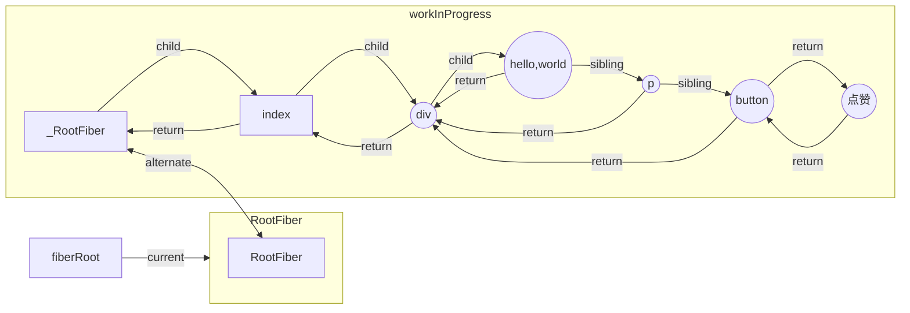

## 结构

```mermaid
%% flowchart TB
flowchart LR
  fiberRoot--current-->RootFiber

  subgraph RootFiber [RootFiber]
    RootFiber1[RootFiber]
  end

  subgraph workInProgress [workInProgress]
    _RootFiber<--alternate-->RootFiber1
    _RootFiber--child--> 4index[index] --child--> div((div)) --child--> hello((hello,world))

    p((p)) --sibling--> button((button))--return-->点赞((点赞))

    4index --return--> _RootFiber
    div --return--> 4index
    hello --return--> div
    hello --sibling--> p

    点赞 --return--> button
    button --return--> div
    p --return--> div
  end
```