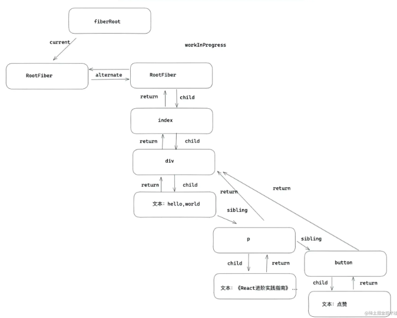

# Fiber更新机制
## 初始化

### 第一步：创建fiberRoot和rootFiber

#### fiberRoot： 首次构建应用， 创建一个 fiberRoot ，作为整个 React 应用的根基。
```javaScript
ReactDOM.render(<Index/>, document.getElementById('app'));
```

#### rootFiber: 通过 ReactDOM.render 渲染出来的。
比如一个组件会渲染一个rootFiber。 rootFiber可以有多个，但fiberRoot只能有一个。

### 第二步：创建workInProgress树
- workInProgress fiber tree：内存中构建的树。
- current fiber tree：正在视图层渲染的树。

渲染流程中，先复用current树（rootFiber）的alternate 作为 workInProgress。

```javaScript
export default class Index extends React.Component{
   state={ number:666 } 
   handleClick=()=>{
     this.setState({
         number:this.state.number + 1
     })
   }
   render(){
     return <div>
       hello，world
       <p > 《React进阶实践指南》 { this.state.number }   </p>
       <button onClick={ this.handleClick } >点赞</button>
     </div>
   }
}
```

- current fiber tree:
- old fiber tree，对应当前屏幕显示的内容，通过根节点 fiberRootNode 的 currrent 指针可以访问。

workInProgress fiber tree:
更新过程中构建的 new fiber tree

- return： 指向父级 Fiber 节点。
- child：指向子 Fiber 节点。
- sibling：指向兄弟 fiber 节点。

```mermaid
%% flowchart TB
flowchart LR
  fiberRoot--current-->RootFiber

  subgraph RootFiber [RootFiber]
    RootFiber1[RootFiber]
  end

  subgraph workInProgress [workInProgress]
    _RootFiber<--alternate-->RootFiber1
    _RootFiber--child--> 4index[index] --child--> div((div)) --child--> hello((hello,world))

    p((p)) --sibling--> button((button))--return-->点赞((点赞))

    4index --return--> _RootFiber
    div --return--> 4index
    hello --return--> div
    hello --sibling--> p

    点赞 --return--> button
    button --return--> div
    p --return--> div
  end
```



#### fiber 双缓存
```
diff 比较，就是在构建 workInProgress fiber tree 的过程中，
判断 current fiber tree 中的 fiber node 是否可以被 workInProgress fiber tree 复用。

能被复用，意味在本次更新中，需要做:
组件的 update 以及 dom 节点的 move、update 等操作；

不可复用，则意味着需要做:
组件的 mount、unmount 以及 dom 节点的 insert、delete 等操作。
```

当更新完成以后，fiberRootNode 的 current 指针会指向 workInProgress fiber tree，作为下一次更新的 current fiber tree

### 第三步：深度调和子节点，渲染视图
遍历fiber树，以workInProgress 作为最新的渲染树，即current Fiber 树。

### 更新
更新重复上述第二和第三步。