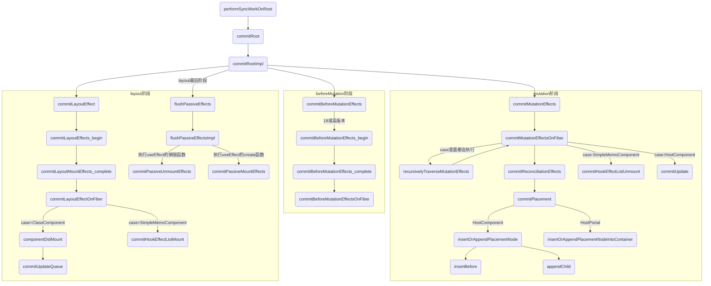

## 一.提交阶段
由render转入commit的流程是在
performSyncWorkOnRoot 或 performConcurrentWorkOnRoot 中进行的，执行哪个看本次更新的优先级

## 1-1-1 各个阶段分别会执行自己的主函数
- before mutation阶段：commitBeforeMutationEffects
- mutation阶段： commitMutationEffects
- layout阶段  commitLayoutEffects

## commit流程图 
performSyncWorkOnRoot render流程 详细见 05_3_commit阶段.md


## 1-2 注意：复习
render 阶段也是在 performSyncWorkOnRoot 或 performConcurrentWorkOnRoot 中进行的
详细见:
05_1_fiber树的协调与渲染_render_beginWork.md 

### performSyncWorkOnRoot 方法
```javaScript
  function performSyncWorkOnRoot(root) {
    if (!((executionContext & (RenderContext | CommitContext)) === NoContext)) {
      {
        throw Error("Should not already be working.");
      }
    }

    flushPassiveEffects();
    var lanes;
    var exitStatus;

    if (root === workInProgressRoot && includesSomeLane(root.expiredLanes, workInProgressRootRenderLanes)) {
      // There's a partial tree, and at least one of its lanes has expired. Finish
      // rendering it before rendering the rest of the expired work.
      lanes = workInProgressRootRenderLanes;
      exitStatus = renderRootSync(root, lanes);

      if (includesSomeLane(workInProgressRootIncludedLanes, workInProgressRootUpdatedLanes)) {
        // The render included lanes that were updated during the render phase.
        // For example, when unhiding a hidden tree, we include all the lanes
        // that were previously skipped when the tree was hidden. That set of
        // lanes is a superset of the lanes we started rendering with.
        //
        // Note that this only happens when part of the tree is rendered
        // concurrently. If the whole tree is rendered synchronously, then there
        // are no interleaved events.
        lanes = getNextLanes(root, lanes);
        exitStatus = renderRootSync(root, lanes);
      }
    } else {
      lanes = getNextLanes(root, NoLanes);
      exitStatus = renderRootSync(root, lanes);
    }

    if (root.tag !== LegacyRoot && exitStatus === RootErrored) {
      executionContext |= RetryAfterError; // If an error occurred during hydration,
      // discard server response and fall back to client side render.

      if (root.hydrate) {
        root.hydrate = false;
        clearContainer(root.containerInfo);
      } // If something threw an error, try rendering one more time. We'll render
      // synchronously to block concurrent data mutations, and we'll includes
      // all pending updates are included. If it still fails after the second
      // attempt, we'll give up and commit the resulting tree.


      lanes = getLanesToRetrySynchronouslyOnError(root);

      if (lanes !== NoLanes) {
        exitStatus = renderRootSync(root, lanes);
      }
    }

    if (exitStatus === RootFatalErrored) {
      var fatalError = workInProgressRootFatalError;
      prepareFreshStack(root, NoLanes);
      markRootSuspended$1(root, lanes);
      ensureRootIsScheduled(root, now());
      throw fatalError;
    } // We now have a consistent tree. Because this is a sync render, we
    // will commit it even if something suspended.

    // 赋值WIP
    var finishedWork = root.current.alternate;
    root.finishedWork = finishedWork;
    root.finishedLanes = lanes;
    // commit阶段的入口函数
    commitRoot(root); // Before exiting, make sure there's a callback scheduled for the next
    // pending level.

    ensureRootIsScheduled(root, now());
    return null;
  }

  function renderRootSync(root, lanes) {
    var prevExecutionContext = executionContext;
    executionContext |= RenderContext;
    var prevDispatcher = pushDispatcher(); // If the root or lanes have changed, throw out the existing stack
    // and prepare a fresh one. Otherwise we'll continue where we left off.

    if (workInProgressRoot !== root || workInProgressRootRenderLanes !== lanes) {
      prepareFreshStack(root, lanes);
      startWorkOnPendingInteractions(root, lanes);
    }

    var prevInteractions = pushInteractions(root);

    do {
      try {
        workLoopSync();
        break;
      } catch (thrownValue) {
        handleError(root, thrownValue);
      }
    } while (true);

    //...
  }
```

### 1-2 commitRoot
commitRoot是commit阶段的入口函数，其入参root代表react根fiber节点。
执行commitRootImpl，commit阶段的主逻辑就在此方法中
```javaScript
function commitRoot(root) {
  var renderPriorityLevel = getCurrentPriorityLevel();
  runWithPriority$1(ImmediatePriority$1, commitRootImpl.bind(null, root, renderPriorityLevel));
  return null;
}
```

#### 1-2-1 commit阶段的主要职责就是将render阶段创建的fiber树渲染到页面中，也就是要执行具体的dom操作，因此commit阶段的主要流程可分为三个阶段:
- 渲染前(before mutation)
- 渲染(mutation)
- 渲染后(layout)

#### beforeMutation 之前的逻辑
此阶段首先会循环执行flushPassiveEffects这个函数，且之后还会以一个优先级来调度执行此函数，关于flushPassiveEffects的具体逻辑后面再展开讨论，现在只需知道他与函数组件的useEffect钩子的处理有关。
此外此阶段还会进行一些变量赋值，状态重置的工作。
```javaScript
function commitRootImpl(root, renderPriorityLevel) {
  do {
    // `flushPassiveEffects` will call `flushSyncUpdateQueue` at the end, which
    // means `flushPassiveEffects` will sometimes result in additional
    // passive effects. So we need to keep flushing in a loop until there are
    // no more pending effects.
    // TODO: Might be better if `flushPassiveEffects` did not automatically
    // flush synchronous work at the end, to avoid factoring hazards like this.
    flushPassiveEffects();
  }

  // ...

  // root.finishedWork即是WIP
  var finishedWork = root.finishedWork;
  var lanes = root.finishedLanes;

  if (finishedWork === null) {

    return null;
  }

  // 清空FiberRoot对象上的属性
  root.finishedWork = null;
  root.finishedLanes = NoLanes;

  // ... 

  do {
    {
      invokeGuardedCallback(null, commitBeforeMutationEffects, null);

      if (hasCaughtError()) {
        if (!(nextEffect !== null)) {
          {
            throw Error("Should be working on an effect.");
          }
        }

        var error = clearCaughtError();
        captureCommitPhaseError(nextEffect, error);
        nextEffect = nextEffect.nextEffect;
      }
    }
  } while (nextEffect !== null); // We no longer need to track the active instance fiber

  // ...
  if (subtreeHasEffects || rootHasEffect) {
    var prevTransition = ReactCurrentBatchConfig$3.transition;
    ReactCurrentBatchConfig$3.transition = null;
    var previousPriority = getCurrentUpdatePriority();
    setCurrentUpdatePriority(DiscreteEventPriority);
    var prevExecutionContext = executionContext;
    executionContext |= CommitContext; // Reset this to null before calling lifecycles

    ReactCurrentOwner$2.current = null; // The commit phase is broken into several sub-phases. We do a separate pass
    // of the effect list for each phase: all mutation effects come before all
    // layout effects, and so on.
    // The first phase a "before mutation" phase. We use this phase to read the
    // state of the host tree right before we mutate it. This is where
    // getSnapshotBeforeUpdate is called.

    var shouldFireAfterActiveInstanceBlur = commitBeforeMutationEffects(root, finishedWork);

    {
      // Mark the current commit time to be shared by all Profilers in this
      // batch. This enables them to be grouped later.
      recordCommitTime();
    }
    // 第二阶段
    commitMutationEffects(root, finishedWork, lanes);

    // ...
  }

  // ...
}
```

### commitBeforeMutationEffects 17 版本
```javaScript
function commitBeforeMutationEffects() {
  while (nextEffect !== null) {
    var current = nextEffect.alternate;

    if (!shouldFireAfterActiveInstanceBlur && focusedInstanceHandle !== null) {
      if ((nextEffect.flags & Deletion) !== NoFlags) {
        if (doesFiberContain(nextEffect, focusedInstanceHandle)) {
          shouldFireAfterActiveInstanceBlur = true;
        }
      } else {
        // TODO: Move this out of the hot path using a dedicated effect tag.
        if (nextEffect.tag === SuspenseComponent && isSuspenseBoundaryBeingHidden(current, nextEffect) && doesFiberContain(nextEffect, focusedInstanceHandle)) {
          shouldFireAfterActiveInstanceBlur = true;
        }
      }
    }

    var flags = nextEffect.flags;

    if ((flags & Snapshot) !== NoFlags) {
      setCurrentFiber(nextEffect);
      commitBeforeMutationLifeCycles(current, nextEffect);
      resetCurrentFiber();
    }

    if ((flags & Passive) !== NoFlags) {
      // If there are passive effects, schedule a callback to flush at
      // the earliest opportunity.
      if (!rootDoesHavePassiveEffects) {
        rootDoesHavePassiveEffects = true;
        scheduleCallback(NormalPriority$1, function () {
          flushPassiveEffects();
          return null;
        });
      }
    }

    nextEffect = nextEffect.nextEffect;
  }
}

function flushPassiveEffects() {
  // Returns whether passive effects were flushed.
  if (pendingPassiveEffectsRenderPriority !== NoPriority$1) {
    var priorityLevel = pendingPassiveEffectsRenderPriority > NormalPriority$1 ? NormalPriority$1 : pendingPassiveEffectsRenderPriority;
    pendingPassiveEffectsRenderPriority = NoPriority$1;

    {
      return runWithPriority$1(priorityLevel, flushPassiveEffectsImpl);
    }
  }

  return false;
}
```

## 二. commitBeforeMutationEffects
beforeMutation阶段的主函数，他的调用栈如下，commit阶段的三个主函数的调用栈都是这样的
注意.17高版本或则18才有以下调用：
```
commitBeforeMutationEffects =>
commitBeforeMutationEffects_begin =>
commitBeforeMutationEffects_complete
```

### commitBeforeMutationEffects 18版本
```javaScript
function commitBeforeMutationEffects(root, firstChild) {
  console.log('分割线commitBeforeMutationEffects=======>start')
  console.log('commitBeforeMutationEffects:', root, firstChild)
  console.log('分割线commitBeforeMutationEffects=======>end')
  focusedInstanceHandle = prepareForCommit(root.containerInfo);
  nextEffect = firstChild;
  commitBeforeMutationEffects_begin(); // We no longer need to track the active instance fiber

  var shouldFire = shouldFireAfterActiveInstanceBlur;
  shouldFireAfterActiveInstanceBlur = false;
  focusedInstanceHandle = null;
  return shouldFire;
}
```

### 2-1 commitBeforeMutationEffects_begin
commitBeforeMutationEffects_begin中会向下遍历child指针。
若不存在子节点则进入当前节点的commitBeforeMutationEffects_complete
```javaScript
function commitBeforeMutationEffects_begin() {
  // commitBeforeMutationEffects_begin中会向下遍历child指针。
  // 若不存在子节点则进入当前节点的commitBeforeMutationEffects_complete
  while (nextEffect !== null) {
    var fiber = nextEffect; // This phase is only used for beforeActiveInstanceBlur.

    var child = fiber.child;

    if ((fiber.subtreeFlags & BeforeMutationMask) !== NoFlags && child !== null) {
      child.return = fiber;
      nextEffect = child;
    } else {
      commitBeforeMutationEffects_complete();
    }
  }
}
```

### 2-3 commitBeforeMutationEffects_complete
commitBeforeMutationEffects_complete会为当前的nextEffect执行commitBeforeMutationEffectsOnFiber，

之后会判断sibling指针，若存在兄弟节点则进入其commitBeforeMutationEffects_begin，否则进入父节点的commitBeforeMutationEffects_complete。我们发现其实这个流程与render阶段的两个函数的执行是类似的，事实上，commit阶段的三个子阶段的主函数的执行顺序都是如此，后面就不再赘述。

```javaScript
function commitBeforeMutationEffects_complete() {
  while (nextEffect !== null) {
    const fiber = nextEffect;
    commitBeforeMutationEffectsOnFiber(fiber);
    const sibling = fiber.sibling;
    if (sibling !== null) {
      ensureCorrectReturnPointer(sibling, fiber.return);
      nextEffect = sibling;
      return;
    }
    nextEffect = fiber.return;
  }
}
```
## 三. commitMutationEffects
18版本
```javaScript
function commitMutationEffects(root, finishedWork, committedLanes) {
  inProgressLanes = committedLanes;
  inProgressRoot = root;
  setCurrentFiber(finishedWork);
  commitMutationEffectsOnFiber(finishedWork, root);
  setCurrentFiber(finishedWork);
  inProgressLanes = null;
  inProgressRoot = null;
}
```
### 3-1 旧版本的 commitMutationEffects_begin 调用逻辑,注意：18新版没有这个函数

commitMutationEffects_begin 的逻辑主要是判是否有需要删除的子节点，执行commitDeletion。其调用栈如下
```
commitDeletion=> unmountHostComponents=> commitUnmount
```

具体的删除逻辑在commitUnmount中,根据tag类型进入不同逻辑：
- 函数组件 执行useLayoutEffect的销毁函数（destory方法）
- class组件 调用componentsWillUnMount生命周期钩子
- hostComponents 解绑ref属性

```javaScript
function commitUnmount(
  finishedRoot: FiberRoot,
  current: Fiber,
  nearestMountedAncestor: Fiber,
): void {
  onCommitUnmount(current);
  switch (current.tag) {
    case FunctionComponent:
    case ForwardRef:
    case MemoComponent:
    case SimpleMemoComponent: {
      const updateQueue: FunctionComponentUpdateQueue | null = (current.updateQueue: any);
      if (updateQueue !== null) {
        const lastEffect = updateQueue.lastEffect;
        if (lastEffect !== null) {
          const firstEffect = lastEffect.next;
          let effect = firstEffect;
           do {
            const {destroy, tag} = effect;
            // 执行useLayoutEffect的销毁函数
            if ((tag & HookLayout) !== NoHookEffect) {
              safelyCallDestroy(current, nearestMountedAncestor, destroy);
            }
            effect = effect.next;
          } while (effect !== firstEffect);
        }
      }
      return;
    }
    case ClassComponent: {
      safelyDetachRef(current, nearestMountedAncestor);
      const instance = current.stateNode;
      if (typeof instance.componentWillUnmount === 'function') {
        safelyCallComponentWillUnmount(
          current,
          nearestMountedAncestor,
          instance,
        );
      }
      return;
    }
    case HostComponent: {
      safelyDetachRef(current, nearestMountedAncestor);
      return;
    }
  }
}
```

### 3-2 18版本： commitDeletionEffectsOnFiber 相当于 commitUnmount中的 commitUnmount
```javaScript
function commitDeletionEffectsOnFiber(finishedRoot, nearestMountedAncestor, deletedFiber) {
  onCommitUnmount(deletedFiber); // The cases in this outer switch modify the stack before they traverse
      switch (deletedFiber.tag) {
      case HostComponent:
        {
          if (!offscreenSubtreeWasHidden) {
            safelyDetachRef(deletedFiber, nearestMountedAncestor);
          } // Intentional fallthrough to next branch

        }
      case HostText:
        {
        // ...
        return;
        }

      case DehydratedFragment:
        {
        // ...
        return;
        }

      case HostPortal:
        {
        // ...
        return;
        }
      case FunctionComponent:
        {
        // ...
        return;
        }
      case ForwardRef:
        {
        // ...
        return;
        }
      case MemoComponent:
        {
        // ...
        return;
        }
      case SimpleMemoComponent:
        {
        // ...
        return;
        }

      case ClassComponent:
        {
        // ...
        return;
        }

      case ScopeComponent:
        {
        // ...
        return;
        }
      case OffscreenComponent:
        {
        // ...
        return;
        }

      default:
        {
          recursivelyTraverseDeletionEffects(finishedRoot, nearestMountedAncestor, deletedFiber);
          return;
        }
}
```

### 3-3 commitMutationEffectsOnFiber 里面的case 执行 recursivelyTraverseMutationEffects
作用： 为每个遍历到的fiber执行 commitMutationEffectsOnFiber

#### commitMutationEffectsOnFiber
```javascript
function commitMutationEffectsOnFiber(finishedWork, root, lanes) {
    var current = finishedWork.alternate;
    var flags = finishedWork.flags; // The effect flag should be checked *after* we refine the type of fiber,
    // because the fiber tag is more specific. An exception is any flag related
    // to reconcilation, because those can be set on all fiber types.

    switch (finishedWork.tag) {
        case FunctionComponent:
        case ForwardRef:
        case MemoComponent:
        case SimpleMemoComponent: {
            recursivelyTraverseMutationEffects(root, finishedWork);
            commitReconciliationEffects(finishedWork);

            if (flags & Update) {
                try {
                    commitHookEffectListUnmount(Insertion | HasEffect, finishedWork, finishedWork.return);
                    commitHookEffectListMount(Insertion | HasEffect, finishedWork);
                } catch (error) {
                    captureCommitPhaseError(finishedWork, finishedWork.return, error);
                } // Layout effects are destroyed during the mutation phase so that all
                // destroy functions for all fibers are called before any create functions.
                // This prevents sibling component effects from interfering with each other,
                // e.g. a destroy function in one component should never override a ref set
                // by a create function in another component during the same commit.


                if (finishedWork.mode & ProfileMode) {
                    try {
                        startLayoutEffectTimer();
                        commitHookEffectListUnmount(Layout | HasEffect, finishedWork, finishedWork.return);
                    } catch (error) {
                        captureCommitPhaseError(finishedWork, finishedWork.return, error);
                    }

                    recordLayoutEffectDuration(finishedWork);
                } else {
                    try {
                        commitHookEffectListUnmount(Layout | HasEffect, finishedWork, finishedWork.return);
                    } catch (error) {
                        captureCommitPhaseError(finishedWork, finishedWork.return, error);
                    }
                }
            }

            return;
        }

        case ClassComponent:
            
        // ...
            
        default:
        {
            recursivelyTraverseMutationEffects(root, finishedWork);
            commitReconciliationEffects(finishedWork);
            return;
        }
}
```
#### recursivelyTraverseMutationEffects
```javascript
function recursivelyTraverseMutationEffects(root, parentFiber, lanes) {
// Deletions effects can be scheduled on any fiber type. They need to happen
// before the children effects hae fired.
var deletions = parentFiber.deletions;

if (deletions !== null) {
  for (var i = 0; i < deletions.length; i++) {
    var childToDelete = deletions[i];

    try {
      commitDeletionEffects(root, parentFiber, childToDelete);
    } catch (error) {
      captureCommitPhaseError(childToDelete, parentFiber, error);
    }
  }
}

var prevDebugFiber = getCurrentFiber();

if (parentFiber.subtreeFlags & MutationMask) {
  var child = parentFiber.child;

  while (child !== null) {
    setCurrentFiber(child);
    commitMutationEffectsOnFiber(child, root);
    child = child.sibling;
  }
}

setCurrentFiber(prevDebugFiber);
}
```

### 3-4 commitReconciliationEffects --> commitPlacement
根据flags不同类型进入不同case，调用相应处理函数后删除对应的flags。我们分别来分析，首先看placement的处理函数commitPlacement根据flags不同类型进入不同case，调用相应处理函数后删除对应的flags。我们分别来分析，首先看placement的处理函数commitPlacement

总结commitPlacement的功能：
```
查找离它最近的父级host类型的fiber节点以及离它最近的host类型的兄弟节点，
调用insertOrAppendPlacementNode进行插入，该函数的主逻辑是兄弟节点存在则调用其insertBefore方法，
否则调用父节点的appendChild方法进行插入。
```

```javascript
function commitPlacement(finishedWork) {
// 查找最近的父节点
var parentFiber = getHostParentFiber(finishedWork); // Note: these two variables *must* always be updated together.

switch (parentFiber.tag) {
  case HostComponent:
    {
      var parent = parentFiber.stateNode;

      if (parentFiber.flags & ContentReset) {
        // Reset the text content of the parent before doing any insertions
        resetTextContent(parent); // Clear ContentReset from the effect tag

        parentFiber.flags &= ~ContentReset;
      }

      var before = getHostSibling(finishedWork); // We only have the top Fiber that was inserted but we need to recurse down its
      // children to find all the terminal nodes.

      insertOrAppendPlacementNode(finishedWork, before, parent);
      break;
    }

  case HostRoot:
  case HostPortal:
    {
      var _parent = parentFiber.stateNode.containerInfo;
      // 查找最近的兄弟节点
      var _before = getHostSibling(finishedWork);

      insertOrAppendPlacementNodeIntoContainer(finishedWork, _before, _parent);
      break;
    }
  // eslint-disable-next-line-no-fallthrough

  default:
    throw new Error('Invalid host parent fiber. This error is likely caused by a bug ' + 'in React. Please file an issue.');
}
}
```

### 3-5 分析在 commitMutationEffectsOnFiber update对应的处理函数commitWork
根据不通tag类型进入不同case：

- 对于函数组件会执行commitHookEffectListUnmount，从名字上不难分析出此函数用于执行副作用的销毁函数，这里的第一个入参是HookLayout，这表明这里会执行所有useLayoutEffect的销毁函数。
- 对于HostComponent会执行commitUpdate，此函数负责更新具体的dom属性，传入方法的updatePayload属性，他是一个数组，存储了本次需要更新的key和value，后面分析状态更新流程时会继续讨论。