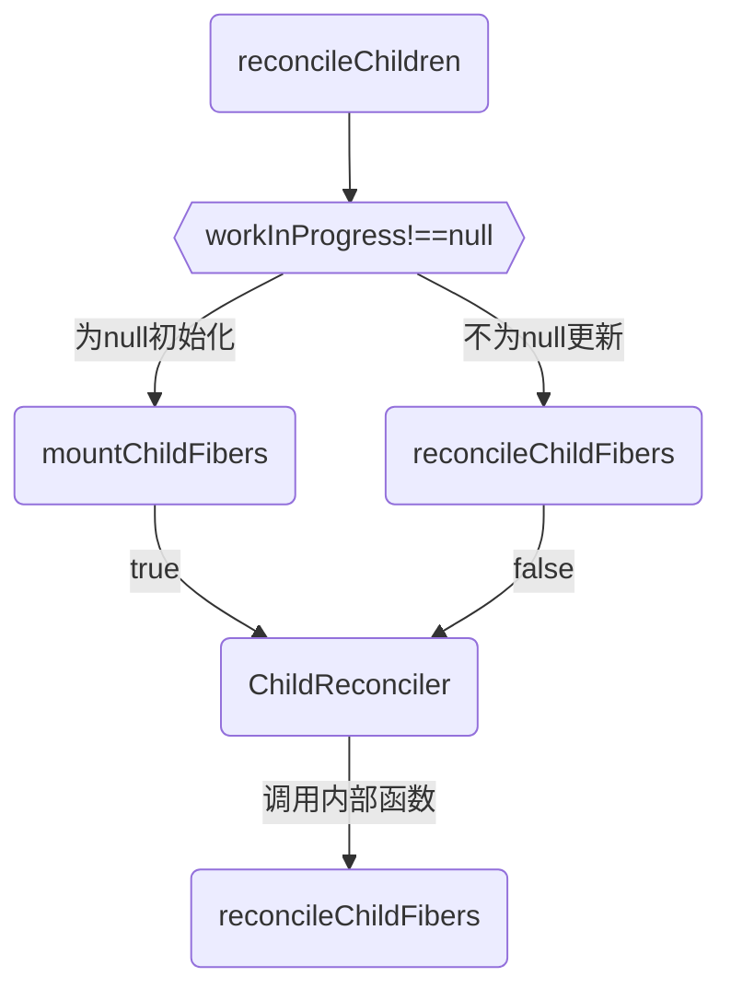

## diff 流程

```mermaid
flowchart BR
A1(reconcileChildren)
A1-->A1if{{workInProgress!==null}}
A1if--为null初始化-->A2A(mountChildFibers)--true-->A3
A1if--不为null更新-->A2B(reconcileChildFibers)--false-->A3

%% 参考：06_辅3_ChildReconciler完整函数.js
%% reconcileChildFibers内部会根据newChild（即新生成的ReactElement）的类型
%% 和$$typeof属性调用不同的处理函数
A3(ChildReconciler)--调用内部函数-->A4(reconcileChildFibers)
```