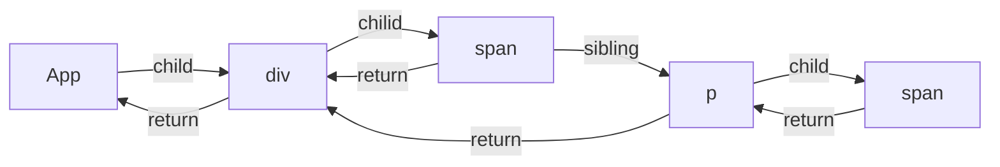

## 渲染的 fiber 树结构

```mermaid
flowchart LR
  App--child-->div--chilid-->span
  
  div--return-->App

  p--return-->div
  p--child-->span2[span]
  span2--return-->p

  span--return-->div
  span--sibling-->p
```