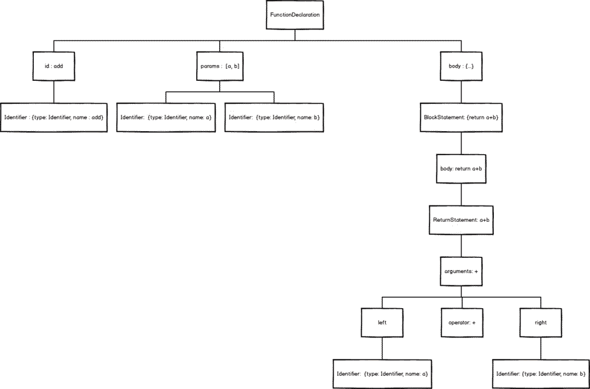

AST在日常业务中也许很难涉及到，但当你不止于想做一个工程师，而想做工程师的工程师，

写出vue、react之类的大型框架，或类似webpack、vue-cli前端自动化的工具，或者有批量修改源码的工程需求，那你必须懂得AST。AST的能力十分强大，且能帮你真正吃透javascript的语言精髓。

在javascript世界中，你可以认为抽象语法树(AST)是最底层。再往下，就是关于转换和编译的“黑魔法”领域了。

## 拆解Javascript
通过抽象语法树解析，我们可以像童年时拆解玩具一样，透视Javascript这台机器的运转，并且重新按着你的意愿来组装。
```javaScript
function add(a, b) {
    return a + b
}

第一步：
一个id，就是它的名字，即add
两个params，就是它的参数，即[a, b]
一块body，也就是大括号内的一堆东西

1.add没办法继续拆下去了，它是一个最基础Identifier（标志）对象，用来作为函数的唯一标志，就像人的姓名一样。
{
    name: 'add'
    type: 'identifier'
    ...
}

2.params继续拆下去，其实是两个Identifier组成的数组。之后也没办法拆下去了。
[
    {
        name: 'a'
        type: 'identifier'
        ...
    },
    {
        name: 'b'
        type: 'identifier'
        ...
    }
]

3.body其实是一个BlockStatement（块状域）对象，用来表示是{return a + b}

打开Blockstatement，里面藏着一个ReturnStatement（Return域）对象，用来表示return a + b

继续打开ReturnStatement,里面是一个BinaryExpression(二项式)对象，用来表示a + b

继续打开BinaryExpression，它成了三部分，left，operator，right

operator 即+
left 里面装的，是Identifier对象 a
right 里面装的，是Identifer对象 b
就这样，我们把一个简单的add函数拆解完毕，用图表示就是
```
抽象语法树(Abstract Syntax Tree)，的确是一种标准的树结构。

那么，上面我们提到的Identifier、Blockstatement、ReturnStatement、BinaryExpression， 这一个个小部件的说明书去哪查？

## ast抽象语法树，实际上就是一种树形结构来表示编程语句。
可以理解为可以将一串代码解析成一个树形结构，这个树形结构上面每个节点代表一种语法结构。
这里列一个必备网站：https://astexplorer.net/，用来查看 js 被转换为抽象语法树后的样子。
