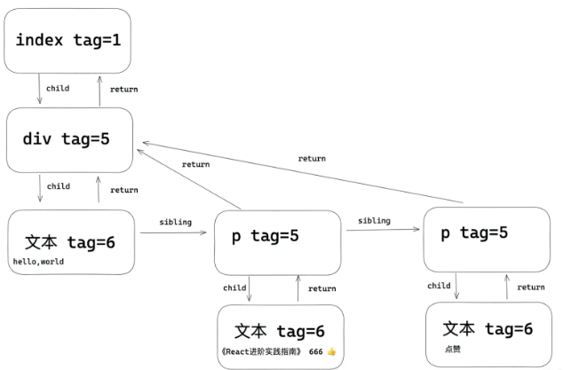

## 前言
### 大型应用为什么会慢?
在构建复杂的大型应用的时候，各种页面之前的相互操作和更新很有可能会引起页面的重绘或重排列，而频繁操作这些dom其实是非常消耗性能的
```javaScript
这是一个节点上的属性，可以看到一个节点上的属性是非常多的，在复杂应用中，操作这些属性的时候可能一不小心就会引起节点大量的更新，那如何提高应用的性能呢？

const div = document.createElement('div');
let str = ''
for(let k in div){
  str+=','+k
}
console.log(str)
```

### 为什么会出现Fiber
react从15版本开始，到现在的17，以及快出来的18，内部经历了非常大的变化，这一切都是围绕着一个目标进行的，这个目标是异步可中断的更新，而这个目的的最终结果是为了构建快速响应的应用。

在更新的时候可能会更新大量的dom，所以react在应用层和dom层之间增加了一层Fiber，而Fiber是在内存中工作的，所以在更新的时候只需要在内存中进行dom更新的比较，最后再应用到需要更新真实节点上

- 在react15之前，这个对比的过程被称之为stack reconcile，它的对比方式是‘一条路走到黑’，也就是说这个对比的过程是不能被中断的，这会出现什么情况呢，比如在页面渲染一个比较消耗性能操作，如果这个时候如果用户进行一些操作就会出现卡顿，应用就会显得不流畅。

- react16之后出现了scheduler，以及react17的Lane模型，它们可以配合着工作，将比较耗时的任务按照Fiber节点划分成工作单元，并且遍历Fiber树计算或者更新节点上的状态可以被中断、继续，以及可以被高优先级的任务打断，比如用户触发的更新就是一个高优先级的任务，高优先级的任务优先执行，应用就不会太卡顿。

### 1.fiber 概念
它是Fiber树结构的节点单位
Fiber是一个链表数据结构（环状链表）
```
Child 指向 当前Fiber的第一个子节点
Sibling 指向当前Fiber的的下一个兄弟节点
Return 指向当前 Fiber 节点的 父节点
```

fiber 是react中最小的执行单位，可以理解为fiber就是虚拟DOM。
是一个js对象，能承载节点信息、优先级、updateQueue，同时它还是一个工作单元。

fiber 根据优先级暂停、继续、排列优先级：Fiber节点上保存了优先级，能通过不同节点优先级的对比，达到任务的暂停、继续、排列优先级等能力，也为上层实现批量更新、Suspense提供了基础


更新 fiber 的过程叫做 Reconciler（调度器）

### 2.element,fiber, DOM 之间的关系？
- element 就是jsx语法，通过React.createElement创建成element对象.
- DOM 就是浏览器的DOM
- fiber：每一次的 element 变化都会通过 调和 fiber 来 触发真实 DOM 渲染。
```
                            更新 element                  更新
一次更新----->create element------------>调度器React Fiber---------->真实dom
```

### fiber结构
每一个 element 都会对应一个 fiber ，每一个 fiber 是通过 return ， child ，sibling 三个属性建立起联系的。

- return： 指向父级 Fiber 节点。
- child：指向子 Fiber 节点。
- sibling：指向兄弟 fiber 节点。
```javaScript
function FiberNode(){

    ....

  this.key = key;                  // key调和子节点时候用到。 
  
  this.return = null;              // 指向父级fiber
  this.child = null;               // 指向子级fiber
  this.sibling = null;             // 指向兄弟fiber 
  this.index = 0;                  // 索引

  this.expirationTime = NoWork;    // 通过不同过期时间，判断任务是否过期， 在v17版本用lane表示。

  this.alternate = null;           //双缓存树，指向缓存的fiber。更新阶段，两颗树互相交替。
  
  ....
}
```

```javaScript
function FiberNode(
  tag: WorkTag,
  pendingProps: mixed,
  key: null | string,
  mode: TypeOfMode,
) {
  //作为静态的数据结构 保存节点的信息 
  this.tag = tag;//对应组件的类型
  this.key = key;//key属性
  this.elementType = null;//元素类型
  this.type = null;//func或者class
  this.stateNode = null;//真实dom节点

  //作为fiber数架构 连接成fiber树
  this.return = null;//指向父节点
  this.child = null;//指向child
  this.sibling = null;//指向兄弟节点
  this.index = 0;

  this.ref = null;

  //用作为工作单元 来计算state
  this.pendingProps = pendingProps;
  this.memoizedProps = null;
  this.updateQueue = null;
  this.memoizedState = null;
  this.dependencies = null;

  this.mode = mode;
    
	//effect相关
  this.effectTag = NoEffect;
  this.nextEffect = null;
  this.firstEffect = null;
  this.lastEffect = null;

  //优先级相关的属性
  this.lanes = NoLanes;
  this.childLanes = NoLanes;

  //current和workInProgress的指针
  this.alternate = null;
}
```

## 1.mount
在mount时：会创建fiberRoot和rootFiber，然后根据jsx对象创建Fiber节点，节点连接成current Fiber树。

- fiberRoot：指整个应用的根节点，只存在一个

- rootFiber：ReactDOM.render或者ReactDOM.unstable_createRoot创建出来的应用的节点，可以存在多个。

在mount的时候，也就是首次渲染的时候，render阶段会根据jsx对象生成新的Fiber节点。

然后这些Fiber节点会被标记成带有‘Placement’的副作用，说明它们是新增的节点，需要被插入到真实节点中了。

在commit阶段就会操作真实节点，将它们插入到dom树中。

## 2.update
在update时：会根据新的状态形成的jsx（ClassComponent的render或者FuncComponent的返回值）和current Fiber对比形（diff算法）成一颗叫workInProgress的Fiber树。

然后将fiberRoot的current指向workInProgress树，此时workInProgress就变成了current Fiber。

在update的时候，render阶段会根据最新的jsx和老的Fiber进行对比，生成新的Fiber。
这些Fiber会带有各种副作用，比如‘Deletion’、‘Update’、‘Placement’等，这一个对比的过程就是diff算法 ，在commit阶段会操作真实节点，执行相应的副作用。

结构例子：
```javaScript
export default class Index extends React.Component{
   state={ number:666 } 
   handleClick=()=>{
     this.setState({
         number:this.state.number + 1
     })
   }
   render(){
     return <div>
       hello，world
       <p > 《React进阶实践指南》 { this.state.number }   </p>
       <button onClick={ this.handleClick } >点赞</button>
     </div>
   }
}
```
fiber对应的关系如下：
