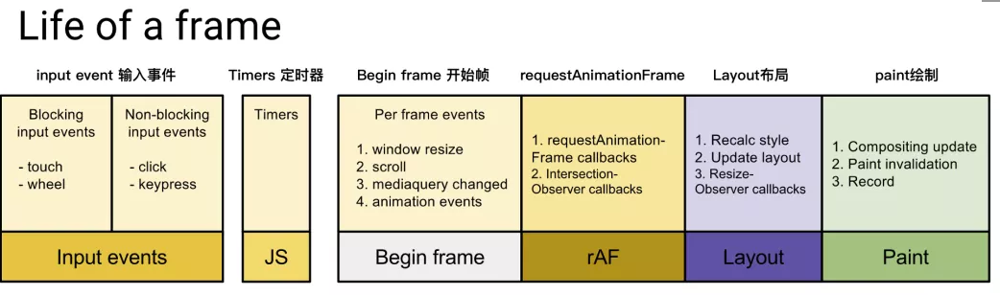

## 渲染帧
在浏览器中，页面是一帧一帧绘制出来的，渲染的帧率与设备的刷新率保持一致。

一般情况下，设备的屏幕刷新率为 1s 60次，当每秒内绘制的帧数（FPS）超过60时，页面渲染是流畅的；而当 FPS 小于60时，会出现一定程度的卡顿现象。

## 下面来看完整的一帧中，具体做了哪些事情


1. 首先需要处理输入事件，能够让用户得到最早的反馈

2. 接下来是处理定时器，需要检查定时器是否到时间，并执行对应的回调

3. 接下来处理 Begin Frame（开始帧），即每一帧的事件，包括 window.resize、scroll、media query change 等

4. 接下来执行请求动画帧 requestAnimationFrame（rAF），即在每次绘制之前，会执行 rAF 回调

5. 紧接着进行 Layout 操作，包括计算布局和更新布局，即这个元素的样式是怎样的，它应该在页面如何展示

6. 接着进行 Paint 操作，得到树中每个节点的尺寸与位置等信息，浏览器针对每个元素进行内容填充

到这时以上的六个阶段都已经完成了，接下来处于空闲阶段（Idle Peroid），可以在这时执行requestIdleCallback里注册的任务（它就是 React Fiber 任务调度实现的基础）

## RequestIdleCallback
RequestIdleCallback 是 react Fiber 实现的基础 api 。该方法将在浏览器的空闲时段内调用的函数排队，使开发者在主事件循环上执行后台和低优先级的工作，而不影响延迟关键事件，如动画和输入响应。正常帧任务完成后没超过16ms，说明有多余的空闲时间，此时就会执行requestIdleCallback里注册的任务。

1. 低优先级任务由requestIdleCallback处理；
2. 高优先级任务，如动画相关的由requestAnimationFrame处理；
3. requestIdleCallback可以在多个空闲期调用空闲期回调，执行任务；

window.requestIdleCallback(callback)的callback中会接收到默认参数 deadline ，其中包含了以下两个属性：
```
timeRamining 返回当前帧还剩多少时间供用户使用
didTimeout 返回 callback 任务是否超时
```


```javaScript
const sleep = (delay) => {
  const start = Date.now();
  while (Date.now() - start <= delay) {}
};
const taskQueue = [
  () => {
    console.log("task1 start");
    sleep(3);
    console.log("task1 end");
  },
  () => {
    console.log("task2 start");
    sleep(3);
    console.log("task2 end");
  },
  () => {
    console.log("task3 start");
    sleep(3);
    console.log("task3 end");
  },
];
const performUnitWork = () => {
  // 取出第一个队列中的第一个任务并执行
  taskQueue.shift()();
};
const workloop = (deadline) => {
  console.log(`此帧的剩余时间为: ${deadline.timeRemaining()}`);
  // 如果此帧剩余时间大于0或者已经到了定义的超时时间（上文定义了timeout时间为1000，到达时间时必须强制执行），且当时存在任务，则直接执行这个任务
  // 如果没有剩余时间，则应该放弃执行任务控制权，把执行权交还给浏览器
  while (
    (deadline.timeRemaining() > 0 || deadline.didTimeout) &&
    taskQueue.length > 0
  ) {
    performUnitWork();
  }
  // 如果还有未完成的任务，继续调用requestIdleCallback申请下一个时间片
  if (taskQueue.length > 0) {
    window.requestIdleCallback(workloop, { timeout: 1000 });
  }
};
requestIdleCallback(workloop, { timeout: 1000 });
/*
上面定义了一个任务队列taskQueue，并定义了workloop函数，其中采用window.requestIdleCallback(workloop, { timeout: 1000 })去执行taskQueue中的任务。每个任务中仅仅做了console.log、sleep(3)的工作，时间是非常短的（大约3ms多一点），浏览器计算此帧中还剩余15.5ms，足以一次执行完这三个任务，因此在此帧的空闲时间中，taskQueue中定义的三个任务均执行完毕。打印结果如下： 
此帧的剩余时间为: 49.8
task1 start
task1 end
task2 start
task2 end
task3 start
task3 end
*/
```