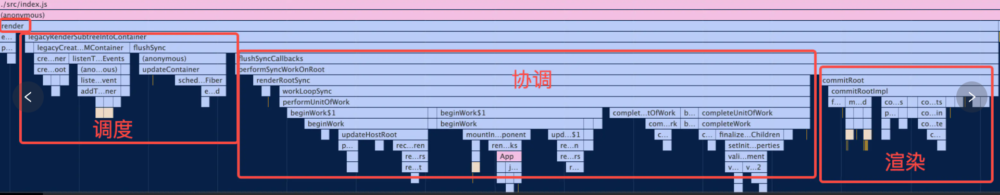
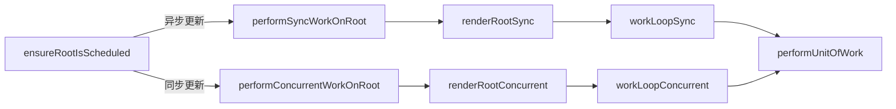
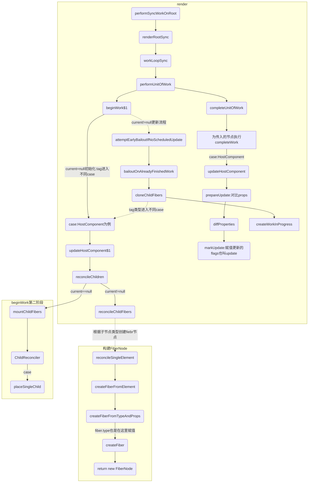
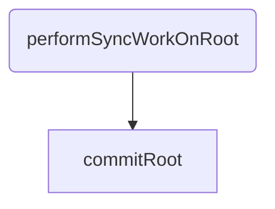
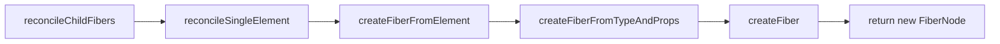

## 构建三个阶段
即首先进入调度阶段调度本次更新任务，调度成功后进入render阶段，处理本次更新并生成fiber树，

最后进入渲染阶段将fiber树渲染到视图中。
调度器，协调器，渲染器的工作一一对应。
```
调度器(render):scheduler，用于注册任务，并在合适的时机执行任务，通常与协调器配合使用。

协调器:react-reconciler，用于处理并生成fiber树（react中fiber节点即代表vnode，fiber树即vnode tree），输出给渲染器进行渲染。

渲染器:react-dom用于web端，将协调器的输出结果渲染到web页面中
```


## 二.协调阶段（Render）

### 2-1 双缓存模型
基本原理是在内存中绘制当前帧，绘制完毕后直接用当前帧替换上一帧，由于省掉了帧与帧之间替换的时间因此可以有效的避免闪烁问题。

协调阶段的主要职责就是输出fiber树，react正是使用双缓存模型来完成fiber树的构建。

react中最多会同时存在两颗fiber树，他们分别是workInProgressFiber树和currentFiber树，后面就简称（WIP和CUR），两棵树中的fiber节点通过alternate属性连接。
- CUR代表页面当前状态（正在展示的内容）
- WIP是正在内存中构建的fiber树，他代表了在本次更新后页面的状态。

react应用的通过根fiber节点fiberRoot的current指针来完成两颗fiber树的更替。

- 页面首次渲染时，current为null，当WIP构建完成并完成渲染后，current指向WIP，即此时WIP变成CUR。

- 当触发状态更新时，会重新生成一颗WIP，以此往复

接下来我们以首屏渲染为例（current为null）来分析render阶段与commit阶段的主要工作。


### 2-2 入口函数
render阶段主要工作是构建WIP，他开始于 performSyncWorkOnRoot 函数或performConcurrentWorkOnRoot 函数，这取决于本次更新是同步更新还是异步更新。


详细一点
beginWork 与 completeWork 二者是相互配合共同完成fiebr树的构建的。


#### commit流程图 详细见 05_3_commit阶段.md：


```javaScript
 // 会以不同的优先级注册本次更新的回调任务
  function ensureRootIsScheduled(root, currentTime) {
    ...

    if (newCallbackPriority === SyncLanePriority) {
      // Special case: Sync React callbacks are scheduled on a special
      // internal queue
      newCallbackNode = scheduleSyncCallback(performSyncWorkOnRoot.bind(null, root));
    } else if (newCallbackPriority === SyncBatchedLanePriority) {
      newCallbackNode = scheduleCallback(ImmediatePriority$1, performSyncWorkOnRoot.bind(null, root));
    } else {
      var schedulerPriorityLevel = lanePriorityToSchedulerPriority(newCallbackPriority);
      newCallbackNode = scheduleCallback(schedulerPriorityLevel, performConcurrentWorkOnRoot.bind(null, root));
    }

    root.callbackPriority = newCallbackPriority;
    root.callbackNode = newCallbackNode;
  }
```

### 2-3 render阶段的实际起点函数是 performUnitOfWork
它会在一个循环中执行。

performUnitOfWork职责是创建当前fiber节点的下一个fiber节点并赋值给workInProgress，并将当前节点与已创建的fiber节点连接起来。
```javaScript
function performUnitOfWork(unitOfWork: Fiber): void {
// 传参unitOfWork是当前fiber节点
  const current = unitOfWork.alternate;
  let next;
  ...
  // beginWork方法会创建当前fiber节点的第一个子fiber节点
  next = beginWork(current, unitOfWork, subtreeRenderLanes);
  unitOfWork.memoizedProps = unitOfWork.pendingProps;
  if (next === null) {
    completeUnitOfWork(unitOfWork);
  } else {
    workInProgress = next;
  }
}
```
render阶段的执行其实是一个深度优先遍历的过程，它有两个核心函数，beginWork和completeUnitOfWork，

两个函数的功能与执行时机有所不同，在遍历的过程中，会对每个遍历到的节点执行beginWork创建子fiber节点。

若当前节点不存在子节点（next === null），则对其执行completeUnitOfWork。

completeUnitOfWork方法内部会判断当前节点有无兄弟节点，有则进入兄弟节点的beginWork流程，否则进入父节点的completeUnitOfWork流程

### 2-4 beginWork 
beginWork 功能：创建当前节点的子fiber节点，接下来看其具体实现
```javaScript
function beginWork(
  current: Fiber | null,
  workInProgress: Fiber,
  renderLanes: Lanes,
): Fiber | null {
  if (current !== null) {
   // update时的逻辑
  } else {
    didReceiveUpdate = false;
  }
  workInProgress.lanes = NoLanes;
  switch (workInProgress.tag) {
    case FunctionComponent: {
     .....
    }
    case ClassComponent: {
     .....
    }
    case HostComponent:
      return updateHostComponent(current, workInProgress, renderLanes);
  }
}
```

第一段 根据current是否存在进入不同逻辑，由于首屏渲染时current为null，因此我们暂时不关注，后面分析状态更新流程时再来看。

第二段，根据不同tag类型进入不同case，我们重点关注最常见的HostComponent类型，即普通dom节点，他会进入updateHostComponent方法

updateHostComponent最主要的逻辑是执行了reconcileChildren并返回workInProgress.child，因此可以合理猜测reconcileChildren内部会创建子fiber节点并将其与当前fiber节点（workInProgress）通过child指针连接。
```javaScript
function updateHostComponent(
  current: Fiber | null,
  workInProgress: Fiber,
  renderLanes: Lanes,
) {
  pushHostContext(workInProgress);
  const type = workInProgress.type;
  const nextProps = workInProgress.pendingProps;
  const prevProps = current !== null ? current.memoizedProps : null;
  // 获取子节点
  let nextChildren = nextProps.children;
  const isDirectTextChild = shouldSetTextContent(type, nextProps);
  // 单一文本子节点不创建fiber节点
  if (isDirectTextChild) {
    nextChildren = null;
  } else if (prevProps !== null && shouldSetTextContent(type, prevProps)) {
    workInProgress.flags |= ContentReset;
  }
  markRef(current, workInProgress);
  reconcileChildren(current, workInProgress, nextChildren, renderLanes);
  return workInProgress.child;
}
```

reconcileChildren内部根据current是否为null进入不同逻辑。我们看一下mountChildFibers和reconcileChildFibers这两个函数
```javaScript
function reconcileChildren(current, workInProgress, nextChildren, renderLanes) {
  if (current === null) {
    workInProgress.child = mountChildFibers(workInProgress, null, nextChildren, renderLanes);
  } else {
    workInProgress.child = reconcileChildFibers(workInProgress, current.child, nextChildren, renderLanes);
  }
}

// react/packages/react-reconciler/src/ReactChildFiber.old.js
export const reconcileChildFibers = ChildReconciler(true);
export const mountChildFibers = ChildReconciler(false);
function ChildReconciler(shouldTrackSideEffects) {
  ///  
  return reconcileChildFibers;
}
```

这两个函数事实上是同一个函数，即ChildReconciler的返回值reconcileChildFibers，只是传入ChildReconciler的参数shouldTrackSideEffects（追踪副作用）不同，事实上此参数与update时为fiber节点标记副作用（flags）的逻辑有关，后续在分析update的流程时会继续讨论，接下来我们看下reconcileChildFibers的实现逻辑：

其主要职责就是根据子节点类型创建fiebr节点，以 reconcileSingleElement 为例看下其调用栈：


```javaScript
function reconcileChildFibers(
    returnFiber: Fiber,
    currentFirstChild: Fiber | null,
    newChild: any,
    lanes: Lanes,
  ): Fiber | null {
    const isUnkeyedTopLevelFragment =
      typeof newChild === 'object' &&
      newChild !== null &&
      newChild.type === REACT_FRAGMENT_TYPE &&
      newChild.key === null;
    if (isUnkeyedTopLevelFragment) {
      newChild = newChild.props.children;
    }
    if (typeof newChild === 'object' && newChild !== null) {
      switch (newChild.$$typeof) {
        case REACT_ELEMENT_TYPE:
          return placeSingleChild(
            reconcileSingleElement(
              returnFiber,
              currentFirstChild,
              newChild,
              lanes,
            ),
          );
      }

      if (isArray(newChild)) {
        return reconcileChildrenArray(
          returnFiber,
          currentFirstChild,
          newChild,
          lanes,
        );
      }
    }

    if (
      (typeof newChild === 'string' && newChild !== '') ||
      typeof newChild === 'number'
    ) {
      return placeSingleChild(
        reconcileSingleTextNode(
          returnFiber,
          currentFirstChild,
          '' + newChild,
          lanes,
        ),
      );
    }
    return deleteRemainingChildren(returnFiber, currentFirstChild);
}
```

最终返回了一个FiberNode实例，我们可以看一下FiberNode的结构，作为一种数据结构来描述dom节点，它有众多描述属性（可分为5大类，位置，类型，状态，副作用，alternate），现在我们先只关心如下几个属性，他们是多个fiber节点之间相互连接构成fiber树的核心属性。
```javaScript
  var createFiber = function (tag, pendingProps, key, mode) {
    // $FlowFixMe: the shapes are exact here but Flow doesn't like constructors
    return new FiberNode(tag, pendingProps, key, mode);
  };

  function FiberNode(tag, pendingProps, key, mode) {
    // Instance
    this.tag = tag;
    this.key = key;
    this.elementType = null;
    this.type = null;
    this.stateNode = null; // Fiber

    this.return = null;
    this.child = null;
    this.sibling = null;
    this.index = 0;
    this.ref = null;
    this.pendingProps = pendingProps;
    this.memoizedProps = null;
    this.updateQueue = null;
    this.memoizedState = null;
    this.dependencies = null;
    this.mode = mode; // Effects

    this.flags = NoFlags;
    this.nextEffect = null;
    this.firstEffect = null;
    this.lastEffect = null;
    this.lanes = NoLanes;
    this.childLanes = NoLanes;
    this.alternate = null;

    {
      // Note: The following is done to avoid a v8 performance cliff.
      //
      // Initializing the fields below to smis and later updating them with
      // double values will cause Fibers to end up having separate shapes.
      // This behavior/bug has something to do with Object.preventExtension().
      // Fortunately this only impacts DEV builds.
      // Unfortunately it makes React unusably slow for some applications.
      // To work around this, initialize the fields below with doubles.
      //
      // Learn more about this here:
      // https://github.com/facebook/react/issues/14365
      // https://bugs.chromium.org/p/v8/issues/detail?id=8538
      this.actualDuration = Number.NaN;
      this.actualStartTime = Number.NaN;
      this.selfBaseDuration = Number.NaN;
      this.treeBaseDuration = Number.NaN; // It's okay to replace the initial doubles with smis after initialization.
      // This won't trigger the performance cliff mentioned above,
      // and it simplifies other profiler code (including DevTools).

      this.actualDuration = 0;
      this.actualStartTime = -1;
      this.selfBaseDuration = 0;
      this.treeBaseDuration = 0;
    }

    {
      // This isn't directly used but is handy for debugging internals:
      this._debugID = debugCounter++;
      this._debugSource = null;
      this._debugOwner = null;
      this._debugNeedsRemount = false;
      this._debugHookTypes = null;

      if (!hasBadMapPolyfill && typeof Object.preventExtensions === 'function') {
        Object.preventExtensions(this);
      }
    }
  }
```

### fiber.type 等值在这里赋值
```javaScript
function createFiberFromTypeAndProps(type, // React$ElementType
  key, pendingProps, owner, mode, lanes) {

    // ...

    var fiber = createFiber(fiberTag, pendingProps, key, mode);
    fiber.elementType = type;
    console.log('对fiber.type等赋值:', type, 'resolvedType:', resolvedType)
    fiber.type = resolvedType;
    fiber.lanes = lanes;

    {
      fiber._debugOwner = owner;
    }

    return fiber;
}
```

### fiber结构: alternate
在任何时候，一个组件实例最多有两个与之对应的Fiber对象：当前即将渲染的（current fiber）和workInProgress fiber，diff产生出的变化会标记在workInProgress fiber上。

current fiber的alternate是workInProgress fiber，workInProgress fiber的alternate是current fiber，有点绕，看下面的代码片段好理解些，workInProgress构造完毕，得到了新的fiber，然后把current指针指向workInProgress，丢掉旧的fiber。Fiber的alternate是一个叫cloneFiber的函数惰性的创建的，与总是创建一个新对象不同，cloneFiber将尝试重用Fiber的alternate（如果存在的话），以实现最小化内存分配。
```javaScript
function createWorkInProgress(current, pendingProps, expirationTime) {
  var workInProgress = current.alternate;
  if (workInProgress === null) {
    workInProgress = createFiber(current.tag, pendingProps, current.key, current.mode);
    console.log("workInProgress", workInProgress) 
    workInProgress.elementType = current.elementType;
    workInProgress.type = current.type;
    workInProgress.stateNode = current.stateNode;

    // ...

    workInProgress.alternate = current;
    current.alternate = workInProgress;
  } 

  // ...
  return workInProgress;
}
```

此外我们关注下reconcileChildrenArray的逻辑，若当前节点存在多个子节点时会进入该逻辑
```html
<div>
   <p></p>
   <p></p>
   <p></p>
 </div>
```
reconcileChildrenArray 的职责可概括为:为所有子节点创建fiber节点，并返回第一个子fiber节点，其余子节点通过sibling指针连接。
前面在分析 performUnitOfWork 时提到，在当前节点的 completeUnitOfWork 流程中会判断当前节点有无兄弟节点，其判断的依据就是通过sibling指针。

至此 beginWork 的大体逻辑已梳理完毕，接下来分析 completeUnitOfWork


