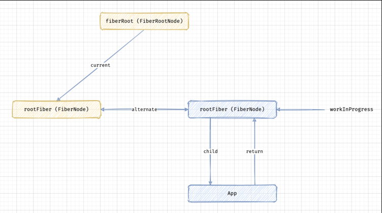
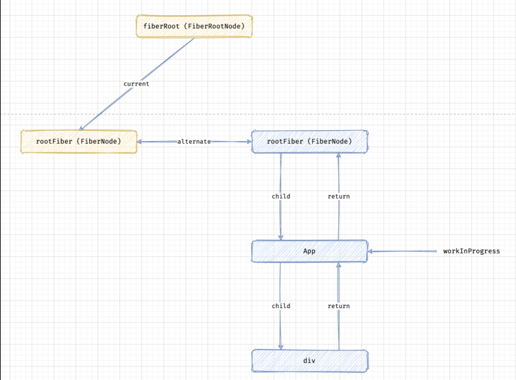
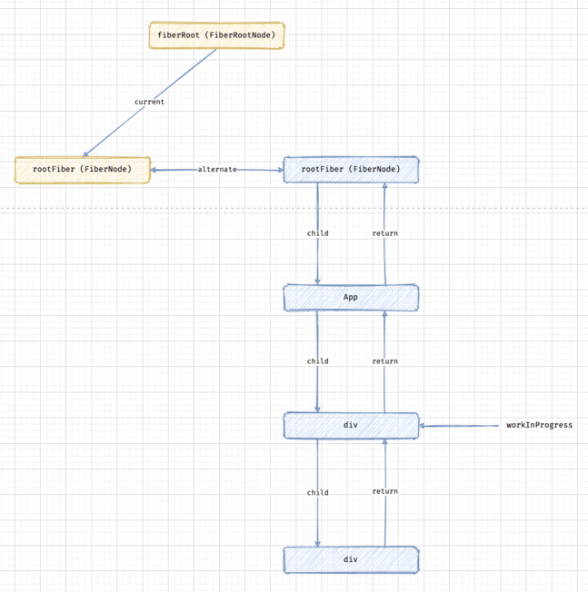
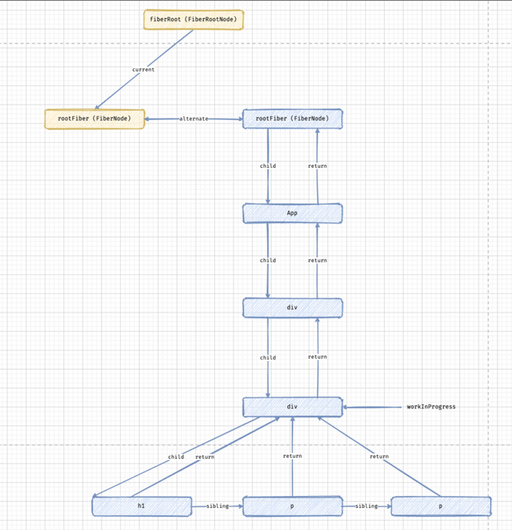

```
↑


```

```
深入理解React源码 - 首次渲染（简单组件） I  基于：React 15.6.2
https://zhuanlan.zhihu.com/p/32520194

```

```js
//JSX是在编译的时候由Babel转译成React.createElement()调用的。举例来说，create-react-app 自带的App.js：

//然后这个函数返回的ReactElement 会在应用层的"index.js"渲染：
ReactDOM.render(
  <App />,
  document.getElementById('root')
);
```
```
React.createElement() - 创建一个 ReactElement

1.第一步其实没做啥。仅仅是实例化一个ReactElement，再用传入的参数初始化它。这一步的目标结构是

2. ReactElement.createElement(type, config, children) 做了三件事： 1) 把 config里的数据一项一项拷入props, 2) 拷贝 children 到 props.children， 3) 拷贝 type.defaultProps 到 props;

3. 然后 ReactElement(type,…, props) 会把 type 和 props 原样透传给 ReactElement 的构造函数，并返回新构造的实例.
这个新构建的ReactElement一会会在ReactMount.instantiateReactComponent() 函数中用到。因为下一步也会构建一个ReactElement我们先把这一步生成的对象命名为ReactElement[1]。

ReactDom.render() -开始渲染

```

# 二
```
https://www.cnblogs.com/dtux/p/14953844.html

以 performSyncWorkOnRoot 和 commitRoot 两个方法为界限，可以把 ReactDOM.render 分为三个阶段：

Init
Render
Commit
```
###### render
很简单，直接调用 legacyRenderSubtreeIntoContainer。
这里需要注意一点，此时的 element 已经不是 render 中传入的 了，而是经过 React.createElement 转换后的一个 ReactElement 对象。
```js
export function render(
  element: React$Element<any>,
  container: Container,
  callback: ?Function,
) {
  // 省略对 container 的校验逻辑
  return legacyRenderSubtreeIntoContainer(
    null,
    element,
    container,
    false,
    callback,
  );
}
```

### legacyRenderSubtreeIntoContainer
```
作用是渲染子树并将其挂载到 container 上。再来看一下入参，children 和 container 分别是之前传入 render 方法的 App 元素和 id 为 root 的 DOM 元素，所以可以看出这个方法会根据 App 元素生成对应的 DOM 树，并将其挂在到 root 元素上。
```

```ts
function legacyRenderSubtreeIntoContainer(
  parentComponent: ?React$Component<any, any>,
  children: ReactNodeList,
  container: Container,
  forceHydrate: boolean,
  callback: ?Function,
) {
  let root: RootType = (container._reactRootContainer: any);
  let fiberRoot;
  if (!root) {
    root = container._reactRootContainer = legacyCreateRootFromDOMContainer(
      container,
      forceHydrate,
    );
    fiberRoot = root._internalRoot;
	// 省略对 callback 的处理逻辑
    unbatchedUpdates(() => {
      updateContainer(children, fiberRoot, parentComponent, callback);
    });
  } else {
    // 省略 else 逻辑
  }
  return getPublicRootInstance(fiberRoot);
}
```

```
1.首次挂载时，会通过 legacyCreateRootFromDOMContainer 方法创建 container.reactRootContainer 对象并赋值给 root。 container 对象现在长这样：
{
callbackNode: null
callbackPriority: 0
containerInfo: div#root
context: {}
current: FiberNode {tag: 3, key: null, elementType: null, type: null, stateNode: FiberRootNode, …}
entangledLanes: 0
entanglements: (31) [0, 0, 0, 0, 0, 0, 0, 0, 0, 0, 0, 0, 0, 0, 0, 0, 0, 0, 0, 0, 0, 0, 0, 0, 0, 0, 0, 0, 0, 0, 0]
eventTimes: (31) [-1, 0, 0, 0, 0, 0, 0, 0, 0, 0, 0, 0, 0, 0, 0, 0, 0, 0, 0, 0, 0, 0, 0, 0, 0, 0, 0, 0, 0, 0, 0]
expirationTimes: (31) [-1, -1, -1, -1, -1, -1, -1, -1, -1, -1, -1, -1, -1, -1, -1, -1, -1, -1, -1, -1, -1, -1, -1, -1, -1, -1, -1, -1, -1, -1, -1]
expiredLanes: 0
finishedLanes: 0
finishedWork: null
hydrate: false
interactionThreadID: 1
memoizedInteractions: Set(0) {}
mutableReadLanes: 0
mutableSourceEagerHydrationData: null
pendingChildren: null
pendingContext: null
pendingInteractionMap: Map(0) {}
pendingLanes: 0
pingCache: null
pingedLanes: 0
suspendedLanes: 0
tag: 0
timeoutHandle: -1
}

2.初始化 fiberRoot 为 root.internalRoot，类型为 FiberRootNode。fiberRoot 有一个极其重要的 current 属性，类型为 FiberNode，而 FiberNode 为 Fiber 节点的对应的类型。所以说 current 对象是一个 Fiber 节点，不仅如此，它还是我们要构造的 Fiber 树的头节点，我们称它为 rootFiber。到目前为止，我们可以得到下图的指向关系：
```

###### 3.将 fiberRoot 以及其它参数传入 updateContainer 形成回调函数，将回调函数传入 unbatchedUpdates 并调用。
```js
function legacyRenderSubtreeIntoContainer(parentComponent, children, container, forceHydrate, callback) {
	...
    unbatchedUpdates(function () {
      updateContainer(children, fiberRoot, parentComponent, callback);
    });
    ...
}

function unbatchedUpdates(fn, a) {
  var prevExecutionContext = executionContext;
  executionContext &= ~BatchedContext;
  executionContext |= LegacyUnbatchedContext;

  try {
    return fn(a);
  } finally {
    executionContext = prevExecutionContext;

    if (executionContext === NoContext) {
      // Flush the immediate callbacks that were scheduled during this batch
      resetRenderTimer();
      flushSyncCallbackQueue();
    }
  }
}
```

###### 4.updateContainer
```
updateContainer 方法做的还是一些杂活，我们简单总结一下：

1.计算当前 Fiber 节点的 lane（优先级）。
2.根据 lane（优先级），创建当前 Fiber 节点的 update 对象，并将其入队。
3.调度当前 Fiber 节点（rootFiber）。
```
```ts
export function updateContainer(
  element: ReactNodeList,
  container: OpaqueRoot,
  parentComponent: ?React$Component<any, any>,
  callback: ?Function,
): Lane {
  const current = container.current;
  const eventTime = requestEventTime();
  // 计算当前节点的 lane（优先级）
  const lane = requestUpdateLane(current);
  if (enableSchedulingProfiler) {
    markRenderScheduled(lane);
  }
  const context = getContextForSubtree(parentComponent);
  if (container.context === null) {
    container.context = context;
  } else {
    container.pendingContext = context;
  }
  // 根据 lane（优先级）计算当前节点的 update 对象
  const update = createUpdate(eventTime, lane);
  update.payload = {element};
  callback = callback === undefined ? null : callback;
  if (callback !== null) {
    update.callback = callback;
  }
  // 将 update 对象入队
  enqueueUpdate(current, update);
  // 调度当前 Fiber节点（rootFiber）
  scheduleUpdateOnFiber(current, lane, eventTime);
  return lane;
}
```

###### 5.scheduleUpdateOnFiber
```
接着会进入 scheduleUpdateOnFiber 方法，根据 lane（优先级）等于 SyncLane，代码最终会执行 performSyncWorkOnRoot 方法。performSyncWorkOnRoot 翻译过来，就是指执行根节点（rootFiber）的同步任务，所以 ReactDOM.render 的首次渲染其实是一个同步的过程。
```
```js
function scheduleUpdateOnFiber(fiber, lane, eventTime) {
  checkForNestedUpdates();
  warnAboutRenderPhaseUpdatesInDEV(fiber);
  var root = markUpdateLaneFromFiberToRoot(fiber, lane);

  if (root === null) {
    warnAboutUpdateOnUnmountedFiberInDEV(fiber);
    return null;
  } // Mark that the root has a pending update.


  markRootUpdated(root, lane, eventTime);

  if (root === workInProgressRoot) {
    // Received an update to a tree that's in the middle of rendering. Mark
    // that there was an interleaved update work on this root. Unless the
    // `deferRenderPhaseUpdateToNextBatch` flag is off and this is a render
    // phase update. In that case, we don't treat render phase updates as if
    // they were interleaved, for backwards compat reasons.
    {
      workInProgressRootUpdatedLanes = mergeLanes(workInProgressRootUpdatedLanes, lane);
    }

    if (workInProgressRootExitStatus === RootSuspendedWithDelay) {
      // The root already suspended with a delay, which means this render
      // definitely won't finish. Since we have a new update, let's mark it as
      // suspended now, right before marking the incoming update. This has the
      // effect of interrupting the current render and switching to the update.
      // TODO: Make sure this doesn't override pings that happen while we've
      // already started rendering.
      markRootSuspended$1(root, workInProgressRootRenderLanes);
    }
  } // TODO: requestUpdateLanePriority also reads the priority. Pass the
  // priority as an argument to that function and this one.
  var priorityLevel = getCurrentPriorityLevel();

  if (lane === SyncLane) {
    if ( // Check if we're inside unbatchedUpdates
    (executionContext & LegacyUnbatchedContext) !== NoContext && // Check if we're not already rendering
    (executionContext & (RenderContext | CommitContext)) === NoContext) {
      // Register pending interactions on the root to avoid losing traced interaction data.
      schedulePendingInteractions(root, lane); // This is a legacy edge case. The initial mount of a ReactDOM.render-ed
      // root inside of batchedUpdates should be synchronous, but layout updates
      // should be deferred until the end of the batch.

      performSyncWorkOnRoot(root);
    } else {
      ensureRootIsScheduled(root, eventTime);
      schedulePendingInteractions(root, lane);

      if (executionContext === NoContext) {
        // Flush the synchronous work now, unless we're already working or inside
        // a batch. This is intentionally inside scheduleUpdateOnFiber instead of
        // scheduleCallbackForFiber to preserve the ability to schedule a callback
        // without immediately flushing it. We only do this for user-initiated
        // updates, to preserve historical behavior of legacy mode.
        resetRenderTimer();
        flushSyncCallbackQueue();
      }
    }
  } else {
    // Schedule a discrete update but only if it's not Sync.
    if ((executionContext & DiscreteEventContext) !== NoContext && ( // Only updates at user-blocking priority or greater are considered
    // discrete, even inside a discrete event.
    priorityLevel === UserBlockingPriority$2 || priorityLevel === ImmediatePriority$1)) {
      // This is the result of a discrete event. Track the lowest priority
      // discrete update per root so we can flush them early, if needed.
      if (rootsWithPendingDiscreteUpdates === null) {
        rootsWithPendingDiscreteUpdates = new Set([root]);
      } else {
        rootsWithPendingDiscreteUpdates.add(root);
      }
    } // Schedule other updates after in case the callback is sync.
    ensureRootIsScheduled(root, eventTime);
    schedulePendingInteractions(root, lane);
  } // We use this when assigning a lane for a transition inside
  // `requestUpdateLane`. We assume it's the same as the root being updated,
  // since in the common case of a single root app it probably is. If it's not
  // the same root, then it's not a huge deal, we just might batch more stuff
  // together more than necessary.
  mostRecentlyUpdatedRoot = root;
} // This is split into a separate function so we can mark a fiber with pending
```

```
到这里大家可能会有个疑问，为什么 ReactDOM.render 触发的首次渲染是一个同步的过程呢？不是说在新的 Fiber 架构下，render 阶段是一个可打断的异步过程。
我们先来看看 lane 是怎么计算得到的，相关逻辑在 updateContainer 中的 requestUpdateLane 方法里：
```
```ts
export function requestUpdateLane(fiber: Fiber): Lane {
  const mode = fiber.mode;
  if ((mode & BlockingMode) === NoMode) {
    return (SyncLane: Lane);
  } else if ((mode & ConcurrentMode) === NoMode) {
    return getCurrentPriorityLevel() === ImmediateSchedulerPriority
      ? (SyncLane: Lane)
      : (SyncBatchedLane: Lane);
  } else if (
    !deferRenderPhaseUpdateToNextBatch &&
    (executionContext & RenderContext) !== NoContext &&
    workInProgressRootRenderLanes !== NoLanes
  ) {
   return pickArbitraryLane(workInProgressRootRenderLanes);
  }
  // 省略非核心代码
}
```
```
可以看出 lane 的计算是由当前 Fiber 节点（rootFiber）的 mode 属性决定的，这里的 mode 属性其实指的就是当前 Fiber 节点的渲染模式，而 rootFiber 的 mode 属性其实最终是由 React 的启动方式决定的。
React 其实有三种启动模式：

1.Legacy Mode： ReactDOM.render(<App />, rootNode)。这是目前 React App 使用的方式，当前没有删除这个模式的计划，但是这个模式不支持一些新的功能。
2.Blocking Mode：ReactDOM.createBlockingRoot(rootNode).render(<App />)。目前正在实验中，作为迁移到 concurrent 模式的第一个步骤。
3.Concurrent Mode： ReactDOM.createRoot(rootNode).render(<App />)。目前正在实验中，在未来稳定之后，将作为 React 的默认启动方式。此模式启用所有新功能。

因此不同的渲染模式在挂载阶段的差异，本质上来说并不是工作流的差异（其工作流涉及 初始化 → render → commit 这 3 个步骤），而是 mode 属性的差异。mode 属性决定着这个工作流是一气呵成（同步）的，还是分片执行（异步）的
```

# Render Phase
###### 6.performSyncWorkOnRoot
核心是调用 renderRootSync 方法
```js
function performSyncWorkOnRoot(root) {
  if (!((executionContext & (RenderContext | CommitContext)) === NoContext)) {
    {
      throw Error( "Should not already be working." );
    }
  }

  flushPassiveEffects();
  var lanes;
  var exitStatus;

  if (root === workInProgressRoot && includesSomeLane(root.expiredLanes, workInProgressRootRenderLanes)) {
    // There's a partial tree, and at least one of its lanes has expired. Finish
    // rendering it before rendering the rest of the expired work.
    lanes = workInProgressRootRenderLanes;
    exitStatus = renderRootSync(root, lanes);

    if (includesSomeLane(workInProgressRootIncludedLanes, workInProgressRootUpdatedLanes)) {
      // The render included lanes that were updated during the render phase.
      // For example, when unhiding a hidden tree, we include all the lanes
      // that were previously skipped when the tree was hidden. That set of
      // lanes is a superset of the lanes we started rendering with.
      //
      // Note that this only happens when part of the tree is rendered
      // concurrently. If the whole tree is rendered synchronously, then there
      // are no interleaved events.
      lanes = getNextLanes(root, lanes);
      exitStatus = renderRootSync(root, lanes);
    }
  } else {
    lanes = getNextLanes(root, NoLanes);
    exitStatus = renderRootSync(root, lanes);
  }

  if (root.tag !== LegacyRoot && exitStatus === RootErrored) {
    executionContext |= RetryAfterError; // If an error occurred during hydration,
    // discard server response and fall back to client side render.

    if (root.hydrate) {
      root.hydrate = false;
      clearContainer(root.containerInfo);
    } // If something threw an error, try rendering one more time. We'll render
    // synchronously to block concurrent data mutations, and we'll includes
    // all pending updates are included. If it still fails after the second
    // attempt, we'll give up and commit the resulting tree.


    lanes = getLanesToRetrySynchronouslyOnError(root);

    if (lanes !== NoLanes) {
      exitStatus = renderRootSync(root, lanes);
    }
  }

  if (exitStatus === RootFatalErrored) {
    var fatalError = workInProgressRootFatalError;
    prepareFreshStack(root, NoLanes);
    markRootSuspended$1(root, lanes);
    ensureRootIsScheduled(root, now());
    throw fatalError;
  } // We now have a consistent tree. Because this is a sync render, we
  // will commit it even if something suspended.


  var finishedWork = root.current.alternate;
  root.finishedWork = finishedWork;
  root.finishedLanes = lanes;
  commitRoot(root); // Before exiting, make sure there's a callback scheduled for the next
  // pending level.

  ensureRootIsScheduled(root, now());
  return null;
}
```
###### prepareFreshStack
首先调用 prepareFreshStack 方法，prepareFreshStack 中有一个重要的方法 createWorkInProgress。
```js

function prepareFreshStack(root, lanes) {
  root.finishedWork = null;
  root.finishedLanes = NoLanes;
  var timeoutHandle = root.timeoutHandle;
  ...
  workInProgressRoot = root;
  workInProgress = createWorkInProgress(root.current, null);
  workInProgressRootRenderLanes = subtreeRenderLanes = workInProgressRootIncludedLanes = lanes;
  workInProgressRootExitStatus = RootIncomplete;
  workInProgressRootFatalError = null;
  workInProgressRootSkippedLanes = NoLanes;
  workInProgressRootUpdatedLanes = NoLanes;
  workInProgressRootPingedLanes = NoLanes;
  ...
}
//prepareFreshStack 中有一个重要的方法 createWorkInProgress
export function createWorkInProgress(current: Fiber, pendingProps: any): Fiber {
  let workInProgress = current.alternate;
  if (workInProgress === null) {
	// 通过 current 创建 workInProgress
    workInProgress = createFiber(
      current.tag,
      pendingProps,
      current.key,
      current.mode,
    );
    workInProgress.elementType = current.elementType;
    workInProgress.type = current.type;
    workInProgress.stateNode = current.stateNode;
	// 使 workInProgress 与 current 通过 alternate 相互指向
    workInProgress.alternate = current;
    current.alternate = workInProgress;
  } else {
	// 省略 else 逻辑
  }
  // 省略对 workInProgress 属性的处理逻辑
  return workInProgress;
}
```
###### 下面我们来看一下 workInProgress 究竟是什么？workInProgress 是 createFiber 的返回值，接着来看一下 createFiber。
```
const createFiber = function(
  tag: WorkTag,
  pendingProps: mixed,
  key: null | string,
  mode: TypeOfMode,
): Fiber {
  return new FiberNode(tag, pendingProps, key, mode);
};

可以看出 createFiber 其实就是在创建一个 Fiber 节点。所以说 workInProgress 其实就是一个 Fiber 节点。
从 createWorkInProgress 中，我们还可以看出：

1.workInProgress 节点是 current 节点（rootFiber）的一个副本。
2.workInProgress 节点与 current 节点（rootFiber）通过 alternate 属性相互指向。
所以到现在为止，我们的 Fiber 树如下：
fiberRoot(FiberRootNode)
|current
V
rootFiber(FiberNode) <--alernater-->rootFiber(FiberNode)<---- workInProgress
```

###### workLoopSync
```js
//performSyncWorkOnRoot 调用 renderRootSync 调用 workLoopSync
//解析：在步骤6 performSyncWorkOnRoot 核心是调用 renderRootSync 方法
function renderRootSync(root, lanes) {
  var prevExecutionContext = executionContext;
  executionContext |= RenderContext;
  var prevDispatcher = pushDispatcher(); // If the root or lanes have changed, throw out the existing stack
  // and prepare a fresh one. Otherwise we'll continue where we left off.

  if (workInProgressRoot !== root || workInProgressRootRenderLanes !== lanes) {
    prepareFreshStack(root, lanes);
    startWorkOnPendingInteractions(root, lanes);
  }

  var prevInteractions = pushInteractions(root);

  do {
    try {
      workLoopSync();
      break;
    } catch (thrownValue) {
      handleError(root, thrownValue);
    }
  } while (true);

  resetContextDependencies();

  {
    popInteractions(prevInteractions);
  }

  executionContext = prevExecutionContext;
  popDispatcher(prevDispatcher);

  if (workInProgress !== null) {
    // This is a sync render, so we should have finished the whole tree.
    {
      {
        throw Error( "Cannot commit an incomplete root. This error is likely caused by a bug in React. Please file an issue." );
      }
    }
  }
  workInProgressRoot = null;
  workInProgressRootRenderLanes = NoLanes;
  return workInProgressRootExitStatus;
} // The work loop is an extremely hot path. Tell Closure not to inline it.
```
接下来调用 workLoopSync 方法，代码很简单，若 workInProgress 不为空，调用 performUnitOfWork 处理 workInProgress 节点。
```js
function workLoopSync() {
  // Already timed out, so perform work without checking if we need to yield.
  while (workInProgress !== null) {
    performUnitOfWork(workInProgress);
  }
}
```

###### performUnitOfWork
performUnitOfWork 有两个重要的方法 beginWork 和 completeUnitOfWork，在 Fiber 的构建过程中，我们只需重点关注 beginWork 这个方法。
```js
function performUnitOfWork(unitOfWork: Fiber): void {
  const current = unitOfWork.alternate;
  setCurrentDebugFiberInDEV(unitOfWork);
  let next;
  if (enableProfilerTimer && (unitOfWork.mode & ProfileMode) !== NoMode) {
    startProfilerTimer(unitOfWork);
    next = beginWork(current, unitOfWork, subtreeRenderLanes);
    stopProfilerTimerIfRunningAndRecordDelta(unitOfWork, true);
  } else {
    next = beginWork(current, unitOfWork, subtreeRenderLanes);
  }
  resetCurrentDebugFiberInDEV();
  unitOfWork.memoizedProps = unitOfWork.pendingProps;
  if (next === null) {
    completeUnitOfWork(unitOfWork);
  } else {
    workInProgress = next;
  }
  ReactCurrentOwner.current = null;
}
```
目前我们只能看出，它会对当前的 workInProgress 节点进行处理，至于怎么处理的，当我们解析完 beginWork 方法再来总结 performUnitOfWork 的作用。

###### beginWork
+ FunctionComponent：函数组件（包括 Hooks）
+ ClassComponent：类组件
+ HostRoot：Fiber 树根节点
+ HostComponent：DOM 元素
+ HostText：文本节点
```ts
function beginWork(
  current: Fiber | null,
  workInProgress: Fiber,
  renderLanes: Lanes,
): Fiber | null {
  // 省略非核心（针对树构建）逻辑
  switch (workInProgress.tag) {
	// 省略部分 case 逻辑
	// 函数组件（包括 Hooks）
    case FunctionComponent: {
      const Component = workInProgress.type;
      const unresolvedProps = workInProgress.pendingProps;
      const resolvedProps =
        workInProgress.elementType === Component
          ? unresolvedProps
          : resolveDefaultProps(Component, unresolvedProps);
      return updateFunctionComponent(
        current,
        workInProgress,
        Component,
        resolvedProps,
        renderLanes,
      );
    }
	// 类组件
    case ClassComponent: {
      const Component = workInProgress.type;
      const unresolvedProps = workInProgress.pendingProps;
      const resolvedProps =
        workInProgress.elementType === Component
          ? unresolvedProps
          : resolveDefaultProps(Component, unresolvedProps);
      return updateClassComponent(
        current,
        workInProgress,
        Component,
        resolvedProps,
        renderLanes,
      );
    }
	// 根节点
    case HostRoot:
      return updateHostRoot(current, workInProgress, renderLanes);
	// DOM 元素
    case HostComponent:
      return updateHostComponent(current, workInProgress, renderLanes);
	// 文本节点
    case HostText:
      return updateHostText(current, workInProgress);
	// 省略部分 case 逻辑
  }
  // 省略匹配不上的错误处理
}
```
当前的 workInProgress 节点为 rootFiber，tag 对应为 HostRoot，会调用 updateHostRoot 方法。
rootFiber 的 tag（HostRoot）是什么来的？核心代码如下：
```js
export function createHostRootFiber(tag: RootTag): Fiber {
  // 省略非核心代码
  return createFiber(HostRoot, null, null, mode);
}
```


###### updateHostRoot
```
//在beginWork 节点调用
function beginWork(
{
	// 根节点
    case HostRoot:
      return updateHostRoot(current, workInProgress, renderLanes);
}
```
```
updateHostRoot 的主要逻辑如下：

1.调用 reconcileChildren 方法创建 workInProgress.child。
2.返回 workInProgress.child。
```
```ts
function updateHostRoot(current, workInProgress, renderLanes) {
	// 省略非核心逻辑
  if (root.hydrate && enterHydrationState(workInProgress)) {
  	// 省略 if 成立的逻辑
  } else {
    reconcileChildren(current, workInProgress, nextChildren, renderLanes);
    resetHydrationState();
  }
  return workInProgress.child;
}
```
这里有一点需要注意，通过查看源码，你会发现不仅是 updateHostRoot 方法，所以的更新方法最终都会调用下面这个方法：

```js
reconcileChildren(current, workInProgress, nextChildren, renderLanes);
```
只是针对不同的节点类型，会有一些不同的处理，最终殊途同归。


###### reconcileChildren
reconcileChildren 根据 current 是否为空进行逻辑分发。
```ts
export function reconcileChildren(
  current: Fiber | null,
  workInProgress: Fiber,
  nextChildren: any,
  renderLanes: Lanes,
) {
  console.log("reconcileChildren_nextChildren",nextChildren)
  if (current === null) {
    // If this is a fresh new component that hasn't been rendered yet, we
    // won't update its child set by applying minimal side-effects. Instead,
    // we will add them all to the child before it gets rendered. That means
    // we can optimize this reconciliation pass by not tracking side-effects.
    workInProgress.child = mountChildFibers(workInProgress, null, nextChildren, renderLanes);
  } else {
    // If the current child is the same as the work in progress, it means that
    // we haven't yet started any work on these children. Therefore, we use
    // the clone algorithm to create a copy of all the current children.
    // If we had any progressed work already, that is invalid at this point so
    // let's throw it out.
    workInProgress.child = reconcileChildFibers(workInProgress, current.child, nextChildren, renderLanes);
  }
}

```
此时 current 节点不为空，会走 else 逻辑，调用 reconcileChildFibers 创建 workInProgress.child 对象。
###### reconcileChildFibers
根据 newChild 的类型进行不同的逻辑处理。
```ts
function reconcileChildFibers(
    returnFiber: Fiber,
    currentFirstChild: Fiber | null,
    newChild: any,
    lanes: Lanes,
  ): Fiber | null {
	// 省略非核心代码
    const isObject = typeof newChild === 'object' && newChild !== null;
    if (isObject) {
      switch (newChild.$$typeof) {
        case REACT_ELEMENT_TYPE:
          return placeSingleChild(
            reconcileSingleElement(
              returnFiber,
              currentFirstChild,
              newChild,
              lanes,
            ),
          );
	  // 省略其他 case 逻辑
     }
    }
	// 省略非核心代码
    if (isArray(newChild)) {
      return reconcileChildrenArray(
        returnFiber,
        currentFirstChild,
        newChild,
        lanes,
      );
    }
	// 省略非核心代码
  }
```
newChild 很关键，我们先明确一下 newChild 究竟是什么？通过层层向上寻找，你会在 updateHostRoot 方法中发现它其实是最开始传入 render 方法的 App 元素，它在 updateHostRoot 中被叫做 nextChildren，到这里我们可以做出这样的猜想，rootFiber 的下一个是 App 节点，并且 App 节点是由 App 元素生成的，下面来看一下 newChild 的结构：

 newChild 类型为 object，$$typeof 属性为 REACT_ELEMENT_TYPE，所以会调用：
```js
placeSingleChild(
  reconcileSingleElement(
    returnFiber,
    currentFirstChild,
    newChild,
    lanes,
  ),
);
``` 

###### reconcileSingleElement
```ts
function reconcileSingleElement(
  returnFiber: Fiber,
  currentFirstChild: Fiber | null,
  element: ReactElement,
  lanes: Lanes,
): Fiber {
  const key = element.key;
  let child = currentFirstChild;
  
  // 省略 child 不存在的处理逻辑
  if (element.type === REACT_FRAGMENT_TYPE) {
	// 省略 if 成立的处理逻辑
  } else {
    const created = createFiberFromElement(element, returnFiber.mode, lanes);
    created.ref = coerceRef(returnFiber, currentFirstChild, element);
    created.return = returnFiber;
    return created;
  }
}

```
先明确一下入参，returnFiber 为 workInProgress 节点，element 其实就是传入的 newChild，也就是 App 元素，所以这个方法的作用为：
1.调用 createFiberFromElement 方法根据 App 元素创建 App 节点。
2.将新生成的 App 节点的 return 属性指向当前 workInProgress 节点（rootFiber）。此时 Fiber 树如下图：
```
fiberRoot(FiberRootNode)
|current
V
rootFiber(FiberNode) <--alernater-->rootFiber(FiberNode)<---- workInProgress
										↑
										|
										|return
										App
```
3.返回 App 节点。


### placeSingleChild
接下来调用 placeSingleChild：
```js
function placeSingleChild(newFiber: Fiber): Fiber {
  if (shouldTrackSideEffects && newFiber.alternate === null) {
    newFiber.flags = Placement;
  }
  return newFiber;
}
```
1.当前的 App 节点打上一个 Placement 的 flags，表示新增这个节点。
2.返回 App 节点。
```ts
function placeSingleChild(newFiber: Fiber): Fiber {
  if (shouldTrackSideEffects && newFiber.alternate === null) {
    newFiber.flags = Placement;
  }
  return newFiber;
}

入参为之前创建的 App 节点，它的作用为：
1.当前的 App 节点打上一个 Placement 的 flags，表示新增这个节点。
2.返回 App 节点

之后 App 节点会被一路返回到的 reconcileChildren 方法：
workInProgress.child = reconcileChildFibers(
  workInProgress,
  current.child,
  nextChildren,
  renderLanes,
);
此时 workInProgress 节点的 child 属性会指向 App 节点。此时 Fiber 树为：
fiberRoot(FiberRootNode)
|current
V
rootFiber(FiberNode) <--alernater-->rootFiber(FiberNode)<---- workInProgress
									|	↑
							child	|	|
									V	|return
									  App
```

## beginWork 小结
简单来说就是创建新的 Fiber 字节点，并将其挂载到 Fiber 树上，最后返回新创建的子节点。
```
1.根据 workInProgress.tag 进行逻辑分发，调用形如 updateHostRoot、updateClassComponent 等更新方法。
2.所有的更新方法最终都会调用 reconcileChildren，reconcileChildren 根据 current 进行简单的逻辑分发。
3.之后会调用 mountChildFibers/reconcileChildFibers 方法，它们的作用是根据 ReactElement 对象生成 Fiber 节点，并打上相应的 flags，表示这个节点是新增，删除还是更新等等。
4.最终返回新创建的 Fiber 节点。
```
## performUnitOfWork 小结
下面我们来小结一下 performUnitOfWork 这个方法，先来回顾一下 workLoopSync 方法。
```js
function workLoopSync() {
  while (workInProgress !== null) {
    performUnitOfWork(workInProgress);
  }
}
```
它会循环执行 performUnitOfWork，而 performUnitOfWork，我们已经知道它会通过 beginWork 创建新的 Fiber 节点。它还有另外一个作用，那就是把 workInProgress 更新为新创建的 Fiber 节点，相关逻辑如下
```js
// 省略非核心代码
// beginWork 返回新创建的 Fiber 节点并赋值给 next
next = beginWork(current, unitOfWork, subtreeRenderLanes);
// 省略非核心代码
if (next === null) {
  completeUnitOfWork(unitOfWork);
} else {
  // 若 Fiber 节点不为空则将 workInProgress 更新为新创建的 Fiber 节点
  workInProgress = next;
}
```

```
所以当 performUnitOfWork 执行完，当前的 workInProgress 都存储着下次要处理的 Fiber 节点，为下一次的 workLoopSync 做准备。
performUnitOfWork 作用总结如下：
1.通过调用 beginWork 创建新的 Fiber 节点，并将其挂载到 Fiber 树上
2.将 workInProgress 更新为新创建的 Fiber 节点。
```
## App节点的处理
rootFiber 节点处理完成之后，对应的 Fiber 树如下：

```

fiberRoot(FiberRootNode)
|current
V
rootFiber(FiberNode) <--alernater-->rootFiber(FiberNode)<---- workInProgress
									|	↑
							child	|	|
									V	|return
									  App
```
接下来 performUnitOfWork 会开始处理 App 节点。App 节点的处理过程大致与 rootFiber 节点类似，就是调用 beginWork 创建新的子节点，也就是 className 为 container 的 div 节点，处理完成之后的 Fiber 树如下:


```
这里有一个很关键的地方需要大家注意。我们先回忆一下对 rootFiber 的处理，针对 rootFiber，我们已经知道在 updateHostRoot 中，它会提取出 nextChildren，也就是最初传入 render 方法的 element。
那针对 App 节点，它是如何获取 nextChildren 的呢？先来看下我们的 App 组件：
class App extends React.Component {
    render() {
        return (
            <div className="container">
                <div className="section">
                    <h1>This is the title.</h1>
                    <p>This is the first paragraph.</p>
                    <p>This is the second paragraph.</p>
                </div>
            </div>
        );
    }
}
```
我们的 App 是一个 class，React 首先会实例化会它：
```js
function constructClassInstance(workInProgress, ctor, props) {
	...
	//实例化
  var instance = new ctor(props, context);
  var state = workInProgress.memoizedState = instance.state !== null && instance.state !== undefined ? instance.state : null;
  //之后会把生成的实例挂在到当前 workInProgress 节点，也就是 App 节点的 stateNode 属性上：
  adoptClassInstance(workInProgress, instance);
  	...
}

function adoptClassInstance(workInProgress, instance) {
  instance.updater = classComponentUpdater;
  workInProgress.stateNode = instance; // The instance needs access to the fiber so that it can schedule updates

  set(instance, workInProgress);

  {
    instance._reactInternalInstance = fakeInternalInstance;
  }
}
```

然后在 updateClassComponent 方法中，会先初始化 instance 为 workInProgress.stateNode，之后调用 instance 的 render 方法并赋值给 nextChildren：
```js
function finishClassComponent(current, workInProgress, Component, shouldUpdate, hasContext, renderLanes) {
	//......省略代码
  var instance = workInProgress.stateNode; // Rerender

  ReactCurrentOwner$1.current = workInProgress;
  var nextChildren;

  if (didCaptureError && typeof Component.getDerivedStateFromError !== 'function') {
    // If we captured an error, but getDerivedStateFromError is not defined,
    // unmount all the children. componentDidCatch will schedule an update to
    // re-render a fallback. This is temporary until we migrate everyone to
    // the new API.
    // TODO: Warn in a future release.
    nextChildren = null;

    {
      stopProfilerTimerIfRunning();
    }
  } else {
    {
      setIsRendering(true);
      nextChildren = instance.render();

      if ( workInProgress.mode & StrictMode) {
        disableLogs();

        try {
          instance.render();
        } finally {
          reenableLogs();
        }
      }

      setIsRendering(false);
    }
  } // React DevTools reads this flag.


  workInProgress.flags |= PerformedWork;

  if (current !== null && didCaptureError) {
    // If we're recovering from an error, reconcile without reusing any of
    // the existing children. Conceptually, the normal children and the children
    // that are shown on error are two different sets, so we shouldn't reuse
    // normal children even if their identities match.
    forceUnmountCurrentAndReconcile(current, workInProgress, nextChildren, renderLanes);
  } else {
    reconcileChildren(current, workInProgress, nextChildren, renderLanes);
  } // Memoize state using the values we just used to render.
  // TODO: Restructure so we never read values from the instance.


  workInProgress.memoizedState = instance.state; // The context might have changed so we need to recalculate it.

  if (hasContext) {
    invalidateContextProvider(workInProgress, Component, true);
  }

  return workInProgress.child;
}
```

此时的 nextChildren 为下面 JSX 经过 React.createElement 转化后的结果：
```
<div className="container">
    <div className="section">
        <h1>This is the title.</h1>
        <p>This is the first paragraph.</p>
        <p>This is the second paragraph.</p>
    </div>
</div>
```
接着来看一下 nextChildren：
```

```


props.children 存储的是其子节点，它可以是对象也可以是数组。对于 App 节点和第一个 div 节点，它们都只有一个子节点。对于第二个 div 节点，它有三个子节点，分别是 h1、p、p，所以它的 children 为数组。

并且 props 还会保存在新生成的 Fiber 节点的 pendingProps 属性上，相关逻辑如下：
```js
export function createFiberFromElement(
  element: ReactElement,
  mode: TypeOfMode,
  lanes: Lanes,
): Fiber {
  let owner = null;
  const type = element.type;
  const key = element.key;
  const pendingProps = element.props;
  const fiber = createFiberFromTypeAndProps(
    type,
    key,
    pendingProps,
    owner,
    mode,
    lanes,
  );
  return fiber;
}
export function createFiberFromTypeAndProps(
  type: any, // React$ElementType
  key: null | string,
  pendingProps: any,
  owner: null | Fiber,
  mode: TypeOfMode,
  lanes: Lanes,
): Fiber {
  // 省略非核心逻辑
  const fiber = createFiber(fiberTag, pendingProps, key, mode);
  fiber.elementType = type;
  fiber.type = resolvedType;
  fiber.lanes = lanes;
  return fiber;
}
```

### 第一个 div 节点的处理
```
App 节点的 nextChildren 是通过构造实例并调用 App 组件内的 render 方法得到的，那对于第一个 div 节点，它的 nextChildren 是如何获取的呢？

针对 div 节点，它的 tag 为 HostComponent，所以在 beginWork 中会调用 updateHostComponent 方法，可以看出 nextChildren 是从当前 workInProgress 节点的 pendingProps 上获取的。
```
```ts
function updateHostComponent(
  current: Fiber | null,
  workInProgress: Fiber,
  renderLanes: Lanes,
) {
  // 省略非核心逻辑
  const nextProps = workInProgress.pendingProps;
  // 省略非核心逻辑
  let nextChildren = nextProps.children;
  // 省略非核心逻辑
  reconcileChildren(current, workInProgress, nextChildren, renderLanes);
  return workInProgress.child;
}
```


```
我们之前说过，在创建新的 Fiber 节点时，我们会把下一个子节点元素保存在 pendingProps 中。当下次调用更新方法（形如 updateHostComponent ）时，我们就可以直接从 pendingProps 中获取下一个子元素。
之后的逻辑同上，处理完第一个 div 节点后的 Fiber 树如下图：
```



## 第二个 div 节点的处理
我们先看一下第二个 div 节点：
```
<div className="section">
  <h1>This is the title.</h1>
  <p>This is the first paragraph.</p>
  <p>This is the second paragraph.</p>
</div>

它比较特殊，有三个字节点，对应的 nextChildren 为

console.log("reconcileChildren_nextChildren",nextChildren)
```

###### 下面我们来看看 React 是如何处理多节点的情况，首先我们还是会进入 reconcileChildFibers 这个方法：

```ts
function reconcileChildren(current, workInProgress, nextChildren, renderLanes) {
  console.log("reconcileChildren_nextChildren",nextChildren)
  if (current === null) {
    // If this is a fresh new component that hasn't been rendered yet, we
    // won't update its child set by applying minimal side-effects. Instead,
    // we will add them all to the child before it gets rendered. That means
    // we can optimize this reconciliation pass by not tracking side-effects.
    workInProgress.child = mountChildFibers(workInProgress, null, nextChildren, renderLanes);
  } else {
    // If the current child is the same as the work in progress, it means that
    // we haven't yet started any work on these children. Therefore, we use
    // the clone algorithm to create a copy of all the current children.
    // If we had any progressed work already, that is invalid at this point so
    // let's throw it out.
    workInProgress.child = reconcileChildFibers(workInProgress, current.child, nextChildren, renderLanes);
  }
}

function reconcileChildFibers(
  returnFiber: Fiber,
  currentFirstChild: Fiber | null,
  newChild: any,
  lanes: Lanes,
): Fiber | null {
  
  // 省略非核心代码
  if (isArray(newChild)) {
    return reconcileChildrenArray(
      returnFiber,
      currentFirstChild,
      newChild,
      lanes,
    );
  }
  
  // 省略非核心代码
}

//真实代码
function reconcileChildFibers(returnFiber, currentFirstChild, newChild, lanes) {
	console.log("reconcileChildren_nextChildren2_reconcileChildFibers",newChild)
	...
    if (isArray$1(newChild)) {
      return reconcileChildrenArray(returnFiber, currentFirstChild, newChild, lanes);
    }
    ...
}
```

newChild 即是 nextChildren，为数组，会调用 reconcileChildrenArray 这个方法
```ts
function reconcileChildrenArray(
  returnFiber: Fiber,
  currentFirstChild: Fiber | null,
  newChildren: Array<*>,
  lanes: Lanes,
): Fiber | null {
  // 省略非核心逻辑
  let previousNewFiber: Fiber | null = null;
  let oldFiber = currentFirstChild;
  // 省略非核心逻辑
  if (oldFiber === null) {
    for (; newIdx < newChildren.length; newIdx++) {
      const newFiber = createChild(returnFiber, newChildren[newIdx], lanes);
      if (newFiber === null) {
        continue;
      }
      lastPlacedIndex = placeChild(newFiber, lastPlacedIndex, newIdx);
      if (previousNewFiber === null) {
        resultingFirstChild = newFiber;
      } else {
        previousNewFiber.sibling = newFiber;
      }
      previousNewFiber = newFiber;
    }
    return resultingFirstChild;
  }
  // 省略非核心逻辑
}
```
```
下面来总结一下这个方法：

1.遍历所有的子元素，通过 createChild 方法根据子元素创建子节点，并将每个字元素的 return 属性指向父节点。
2.用 resultingFirstChild 来标识第一个子元素。
3.将子元素用 sibling 相连。
```
最后我们的 Fiber 树就构建完成了，如下图：

