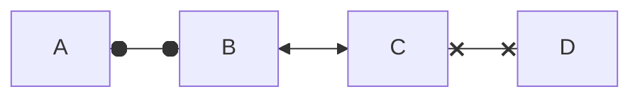

## Mermaid 在github 如何工作？
当代码遇到标记为 mermaid 的代码块时，会生成一个 iframe，iframe 采用原始 Mermaid 语法并传递给 Mermaid.js，然后将代码转换为本地浏览器中的图表。实现这一过程需要如下两个阶段：
- GitHub 的 HTML pipeline；
- 内部文件渲染服务。

首先，用户向 HTML pipeline 中添加了一个过滤器，该过滤器通过查找具有 mermaid 语言特征的原始 pre 标签，并将其替换为渐进式工作的模板，这样，在非 JavaScript 环境中请求嵌入 Mermaid 内容的客户将看到原始的 Markdown 代码。接下来，假设用户是在支持 JavaScript 的环境中查看内容，此时会将 iframe 添加到页面，将 src 属性指向 Viewscreen 服务。这样做具有以下优点：

- 将库 offload 到外部服务时，可以减少 JavaScript 有效负荷；
- 异步渲染图表有助于消除开销；
- 用户提供的内容被锁定在 iframe 中，这样不会在加载图表的 GitHub 页面上造成破坏。

参考：https://zhuanlan.zhihu.com/p/355997933
```mermid
graph LR
emperor((朱八八))-.子.->朱五四-.子.->朱四九-.子.->朱百六


朱雄英--长子-->朱标--长子-->emperor

emperor2((朱允炆))--次子-->朱标
朱樉--次子-->emperor
朱棡--三子-->emperor

emperor3((朱棣))--四子-->emperor

emperor4((朱高炽))--长子-->emperor3
```

## 饼状图
```mermid
pie
    title 为什么总是宅在家里？
    "喜欢宅" : 15
    "天气太热或太冷" : 20
    "穷" : 500
```

## 流程图
```mermid
graph LR
    A[Start] --> B{Is it?};
    B -- Yes --> C[OK];
    C --> D[Rethink];
    D --> B;
    B -- No ----> E[End];
```

## 结点
- 无名字的结点：直接写内容，此时结点边框为方形；节点内容不支持空格
- 有名字的结点：节点名后书写内容，内容左右有特定符号，结点边框由符号决定；节点内容可以有空格

下面的实例中，没有为graph指定方向，因此默认是从上往下的。但是由于各个结点之前没有箭头，所以他们都处于同一排。id1-id6是节点名，可随意定义。

```mermid
graph TD
    默认方形
    id1[方形]
    id2(圆边矩形)
    id3([体育场形])
    id4[[子程序形]]
    id5[(圆柱形)]
    id6((圆形))
```

```mermid
graph TD
	id1{菱形}
	id2{{六角形}}
	id3[/平行四边形/]
	id4[\反向平行四边形\]
	id5[/梯形\]
	id6[\反向梯形/]
```

### 连线样式
- 实线箭头：分为无文本箭头和有文本箭头，有文本箭头有2种书写格式
```mermid
graph LR
a-->b--文本1-->c-->|文本2|d
```

- 粗实线箭头：分为无文本箭头和有文本箭头
```mermid
graph LR
a==>b==文本==>c
```

- 虚线箭头：分为无文本箭头和有文本箭头
```mermid
graph LR
a-.->b-.文本.->c
```

- 无箭头线：即以上三种连线去掉箭头后的形式
```mermid
graph LR
a---b
b--文本1!---c
c---|文本2|d
d===e
e==文本3===f
f-.-g
g-.文本.-h
```

- 其他连线：需要将graph关键字改为flowchart，除了新增加的连线形式外，上面三种线的渲染效果也会不同
```mermid
flowchart LR
    A o--o B
    B <--> C
    C x--x D
    
    旧连线 --文本--> 也会不同
```

延长连线：增加相应字符即可，如下图中的B到E，连线中增加了一个-。字符可多次添加。
```mermid
graph LR
    A[Start] --> B{Is it?};
    B -->|Yes| C[OK];
    C --> D[Rethink];
    D --> B;
    B --->|No| E[End];
```

## 连线形式
- 直链
```mermid
graph LR
   A -- text --> B -- text2 --> C
```

- 多重链：可以使用&字符，或单个描述
```
graph TD
   a --> b & c--> d
   
   A & B--> C & D
   
    X --> M
    X --> N
    Y --> M
    Y --> N
```


## 其他
- 子图：需要将graph关键字改为flowchart，在代码段的开始加入subgraph，尾部加入end
flowchart TB
```mermid
graph TD
    c1-->a2
    subgraph one
    a1-->a2
    end
    subgraph two
    b1-->b2
    end
    subgraph three
    c1-->c2
    end
    one --> two
    three --> two
    two --> c2
```

- 注释：在行首加入%%即可。
```mermid
graph LR
A[Hard edge] -->|Link text| B(Round edge)
B --> C{Decision}
C -->|One| D[Result one]
C -->|Two| E[Result two]
```
## 图1
```mermid
graph TD

A-->B;
A-->C;
B-->D;
C-->D;
```


```
graph LR
    1[开始] --> 2[结束]
```


## 图2
```
flowChart TD
		A[Deploy to production] --> B{Is it Friday};
		B-- yes --> c[Do no deploy];
		B-- No --> D[Do deploy];
		C ---->E[Enjoy your day];
		D ---->E[Enjoy your day];
```

## 画二叉树
```mermaid
graph TB
A((A)) 		%%(())代表圆
B((B))
C((C))
D((D))
E((E))

A---B
A---C
B---F(( ))  %%F中为空字符
style F fill:#f100,stroke-width:0px %% 设置F属性为填充为白色，边框宽度为0
B---D
C---E
C---G(( ))   %%G中为空字符

style G fill:#f100,stroke-width:0px %% 设置F属性为填充为白色，边框宽度为0
linkStyle 2 stroke:#0ff,stroke-width:0px %%将第3条连接线的宽度设为0,就看不见这条线了
linkStyle 5 stroke:#0ff,stroke-width:0px;%%将第l6条连接线的宽度设为0,就看不见这条线了
```
## 箭头

