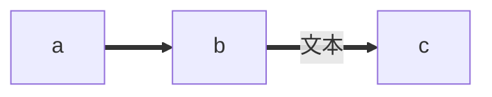

## 总文档
https://mermaid-js.github.io/mermaid/#/flowchart

## git 
https://github.com/mermaid-js/mermaid/blob/develop/README.zh-CN.md

## 在想编辑器
```
https://mermaid-js.github.io/mermaid-live-editor/edit#pako:eNpVkM1qw0AMhF9F6NRC_AI-BBo7zSWQQHLz5iC8SnZJ9gd5TQm2373r_ECrk9B8MwwasA2ascSLUDRwrJWHPF9NZcR2yVF3gqJYjhtO4ILn-wirj02AzoQYrb98PvnVDEE1bGeMIRnrr9NTqh7-necR6mZLMYV4-qscf8II68buTY7_rxjh7PpuzlSeqWhJoCJ5ILhAx-LI6lx9mC8Kk2HHCsu8apKrQuWnzPVRU-K1tikI5pxbxwukPoXD3bdYJun5DdWW8hvci5p-AbkqW5o
```
## Mermaid能绘制哪些图？
- 饼状图：使用pie关键字，具体用法后文将详细介绍
- 流程图：使用graph关键字，具体用法后文将详细介绍
- 序列图：使用sequenceDiagram关键字
- 甘特图：使用gantt关键字
- 类图：使用classDiagram关键字
- 状态图：使用stateDiagram关键字
- 用户旅程图：使用journey关键字

## 方向：用于开头，声明流程图的方向。
- graph或graph TB或graph TD：从上往下
- graph BT：从下往上
- graph LR：从左往右
- graph RL：从右往左


- 粗实线箭头：分为无文本箭头和有文本箭头
