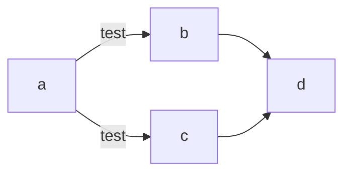
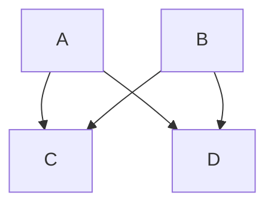
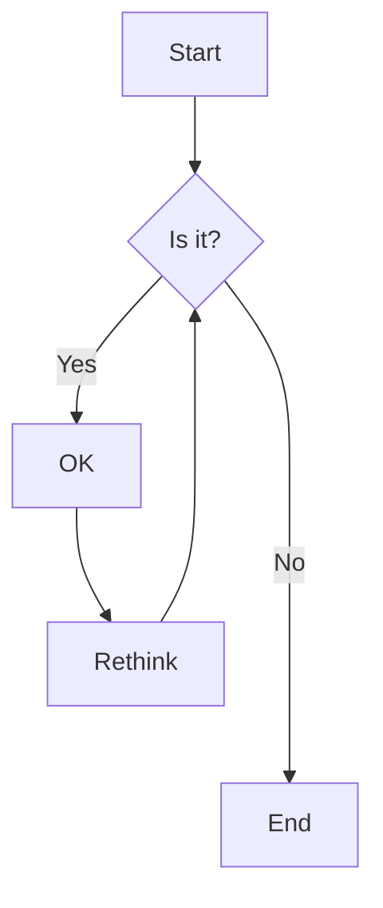
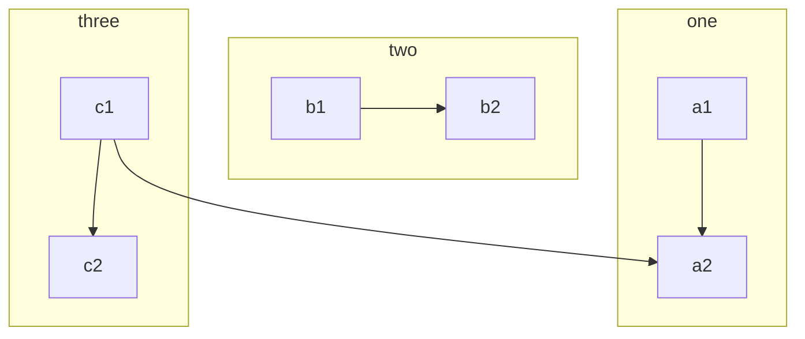
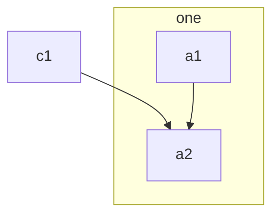
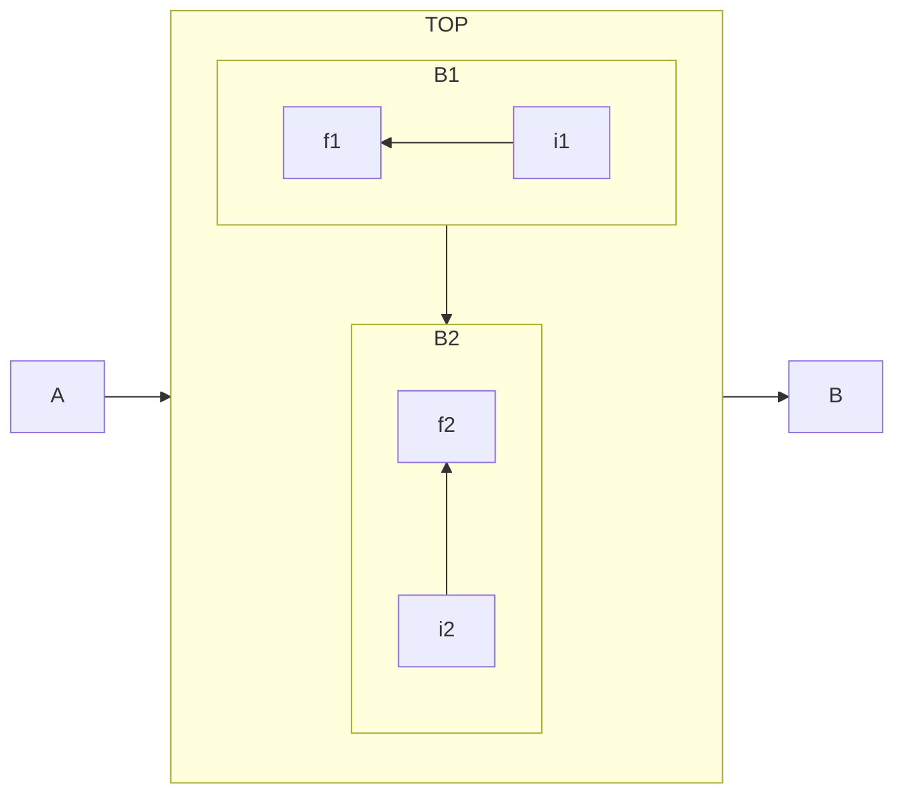
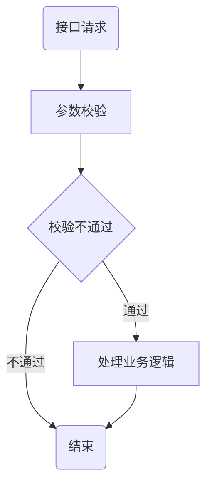

https://juejin.cn/post/7038144693867118629

## 可以在同一行中声明多个节点链接

## 方式描述依赖关系。就像下面的单线：

## 如果您使用基本语法描述相同的图表，则需要四行。

警告：这可能会使flowchart表达式 更难以阅读。

## 

## 在从节点B 到节点E的链接中添加了两个额外的破折号，因此它比常规链接多两个等级：

## 用此处示例的语法来转义字符。

## 子图

### 您还可以为子图设置显式 id。

## 子图中的方向

## 例子
