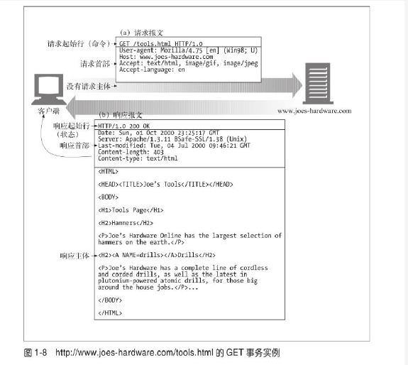

如果http是快递员，报文就是包裹
## 报文三个部分
* 起始行
  报文第一行，在请求报文中说明要做什么
  在响应报文中说明出现什么情况
* 首部字段
  起始行后面有0个或多个首部字段。每个首部字段都包含一个名和一个值。首部以一个空行结束。

* 主体
  空行之后就是可选的报文主体，包含了所有类型的数据。
请求主体中包含了要发送给服务器数据。
响应主体包括返回给客户端的数据。
  注意主体可以是任何数据，二进制，图片等
### 例子：
