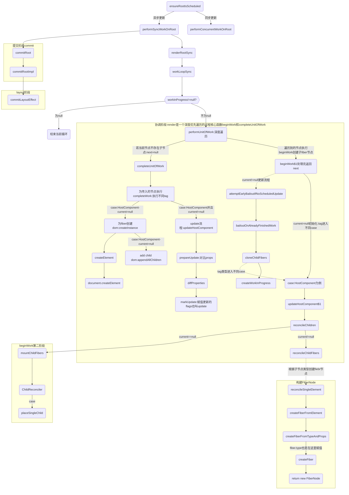
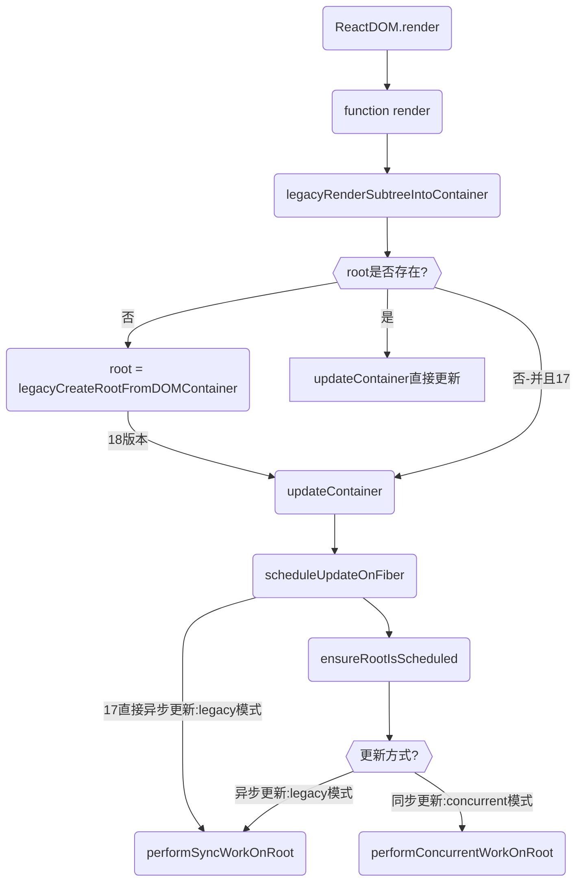
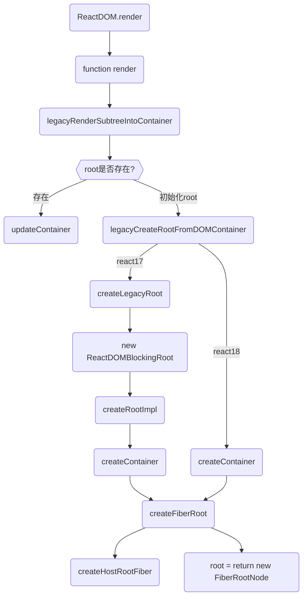

## 1.关于code-record-manual 
```
没去过的地方很难想像出来，到过的地方会忘记，但对于家乡的风景你能把很多细节构建出来。为什么？
```
开始于这句话，并借此指导方向。


## 2.关键-难点

```mermaid
flowchart TD
%% flowchart LR
  A0A(ensureRootIsScheduled)--同步更新-->A0A1(performConcurrentWorkOnRoot)
  A0A--异步更新-->A0A2(performSyncWorkOnRoot)

  A0A2(performSyncWorkOnRoot)-->A2
  A0A2-->D1
  A2(renderRootSync)-->A3(workLoopSync)-->A0Aif

  A0Aif{{workInProgress!=null?}}--不为null-->A4
  A0Aif--为null-->endW(结束当前循环)

subgraph render1[协调阶段:render是一个深度优先遍历的过程核心函数beginWork和completeUnitOfWork]

  A4(performUnitOfWork:深度遍历)

  A4--遍历到的节点执行beginWork创建子fiber节点-->A5(beginWork$1处理完返回next)

  A4--若当前节点不存在子节点:next=null-->A6B(completeUnitOfWork)
  
  A5--current=null初始化:tag进入不同case-->A6A(case:HostComponent为例)-->A6A1(updateHostComponent$1)-->A6A2(reconcileChildren)--current!=null-->A6A3(reconcileChildFibers)

  A5-.current!=null更新流程.->A51(attemptEarlyBailoutIfNoScheduledUpdate)-->A52(bailoutOnAlreadyFinishedWork)-->A53(cloneChildFibers)

  A6B-->A6B1[为传入的节点执行completeWork:执行不同tag]--case:HostComponent并且current!=null-->A6B2(update流程:updateHostComponent)-->A6A1A(prepareUpdate:对比props)-->A6A1B(diffProperties)-->A6A1C(markUpdate:赋值更新的flags也叫update)

  A6B1--case:HostComponent-current=null-->A6B3(为fiber创建dom:createInstance)
  A6B3--case:HostComponent-current=null-->A6B4(add child dom:appendAllChildren)
  A6B3-->A6B3A(createElement)-->A6B3B(document.createElement)

  A53-->createWorkInProgress
  A53-.tag类型进入不同case.->A6A
end

subgraph render2[构建FiberNode]
  A6A3-.根据子节点类型创建fiebr节点.->B1(reconcileSingleElement) --> B2(createFiberFromElement) --> B3(createFiberFromTypeAndProps) --fiber.type也是在这里赋值--> B4(createFiber)--> B5(return new FiberNode)
end

subgraph beginWork2[beginWork第二阶段]
  A6A2--current==null-->C1(mountChildFibers)-->C2(ChildReconciler)--case-->C3(placeSingleChild)
end

%% 提交阶段commit:15_3_commit阶段.md
subgraph commit[提交阶段commit]
  D1(commitRoot)-->D2(commitRootImpl)
end

%% layout阶段:15_3_commit阶段.md
subgraph layout[layout阶段]
  D2-->E1(commitLayoutEffect)
end
```

## 开头

```mermaid
flowchart TB

AAA(ReactDOM.render)-->BBB
BBB(function render)-->A-0

A-0(legacyRenderSubtreeIntoContainer)-->A-1if{{root是否存在?}}

A-1if--否-->A-1
A-1if--是-->updateContainer直接更新

A-1(root = legacyCreateRootFromDOMContainer)

A-1--18版本-->C1
A-1if--否-并且17-->C1

C1(updateContainer)
B1(scheduleUpdateOnFiber)
C1-->B1-->B1A(ensureRootIsScheduled)
B1--17直接异步更新:legacy模式-->D1

B1A-->B1Aif{{更新方式?}}

B1Aif--异步更新:legacy模式-->D1
B1Aif--同步更新:concurrent模式-->E1

D1(performSyncWorkOnRoot)
E1(performConcurrentWorkOnRoot)
```

## legacyRenderSubtreeIntoContainer 扩展

```mermaid
flowchart TB
AAA(ReactDOM.render)-->BBB
BBB(function render)

B3(legacyRenderSubtreeIntoContainer)

BBB-->B3

B3-->B3-1{{root是否存在?}}

B3-1--存在-->C2(updateContainer)

B3-1--初始化root-->C1(legacyCreateRootFromDOMContainer)

C1--react18-->C1a(createContainer)

C1--react17-->C1b(createLegacyRoot)-->C1c(new ReactDOMBlockingRoot)

%% 该方法最终返回了处理完成后的root
C1c-->D1(createRootImpl)

%% 创建fiberRoot: var root = createContainer(container, tag, hydrate);
D1-->D1a(createContainer)

%% 创建fiberRoot对象
%% return createFiberRoot(containerInfo, tag, hydrate);
D1c(createFiberRoot)

D1c-->E12(createHostRootFiber)

%% 17 root
D1a-->D1c
%% 18 root
C1a-->D1c

%% 最终创建了 fiberRoot 和 rootFiber：
%% return root;
D1c-->E1(root = return new FiberRootNode)
```
