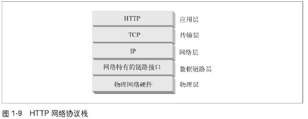
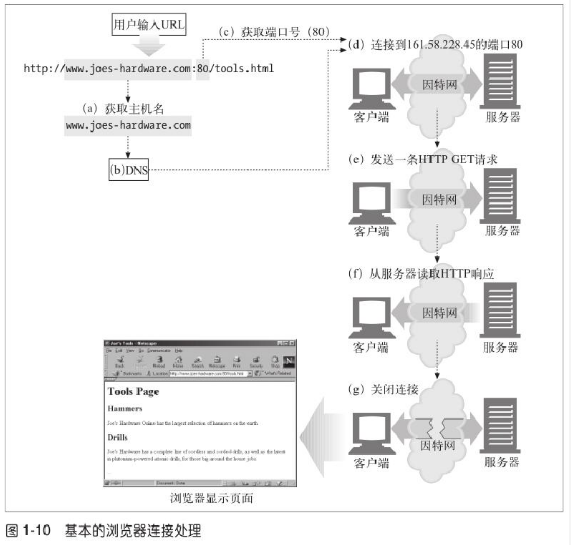

## tcp/ip
```
http:应用层协议，依靠tcp：
1.无差错的数据传输
2.按序传输:数据总是会按照发送的顺序到达
3.未分段的数据流:任意时刻以任意尺寸发送数据
```




```
a.浏览器从url解析出服务器主机名
b.浏览器将服务器的主机转换成服务器ip
c.浏览器将端口号从url解析出来
d.浏览器建立一条与服务器的tcp链接
e.浏览器发送一条http请求报文
f.服务器向浏览器回送响应报文
g.关闭链接，浏览器渲染文档
```