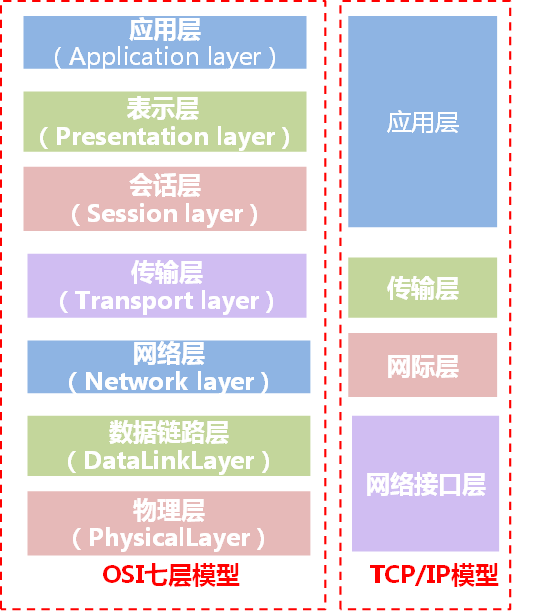

### 图例：


## 应用层
为应用程序提供服务
```
应用软件使用的协议，如邮箱使用的POP3，SMTP、远程登录使用的Telnet、获取IP地址的DHCP、域名解析的DNS、网页浏览的http协议等；这部分协议主要是规定应用软件如何去进行通信的。
```

## 表示层
数据格式转化，数据加密
```
表示层的作用，就是计算机使用计算机的编码，把应用层的图片、声音、文字等表示出来。

表示层的常见协议有jpeg（图片的编码方式），mp3（声音的编码方式），ascii（文字的编码方式）等。
```

## 会话层
建立，管理和维护会话
```
为两端通信实体建立连接（会话），中间有认证鉴权以及检查点记录（供会话意外中断的时候可以继续，类似断点续传）。

实际传输之前会先建立A与B的会话连接，才真正开始传输信息/数据（你可以理解借传输文件理解：你发送文件给对方，要等待对方按下接收，才算建立了会话，然后才开始传输。）这算会话层了。
```

## 传输层
建立，管理和维护端到端的链接
```
将一个数据/文件斩件分成很多小段，标记顺序以被对端接收后可以按顺序重组数据，另外标记该应用程序使用的端口号及提供QOS。（不同的应用程序使用不同计算机的端口号，同样的应用程序需要使用一样的端口号才能正常通信）

例如：
会话建立后，会将A发的信息斩件，如A发送“你吃了饭没有”？传输层将这句话斩成“你”“吃”“了”“饭”“没”“有”6个数据段，标记号使用的端口号，然后准备发出去。
```

上三层的重点在app开发，从传输层开始，重点就在网络通信了。
传输层有两个作用，首选会根据情况，选择跑的傻快但可能丢包的udp协议，或者跑的有点慢但是特别稳不丢包的tcp。

* 所以为了保证文件传输的完整性，一般会选用tcp协议，tcp会对所发的每个数据包进行确认，只有对方真的收到了，才算发送成功。

* 视频聊天发送的数据不是一个本来存在的固定的文件，而是边采集视频边发送，所以没有文件完整性一说，采集多少发送多少嘛。
但是视频聊天时候对延迟要求很高，可以接受数据少量丢失，但不能接受延迟，所以这时会采用udp作为传输层协议。
```
传输层除了负责选择tcp还是udp，还会给数据包打上端口号。
小明只有1个ip，但是小明同时登了qq，微信，支付宝3个应用，那么就有必要给数据包打上不同的端口号，来识别这个数据包属于哪个应用。
```

## 网络层
ip地址及路由选择
路由选路，选择本次通信使用的协议（http、ftp等），指定路由策略及访问控制策略。（IP地址在这一层）

总结：网络层的作用是给数据包打上ip地址，并且进行路由转发。
```
经过前面的工作，小明聊天的内容其实还没有发出去，只是经过了编码，并打上了端口号，但并没有说这个包要发往哪里。
接下来就是网络层的工作，网络层会给数据包打上ip地址，ip地址是互联网地址，类似于发快递时的收件人/发件人地址，有了这个地址，就可以远跨重洋将数据包发往全世界任何一个目的地。

有一个叫路由器的网络设备，是工作在网络层的，路由器相当于快递公司的各个节点，用来根据ip地址来转发各种各样的数据包。
```

```
接上一层，信息还未发出去，这时候在网络层做路由选路，可以理解为，从A家出去，可以分别经“联通”“电信”“移动”3个网络中的一个再到B家。网络层根据路由协议负责选路（根据链路质量、带宽、开销等方法论）。假设最后选了2条，可能就A->联通->B发送“你”“吃”“了”3个数据段，A->电信->B发送“饭”“没”“有”3个数据段。

选路后，这一层要标记IP包头，包头主要内容是源IP地址，目的IP地址，使用什么协议。其中源、目的IP相当于你寄信的时候的收发的地址与邮政编码，标记出发送者与接收者。而协议相当于这封信到底用什么语言书写。
```

## 数据链路层
提供介质访问和链路管理
根据端口与MAC地址，做分组（VLAN）隔离、端口安全、访问控制。（MAC地址在这一层）处理VLAN内的数据帧转发，跨VLAN间的访问，需要上升到网络层。

总结：数据链路层的工作就是给数据包打上mac地址，然后交换机进行高速的交换转发。
```
网络层的路由器用来连接各个网段，可以理解为，快递公司的大卡车负责把快递运到各个派送点，但是快递公司的大卡车并没有直接送到收件人的手里。那么谁最终把快递包送到收件人手里呢，当然是快递小哥。在网络通信中，有个叫交换机的设备，也是负责最终把数据包交给接收人。交换机通过mac地址来识别各个终端（电脑、手机等），会记录下每个mac连在自己的哪个接口上，然后把数据包迅速发出。Mac地址在电脑或手机出厂时就有了，当连接到网络中时，交换机会自动学习到。
```

```
例如：
然后再到数据链路层，数据链路层主要是负责同一个子网内的通信的。例如A、B连接在同一台二层交换机，就属于同一个子网，那么数据帧的通信室是不需要通过网络层的（即三层交换机或者路由器），直接在这台二层交换机就过去了。这一层打的是MAC地址的帧头，对于上述通信过程来说，就是为数据帧打上A的机器的MAC与A的网关的MAC。这一层的工作就完成了。
```

## 物理层
物理层的作用就是定义怎么用物理信号来表示数据。
将数据最终编码为用0、1标识的比特流，然后传输。
```
比如为什么网线是8根小线组成的而不是6根，wifi的电磁波频率为什么是2.4G和5G而不是别的，这些都是ieee（电气和电子工程师协会）规定的标准

最后一层了，经过上述斩件、打完各层标签后的6个数据帧，物理层将他们翻译文6段0、1表示的比特流，然后通过光纤、铜缆进行传输。
```