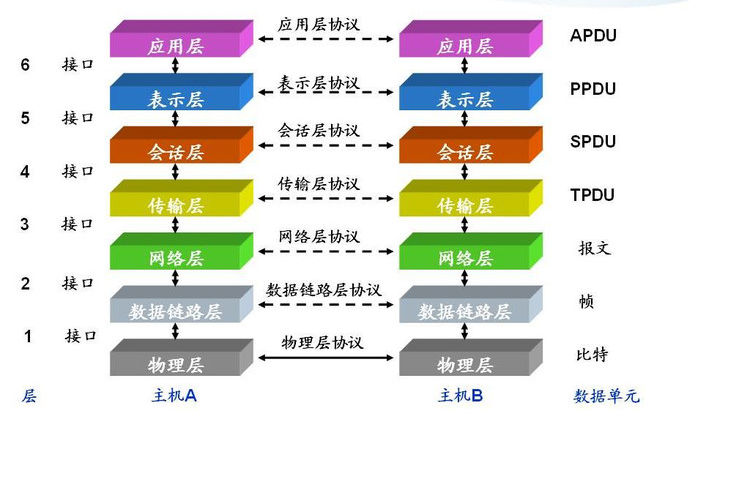

# HTTP 协议_TCP/UDP 协议_IP 协议
```
HTTP 协议:超文本传输协议，对应于应用层，用于如何封装数据.

TCP/UDP 协议:传输控制协议，对应于传输层，主要解决数据在网络中的传输。

IP 协议:对应于网络层，同样解决数据在网络中的传输。

传输数据的时候只使用 TCP/IP 协议(传输层)，如果没有应用层来识别数据内容，传输后的协议都是无用的。
```

**应用层协议很多 FTP,HTTP,TELNET等，可以自己定义应用层协议。**<br>
```
通常称与人类直接打交道的协议，叫应用层（Application）协议，或者业务层协议。三个协议：
1.浏览网页
  web 使用 HTTP 作传输层协议，以封装 HTTP 文本信息，然后使用 TCP/IP 做传输层协议，将数据发送到网络上。
2.下载文件
浏览器是借助FTP协议与文件下载服务器传输数据
3.发送邮件
电子邮件客户端是借助SMTP协议与邮件服务器沟通交流

通俗地说，应用层协议，如同人类的小秘书兼翻译，用服务器可以听得懂的语言与服务器沟通。
HTTP、FTP、SMTP三个小翻译，能把老王的需求翻译成由“0”、“1”组成的小串串，简称应用数据块。
```

### TCP/IP协议就是为了解决哪些问题
```
1.应用数据块如何在浩瀚的互联网准确无误找到目的地？
  IP协议:在应用数据块的外层写上目的地IP地址，使得应用数据块可以找到目的地，这样就解决问题1。
2.服务器回应数据块如何在浩瀚的互联网准确无误地返回？
  IP协议还会在应用数据块的外层写上源IP地址，使得服务器回应数据块返回源主机，这样就解决问题2。
3.应用数据块在到达目的地之前丢失了，如何处理？
4.服务器回应数据块旅途中丢失了，如何处理？
```

IP协议解决1和2问题点基于
* 底层物理网络的连通性是IP能否正常工作的前提
* IP路由表在全球路由器里完成了同步

**即使有了这两个前提条件，也不能100%保证IP报文能够到达目的地！**<br/>
```
信号传输过程失真造成丢包、网络发生拥堵而丢包

我们还需要一个协议，这个协议需要有以下特质：
1.当丢包发生时，能够自动修复丢包，而无需人的手动干预
2.能够智能感知网络的拥堵情况，网络空闲时，尽最大速率发包；网络拥堵时，降低速率发包，不给互联网添堵
```
### 满足这个特质的协议，它的名字叫TCP协议。
TCP协议也不是什么大神，不过是一个任劳任怨的流量调度员。说到底它就有一个本事：
**确认机制！**
凭着这个看家本领，TCP可以保证应用数据的可靠传输。
TCP会对发出的数据包（以下简称包裹）进行编号，如同快递的快递单号一样。对方TCP收到包裹，会回复一个确认消息，确认收到了该编号的包裹了
```
有同学会说，确认机制可以理解，TCP发数据就发数据，但为何TCP发数据之前需要连接？

在互联网上可以找到各种各样的解释，而我的观点是：

双方通过TCP连接，分享彼此的应用数据块第一个字节的原点序号。

如果TCP没有提前分享，接收方不知道接收的数据是否是第一个包。

如果不是第一个包，接收方的TCP却将该数据包提交给应用程序，应用程序压根无法理解。


应用程序以为是第一个包，其实并不是，应用程序的小翻译（HTTP/FTP/SMTP）瞬间懵逼，风雨中瑟瑟发抖。。。

为何无法理解?
分享了原点序列号，即使第二个、第三个数据包先到达目的地，而第一个数据包姗姗来迟的情况，接收方的TCP可以耐心等待第一个数据包的到来，然后按序将数据包提交给应用程序。这样应用程序的小翻译就会秒懂。。。


有了TCP协议的帮助，即使老王的网线拔掉了一段时间，稍后再插入，恢复了网络连通性，老王中断的文件下载任务可以继续工作，而无需老王重新下载。
```

### UDP协议 和 DNS协议
UDP有点像街头的邮筒，应用程序的数据包扔进邮筒就好了，就耐心地等待数据包到达目的地。但扔进邮筒之前，需要写好以下信息：
```
1.收件人的地址（目的IP）
2.收件人的姓名（目的端口号）
3.寄件人地址（源IP）
4.寄件人姓名（源端口号）

IP司机会瞬间地将邮筒里的信件，运往世界各个角落。

比较奢侈的是，一个IP司机运一件信件。
```
我们使用浏览器、邮件客户端却一直和UDP协议直接打交道。要下载文件，首先要域名解析获得服务器的IP地址，而完成域名解析任务的是DNS协议。

**DNS协议**<br/>
DNS协议将自己的域名解析请求报文扔到UDP邮筒里，被IP司机运输到域名服务器家中，服务器返回域名解析应答，同样通过UDP邮筒邮寄服务。