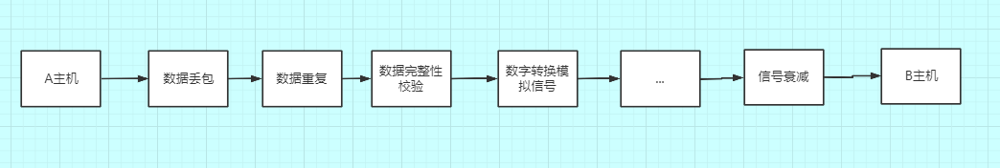
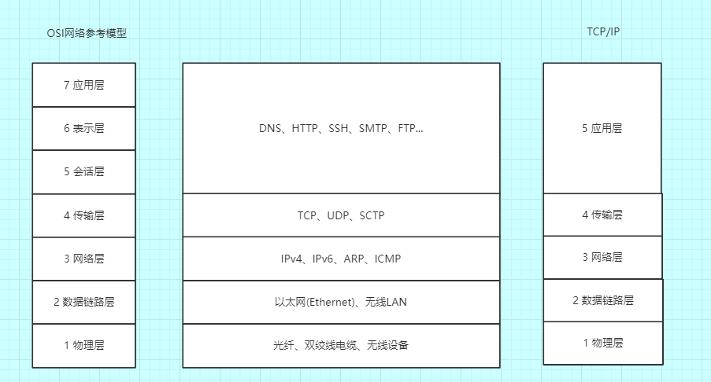
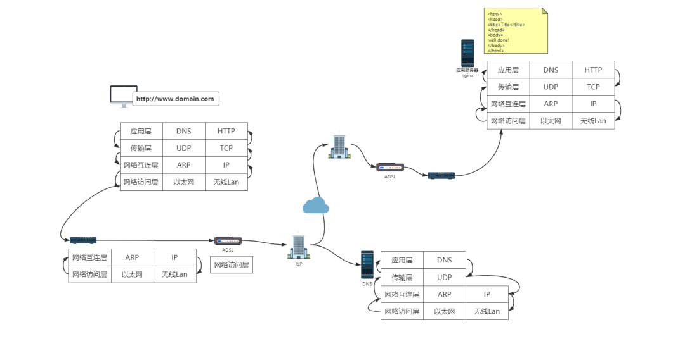

### 1.现在有一个需求：一个数据包从 A 主机传送到 B 主机
在发送过程中都会发生什么?

```
数据传输过程中会发生数据丢包，当数据丢包后，往往会进行数据重传，数据重传多次的话，还有可能会发生数据重复，或者之前数据丢失的包并没有真正丢失，只是在网络中产生了一个延迟，这样也会发生数据的重复问题。

通过网络设备进行数据转发的时候，数据在经过设备的时候都有可能被人串改，或者本身设备有一些问题导致数据的一些错误，所以要进行数据完整性的校验，包括数据传输介质也可能是多样的，比如内网直接通过网线去传输，公网的话通常就要通过光纤去传输，所以要实现不同介质之间信号的转换，数字转换模拟信号，距离比较远的话，还会存在一个信号衰减的问题。
```
### 2.为了简化网络的复杂度，网络通信的不同方面被分解为多层次结构，每一层只与紧挨着的上层或者下层进行交互，将网络分层，这样就可以修改甚至替换某一层的软件，只要层与层之间的接口保持不变，就不会影响到其他层。
* OSI(Open System Interconnection Reference Model)：开放系统互联参考模型
* TCP/IP 协议族

左边是 OSI 网络参考模型分为了 7 层，右边是 TCP/IP 协议族分为了 5 层，TCP/TP 协议族把表示层与会话层合并到了应用层里，中间就是不同层次之间的协议。


### 一个 HTTP 请求的分层解析流程

**通过一个 HTTP 请求看一下不同层次之间是如何工作的：**<br>
```
我们的服务器上部署了一个静态页面(图片又上角黄色的部分)，通过 Nginx 部署在我们的公网上面，现在我们通过浏览器来进行访问，在浏览器中输入域名，点下回车之后它们是如何工作的呢？
```
第一步，获取域名：
```
浏览器先会去解析域名，因为在客户端 C 与服务端 S 进行数据交互的时候，它是不认域名的，认的是 ip 地址，所以浏览器先会解析域名，然后去看下浏览器中有没有域名对应的 DNS 的相关信息的缓存，有的话我们就能从中拿到服务端 S 的 ip 地址，没有的话，会去本地的 host 文件里看有没有配置，没有配置的话，会发起一个 DNS 的请求，获取服务器的 ip 地址(DNS 也是一台服务器，也有自己的 ip 地址，通常是配置在操作系统上的)。
```
### 获取服务器 IP 地址过程：
```
  应用层------>传输层
这时应用层会构造一个 DNS 请求报文，然后应用层会调用传输层的一个接口，因为 DNS 使用 UDP 来进行数据的传输，所以应用层会调用传输层的 UDP 相关的一个协议，实现数据的传输。

说白了就是应用层会调用传输层的 API,传输层会在 DNS 请求报文的基础上加一个 UDP 的请求头。

  传输层---->网络层---->数据链路层
然后传输层会把数据交给网络层，网络层同样的会在 UDP 的请求报文的基础上再加一个 IP 的请求头，网络层再把 IP 请求报文交给数据链路层，

  数据链路层----->然后通过物理层传出去，通常传到路由器上面
数据链路层会实现一个二层的寻址，这时它会把自己的 make 头加上去，并且会把对应的请求报文应该要去交给下一个机器的 make 地址也加上去(会通过网络层的 ARP 协议去找到，ARP 会发送 ARP 的请求去看下 IP 地址对应的 make 地址是多少，拿到之后会交给数据链路层)，然后通过物理层传出去，通常传到路由器上面。
```
<font color='red'>路由器返回域名对应的IP地址(拿到后层层往上传到应用层)</font>
```
路由器是一个三层的设备，最开始会通过物理层来进行连接，之后物理层把数据交给数据链路层，链路层会看下 make 地址是不是给我的，是给我的就解析，不是就丢弃，解析完后，数据报文在往上面去传输到网络层，网络层会去看下这个数据应该传到下一个路由器的地址是多少，这个时候它会通过运营商的网络接口传到运营商的路由器上面，

运营商这边就比较复杂，运营商会有自己的 DNS 服务器，如果电脑配置的是运营商的 DNS 的话，会直接去运营商的 DNS 服务器上去找对应的域名，
这个时候就会拿到对应的 ip 地址，然后开始一个层层的原路返回，直到应用层拿到了返回的报文，也就是拿到了域名对应的 IP 地址。
```

### 这时应用层就会进行 HTTP 请求报文的发送，这时 HTTP 会干什么呢？

```
  应用层------>传输层
同样的它会去调用传输层的协议,因为 HTTP 是基于 TCP 协议来实现的，所以在调用传输协议的时候，传的是 TCP 的一些参数，

  传输层---->网络层---->数据链路层--->然后通过物理层传出去，通常传到路由器进行传输
TCP 会调网络层的 IP 协议，IP 协议会加 IP 头，然后数据链路层会加上 make 头，和刚才 UDP 协议是一样的，会通过物理层和路由器进行数据的传输，

这一次携带的是 IP 地址，所以不用访问运营商的 DNS 服务器，而是运营商根据 IP 地址把数据报文传输给目标服务器的运营商，运营商之前有专线进行连接，所以数据到达了服务器的网络环境下，仍然逐层解析，物理层发往数据链路层，链路层判断数据是不是给自己的，是的话就进行解析，链路层发往网络层，判断网络的 IP 地址是不是自己，是的话进行解析，发往传输层，解析 TCP 的端口比如 80，传输层会把请求报文交给应用层应用程序，如果部署的是 Nginx 服务器的话，默认去找 80 端口对应的应用程序，应用层解析报文，构造一个 HTTP 的响应报文，逐层返回到客户端 C。
```