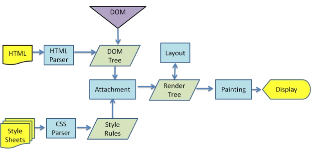

#### 从浏览器地址栏输入 url 到显示页面的步骤
##### 1、输入url首先从本地查找域名，有的话直接用hosts文件里的ip地址，否则查询DNS，得到ip地址

##### 2、查看浏览器缓存，看是否有缓存，如果有缓存，继续查看缓存是否过期，如果没有过期，直接返回缓存页面，
缓存
 1. 如果资源未缓存，发起新请求
 2. 如果已缓存，检验是否足够新鲜，足够新鲜直接提供给客户端，否则与服务器进行验证。
 3. 检验新鲜通常有两个 HTTP 头进行控制
    Expires
    Cache-Control
    - HTTP1.0 提供 Expires，值为一个绝对时间表示缓存新鲜日期
    - HTTP1.1 增加了 Cache-Control: max-age=,值为以秒为单位的最大新鲜时间
如果没有缓存或者缓存过期，发送一个请求。

#### 3. 浏览器**解析 URL**获取协议，主机，端口，path
浏览器获取主机 ip 地址，过程如下：
  1. 浏览器缓存
  2. 本机缓存
  3. hosts 文件
  4. 路由器缓存
  5. ISP DNS 缓存
  6. DNS 递归查询（可能存在负载均衡导致每次 IP 不一样）
#### 4. 浏览器**组装一个 HTTP（GET）请求报文**

#### 5.打开一个 socket 与目标 IP 地址，端口建立 TCP 链接，三次握手如下：
1. 客户端发送一个 TCP 的**SYN=1，Seq=X**的包到服务器端口
2. 服务器发回**SYN=1， ACK=X+1， Seq=Y**的响应包
3. 客户端发送**ACK=Y+1， Seq=Z**

三次握手（Three-way Handshake）其实就是指建立一个TCP连接时，需要客户端和服务器总共发送3个包。进行三次握手的主要作用就是为了确认双方的接收能力和发送能力是否正常、指定自己的初始化序列号为后面的可靠性传送做准备。实质上其实就是连接服务器指定端口，建立TCP连接，并同步连接双方的序列号和确认号，交换`TCP窗口大小`信息。
比较简单：
- 1）No1：浏览器（192.168.1.6）向服务器（115.239.210.36）发出连接请求。此为TCP三次握手第一步，此时从图中可以看出，为SYN，seq:X （x=0）；
- 2）No2：服务器（115.239.210.36）回应了浏览器（192.168.1.6）的请求，并要求确认，此时为：SYN，ACK，此时seq：y（y为0），ACK：x+1（为1）。此为三次握手的第二步；
- 3）No3：浏览器（192.168.1.6）回应了服务器（115.239.210.36）的确认，连接成功。为：ACK，此时seq：x+1（为1），ACK：y+1（为1）。此为三次握手的第三步；
//在TCP三次握手之后，建立了TCP连接，此时HTTP就可以进行传输了。
- 4）No4：浏览器（192.168.1.6）发出一个页面HTTP请求；
- 5）No5：服务器（115.239.210.36）确认；
- 6）No6：服务器（115.239.210.36）发送数据；
- 7）No8：客户端浏览器（192.168.1.6）确认；
- 8）No81：客户端（192.168.1.6）发出一个图片HTTP请求；
- 9）No202：服务器（115.239.210.36）发送状态响应码200 OK。

面试时越简单的问题，一般就是隐藏着比较大的坑，一般都是需要将问题扩展的。上面求职者的回答不对吗？当然对，但距离面试官的期望可能还有点距离。
希望大家能带着如下问题进行阅读，收获会更大。 
1. 请画出三次握手和四次挥手的示意图 
2. 为什么连接的时候是三次握手？ 
3. 什么是半连接队列？ 
4. ISN(Initial Sequence Number)是固定的吗？ 
5. 三次握手过程中可以携带数据吗？ 
6. 如果第三次握手丢失了，客户端服务端会如何处理？ 
7. SYN攻击是什么？ 
8. 挥手为什么需要四次？ 
9. 四次挥手释放连接时，等待2MSL的意义?

##### 5-1.再次详解：刚开始客户端处于 Closed 的状态，服务端处于 Listen 状态。 进行三次握手： 

- 第一次握手：客户端给服务端发一个 SYN 报文，并指明客户端的初始化序列号 ISN(c)。此时客户端处于 `SYN_SEND` 状态。
首部的同步位SYN=1，初始序号seq=x，SYN=1的报文段不能携带数据，但要消耗掉一个序号。 

- 第二次握手：服务器收到客户端的 SYN 报文之后，会以自己的 SYN 报文作为应答，并且也是指定了自己的初始化序列号 ISN(s)。同时会把客户端的 ISN + 1 作为ACK 的值，表示自己已经收到了客户端的 SYN，此时服务器处于 `SYN_REVD` 的状态。
在确认报文段中SYN=1，ACK=1，确认号ack=x+1，初始序号seq=y。 

- 第三次握手：客户端收到 SYN 报文之后，会发送一个 ACK 报文，当然，也是一样把服务器的 ISN + 1 作为 ACK 的值，表示已经收到了服务端的 SYN 报文，此时客户端处于 `ESTABLISHED` 状态。服务器收到 ACK 报文之后，也处于 `ESTABLISHED` 状态，此时，双方已建立起了连接。
确认报文段ACK=1，确认号ack=y+1，序号seq=x+1（初始为seq=x，第二个报文段所以要+1），ACK报文段可以携带数据，不携带数据则不消耗序号。
发送第一个SYN的一端将执行主动打开（active open），接收这个SYN并发回下一个SYN的另一端执行被动打开（passive open）。
在socket编程中，客户端执行connect()时，将触发三次握手。

##### 5-2 为什么需要三次握手，两次不行吗？
弄清这个问题，我们需要先弄明白三次握手的目的是什么，能不能只用两次握手来达到同样的目的。
- 第一次握手：客户端发送网络包，服务端收到了。 这样服务端就能得出结论：客户端的发送能力、服务端的接收能力是正常的。
- 第二次握手：服务端发包，客户端收到了。 这样客户端就能得出结论：发送能力，客户端的接收是正常的。不过此时服务器并不能确认客户端的接收能力是否正常。
- 第三次握手：客户端发包，服务端收到了。 这样服务端就能得出结论：客户端的接收、发送能力正常，服务器自己的发送、接收能力也正常。

因此，需要三次握手才能确认双方的接收与发送能力是否正常。

试想如果是用两次握手，则会出现下面这种情况：
> 如客户端发出连接请求，但因连接请求报文丢失而未收到确认，于是客户端再重传一次连接请求。后来收到了确认，建立了连接。数据传输完毕后，就释放了连接，客户端共发出了两个连接请求报文段，其中第一个丢失，第二个到达了服务端，但是第一个丢失的报文段只是在**某些网络结点长时间滞留了，延误到连接释放以后的某个时间才到达服务端**，此时服务端误认为客户端又发出一次新的连接请求，于是就向客户端发出确认报文段，同意建立连接，不采用三次握手，只要服务端发出确认，就建立新的连接了，此时客户端忽略服务端发来的确认，也不发送数据，则服务端一致等待客户端发送数据，浪费资源。


### 5-3 三次握手过程中可以携带数据吗？

其实第三次握手的时候，是可以携带数据的。但是，第一次、第二次握手不可以携带数据
为什么这样呢?大家可以想一个问题，假如第一次握手可以携带数据的话，如果有人要恶意攻击服务器，那他每次都在第一次握手中的 SYN 报文中放入大量的数据。因为攻击者根本就不理服务器的接收、发送能力是否正常，然后疯狂着重复发 SYN 报文的话，这会让服务器花费很多时间、内存空间来接收这些报文。

也就是说，第一次握手不可以放数据，其中一个简单的原因就是会让服务器更加容易受到攻击了。而对于第三次的话，此时客户端已经处于 ESTABLISHED 状态。对于客户端来说，他已经建立起连接了，并且也已经知道服务器的接收、发送能力是正常的了，所以能携带数据也没啥毛病。

###### 5-4 SYN攻击是什么？
服务器端的资源分配是在二次握手时分配的，而客户端的资源是在完成三次握手时分配的，所以服务器容易受到SYN洪泛攻击。SYN攻击就是Client在短时间内伪造大量不存在的IP地址，并向Server不断地发送SYN包，Server则回复确认包，并等待Client确认，由于源地址不存在，因此Server需要不断重发直至超时，这些伪造的SYN包将长时间占用未连接队列，导致正常的SYN请求因为队列满而被丢弃，从而引起网络拥塞甚至系统瘫痪。SYN 攻击是一种典型的 DoS/DDoS 攻击。

检测 SYN 攻击非常的方便，当你在服务器上看到大量的半连接状态时，特别是源IP地址是随机的，基本上可以断定这是一次SYN攻击。在 Linux/Unix 上可以使用系统自带的 netstats 命令来检测 SYN 攻击。

##### 6、三次握手连接后，浏览器发送一个http请求（这部分是重点，请查询相关资料，详细了解http协议关于请求格式和重要的几个请求头字段含义）。

##### 7、服务器看是否需要缓存，服务器处理完请求，发出一个响应（这部分也是重点，请查询资料了解http响应头各个字段的含义）
服务器检查**HTTP 请求头是否包含缓存验证信息**如果验证缓存新鲜，返回**304**等对应状态码

##### 8、服务器收到请求，转到相关的服务程序，期间可能需要连接并操作数据库（主要分get和post请求）。
服务器处理完请求，发出一个响应（这部分也是重点，请查询资料了解http响应头各个字段的含义）


##### 9、浏览器并根据请求头包含信息决定是否需要关闭TCP连接（如需关闭，则需要四次挥手过程）
浏览器接收 HTTP 响应，然后根据情况选择
      关闭 TCP 连接或者保留重用，关闭 TCP 连接的四次握手如

     1. 主动方发送**Fin=1， Ack=Z， Seq= X**报文
     2. 被动方发送**ACK=X+1， Seq=Z**报文
     3. 被动方发送**Fin=1， ACK=X， Seq=Y**报文
     4. 主动方发送**ACK=Y， Seq=X**报文
##### 9-1. 四次挥手
建立一个连接需要三次握手，而终止一个连接要经过四次挥手（也有将四次挥手叫做四次握手的）。这由TCP的**半关闭**（half-close）造成的。所谓的半关闭，其实就是TCP提供了连接的一端在结束它的发送后还能接收来自另一端数据的能力。

TCP 的连接的拆除需要发送四个包，因此称为四次挥手(Four-way handshake)，客户端或服务器均可主动发起挥手动作。

刚开始双方都处于 ESTABLISHED 状态，假如是客户端先发起关闭请求。四次挥手的过程如下：

- 第一次挥手：客户端发送一个 FIN 报文，报文中会指定一个序列号。此时客户端处于 `FIN_WAIT1` 状态。 即发出**连接释放报文段**（FIN=1，序号seq=u），并停止再发送数据，主动关闭TCP连接，进入FIN_WAIT1（终止等待1）状态，等待服务端的确认。
- 第二次挥手：服务端收到 FIN 之后，会发送 ACK 报文，且把客户端的序列号值 +1 作为 ACK 报文的序列号值，表明已经收到客户端的报文了，此时服务端处于 `CLOSE_WAIT` 状态。 即服务端收到连接释放报文段后即发出**确认报文段**（ACK=1，确认号ack=u+1，序号seq=v），服务端进入CLOSE_WAIT（关闭等待）状态，此时的TCP处于半关闭状态，客户端到服务端的连接释放。客户端收到服务端的确认后，进入FIN_WAIT2（终止等待2）状态，等待服务端发出的连接释放报文段。
- 第三次挥手：如果服务端也想断开连接了，和客户端的第一次挥手一样，发给 FIN 报文，且指定一个序列号。此时服务端处于 `LAST_ACK` 的状态。 即服务端没有要向客户端发出的数据，服务端发出**连接释放报文段**（FIN=1，ACK=1，序号seq=w，确认号ack=u+1），服务端进入LAST_ACK（最后确认）状态，等待客户端的确认。
- 第四次挥手：客户端收到 FIN 之后，一样发送一个 ACK 报文作为应答，且把服务端的序列号值 +1 作为自己 ACK 报文的序列号值，此时客户端处于 `TIME_WAIT` 状态。需要过一阵子以确保服务端收到自己的 ACK 报文之后才会进入 CLOSED 状态，服务端收到 ACK 报文之后，就处于关闭连接了，处于 `CLOSED` 状态。 即客户端收到服务端的连接释放报文段后，对此发出**确认报文段**（ACK=1，seq=u+1，ack=w+1），客户端进入TIME_WAIT（时间等待）状态。此时TCP未释放掉，需要经过时间等待计时器设置的时间2MSL后，客户端才进入CLOSED状态。

收到一个FIN只意味着在这一方向上没有数据流动。客户端执行主动关闭并进入TIME_WAIT是正常的，服务端通常执行被动关闭，不会进入TIME_WAIT状态。

在socket编程中，任何一方执行close()操作即可产生挥手操作。


##### 9-2.挥手为什么需要四次？
因为当服务端收到客户端的SYN连接请求报文后，可以直接发送SYN+ACK报文。其中ACK报文是用来应答的，SYN报文是用来同步的。但是关闭连接时，当服务端收到FIN报文时，很可能并不会立即关闭SOCKET，所以只能先回复一个ACK报文，告诉客户端，"你发的FIN报文我收到了"。只有等到我服务端所有的报文都发送完了，我才能发送FIN报文，因此不能一起发送。故需要四次挥手。

##### 10、浏览器接收到请求
10-1.浏览器检查响应状态吗：是否为 1XX，3XX， 4XX， 5XX，这些情况处理与 2XX 不同

10-2. 如果资源可缓存，**进行缓存**

10-3. 对响应进行**解码**（例如 gzip 压缩）

10-4. 根据资源类型决定如何处理（假设资源为 HTML 文档）

#### 12、浏览器收到结果，开始解析资源（JS、CSS、HTML），解析HTML生成的dom树，和同时解析css生成的cssom树结合生成渲染树
##### 12-1.构建 DOM 树
[根据 DOM 树和 CSSOM 树构建渲染树](https://developers.google.com/web/fundamentals/performance/critical-rendering-path/render-tree-construction)
     1. 从 DOM 树的根节点遍历所有**可见节点**，不可见节点包括：1）`script`,`meta`这样本身不可见的标签。2)被 css 隐藏的节点，如`display: none`
     2. 对每一个可见节点，找到恰当的 CSSOM 规则并应用
     3. 发布可视节点的内容和计算样式
     解析过程中遇到图片、样式表、js 文件，**启动下载**

##### 浏览器渲染dom
1. 浏览器把获取到的HTML代码解析成1个DOM树，HTML中的每个tag都是DOM树中的1个节点，根节点就是我们常用的document对象。DOM树里包含了所有HTML标签，包括display:none隐藏，还有用JS动态添加的元素等。

2. 浏览器把所有样式(用户定义的CSS和用户代理)解析成样式结构体，在解析的过程中会去掉浏览器不能识别的样式，比如IE会去掉-moz开头的样式，而FF会去掉_开头的样式。

3. DOM Tree 和样式结构体组合后构建render tree, render tree类似于DOM tree，但区别很大，render tree能识别样式，render tree中每个NODE都有自己的style，而且render tree不包含隐藏的节点(比如display:none的节点，还有head节点)，因为这些节点不会用于呈现，而且不会影响呈现的，所以就不会包含到 render tree中。

注意 visibility:hidden隐藏的元素还是会包含到 render tree中的，因为visibility:hidden 会影响布局(layout)，会占有空间。根据CSS2的标准，render tree中的每个节点都称为Box (Box dimensions)，理解页面元素为一个具有填充、边距、边框和位置的盒子。

```
参考：https://segmentfault.com/a/1190000017329980
1. 解析HTML，生成DOM树，解析CSS，生成CSSOM树
2. 将DOM树和CSSOM树结合，生成渲染树(Render Tree)
3. Layout(回流):根据生成的渲染树，进行回流(Layout)，得到节点的几何信息（位置，大小）
4. Painting(重绘):根据渲染树以及回流得到的几何信息，得到节点的绝对像素
5. Display:将像素发送给GPU，展示在页面上。（这一步其实还有很多内容，比如会在GPU将多个合成层合并为同一个层，并展示在页面中。
```


一旦render tree构建完毕后，浏览器就可以根据render tree来绘制页面了。

##### 回流重绘，见辅文件
当render tree中的一部分(或全部)因为元素的规模尺寸，布局，隐藏等改变而需要重新构建。这就称为回流(reflow)。每个页面至少需要一次回流，就是在页面第一次加载的时候。

在回流的时候，浏览器会使渲染树中受到影响的部分失效，并重新构造这部分渲染树，完成回流后，浏览器会重新绘制受影响的部分到屏幕中，该过程成为重绘。

##### 减少回流、重绘其实就是需要减少对render tree的操作（合并多次多DOM和样式的修改），并减少对一些style信息的请求，尽量利用好浏览器的优化策略。

1. 策略1.浏览器本身的优化策略
浏览器会维护一个队列，把所有引起重排、重绘的操作放入这个队列，等队列中的操作到了一定数量或时间间隔，浏览器就会flush队列，进行一个批处理。这样让多次的重排重绘变成一次。但有时候一些特殊的style属性会使这种优化失效。例如offsetTop, scrollTop, clientTop, getComputedStyle()（IE中currentStyle）等属性，这些属性都是需要实时回馈给用户的几何属性或布局属性，因此浏览器不得不立即执行，并随之触发重排返回正确的值。
2. 策略2.最小化重绘和重排
由于重绘和重排可能代价比较昂贵，因此最好就是可以减少它的发生次数。为了减少发生次数，我们可以合并多次对DOM和样式的修改，然后一次处理掉。


##### 12-2.js 解析如下
1. 浏览器创建 Document 对象并解析 HTML，将解析到的元素和文本节点添加到文档中，此时**document.readystate 为 loading**

2. HTML 解析器遇到**没有 async 和 defer 的 script 时**，将他们添加到文档中，然后执行行内或外部脚本。这些脚本会同步执行，并且在脚本下载和执行时解析器会暂停。这样就可以用 document.write()把文本插入到输入流中。**同步脚本经常简单定义函数和注册事件处理程序，他们可以遍历和操作 script 和他们之前的文档内容**

3. 当解析器遇到设置了**async**属性的 script 时，开始下载脚本并继续解析文档。脚本会在它**下载完成后尽快执行**，但是**解析器不会停下来等它下载**。异步脚本**禁止使用 document.write()**，它们可以访问自己 script 和之前的文档元素

4. 当文档完成解析，document.readState 变成 interactive

5. 所有**defer**脚本会**按照在文档出现的顺序执行**，延迟脚本**能访问完整文档树**，禁止使用 document.write()

6. 浏览器**在 Document 对象上触发 DOMContentLoaded 事件**

7. 此时文档完全解析完成，浏览器可能还在等待如图片等内容加载，等这些**内容完成载入并且所有异步脚本完成载入和执行**，document.readState 变为 complete,window 触发 load 事件


##### 13. 显示页面（HTML 解析过程中会逐步显示页面）
