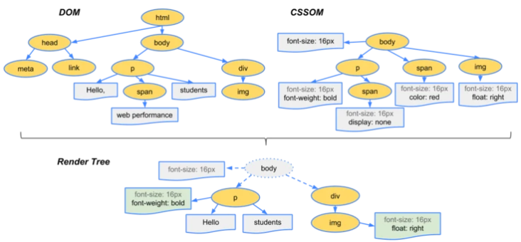

#### 浏览器渲染过程如下：
```
参考：https://segmentfault.com/a/1190000017329980
1. 解析HTML，生成DOM树，解析CSS，生成CSSOM树
2. 将DOM树和CSSOM树结合，生成渲染树(Render Tree)
3. Layout(回流):根据生成的渲染树，进行回流(Layout)，得到节点的几何信息（位置，大小）
4. Painting(重绘):根据渲染树以及回流得到的几何信息，得到节点的绝对像素
5. Display:将像素发送给GPU，展示在页面上。（这一步其实还有很多内容，比如会在GPU将多个合成层合并为同一个层，并展示在页面中。
```


让我们来具体了解下每一步具体做了什么
#### 生成渲染树


为了构建渲染树，浏览器主要完成了以下工作：
1. 从DOM树的根节点开始遍历每个可见节点。
2. 对于每个可见的节点，找到CSSOM树中对应的规则，并应用它们。
3. 根据每个可见节点以及其对应的样式，组合生成渲染树。]

第一步中，既然说到了要遍历可见的节点，那么我们得先知道，什么节点是不可见的。不可见的节点包括：
+ 一些不会渲染输出的节点，比如script、meta、link等。
+ 一些通过css进行隐藏的节点。比如display:none。注意，利用visibility和opacity隐藏的节点，还是会显示在渲染树上的。
只有display:none的节点才不会显示在渲染树上。

#### 回流和回流
回流
```
将可见DOM节点以及它对应的样式结合起来，可是我们还需要计算它们在设备视口(viewport)内的确切位置和大小，
这个计算的阶段就是回流。

当render tree中的一部分(或全部)因为元素的规模尺寸，布局，隐藏等改变而需要重新构建。这就称为回流(reflow)。
每个页面至少需要一次回流，就是在页面第一次加载的时候。 在回流的时候，浏览器会使渲染树中受到影响的部分失效，并重新构造这部分渲染树，
```
重绘
```
通过构造渲染树和回流阶段，我们知道了哪些节点是可见的，以及可见节点的样式和具体的几何信息(位置、大小)，
那么我们就可以将渲染树的每个节点都转换为屏幕上的实际像素，这个阶段就叫做重绘节点。
```

##### 何时发生回流重绘,注意：回流一定会触发重绘，而重绘不一定会回流
完成回流后，浏览器会重新绘制受影响的部分到屏幕中，该过程成为重绘。
回流这一阶段主要是计算节点的位置和几何信息，那么当页面布局和几何信息发生变化的时候，就需要回流。比如以下情况：
```
添加或删除可见的DOM元素

元素的位置发生变化

元素的尺寸发生变化（包括外边距、内边框、边框大小、高度和宽度等）

内容发生变化，比如文本变化或图片被另一个不同尺寸的图片所替代。

页面一开始渲染的时候（这肯定避免不了）

浏览器的窗口尺寸变化（因为回流是根据视口的大小来计算元素的位置和大小的）

1.添加、删除可见的dom

2.元素的位置改变

3.元素的尺寸改变(外边距、内边距、边框厚度、宽高、等几何属性)

4.页面渲染初始化

5.浏览器窗口大小改变
  6.设置style属性
7.改变文字大小
8.添加/删除样式表
9.激活伪类，如:hover
10.操作class属性
11.内容的改变，(用户在输入框中写入内容也会)

引起重绘Repaint的属性:
color	border-style	visibility	background
text-decoration	background-image	background-position	background-repeat
outline-color	outline	outline-style	border-radius
outline-width	box-shadow	background-size
```
```

### 1.减少回流、重绘其实就是需要减少对render tree的操作（合并多次多DOM和样式的修改），并减少对一些style信息的请求，尽量利用好浏览器的优化策略。

### 优化 （一）浏览器本身的优化策略
浏览器会维护一个队列，把所有引起重排、重绘的操作放入这个队列，等队列中的操作到了一定数量或时间间隔，浏览器就会flush队列，进行一个批处理。这样让多次的重排重绘变成一次。但有时候一些特殊的style属性会使这种优化失效。例如offsetTop, scrollTop, clientTop, getComputedStyle()（IE中currentStyle）等属性，这些属性都是需要实时回馈给用户的几何属性或布局属性，因此浏览器不得不立即执行，并随之触发重排返回正确的值。

###（二）最小化重绘和重排
由于重绘和重排可能代价比较昂贵，因此最好就是可以减少它的发生次数。为了减少发生次数，我们可以合并多次对DOM和样式的修改，然后一次处理掉。


#### 优化
```
1.合并多次对DOM和样式
4.对于复杂动画效果,使用绝对定位让其脱离文档流
3.隐藏元素，应用修改，重新显示
```

##### 1.将多次改变样式属性的操作合并为一次操作
```
//javascript
var el = document.querySelector('.el');
el.style.borderLeft = '1px';
el.style.borderRight = '2px';
el.style.padding = '5px';

可以使用内联样式的cssText方法实现：
var el = document.querySelector('.el');
el.style.cssText = 'border-left: 1px; border-right: 2px; padding: 5px';

也可以使用切换类名的方法：
//css
.active {
padding: 5px;
border-left: 1px;
border-right: 2px;
}
// javascript
var el = document.querySelector('.el');
el.className = 'active';
```
